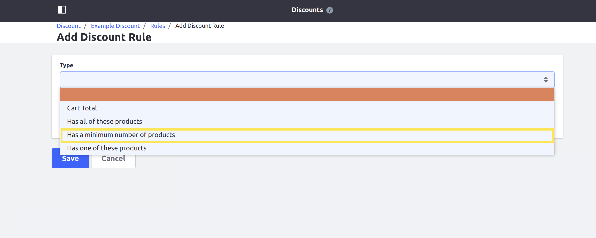

# Adding a New Discount Rule Type

This tutorial will show you how to add a new discount rule type by implementing the [CommerceDiscountRuleType](https://github.com/liferay/com-liferay-commerce/blob/2.0.4/commerce-discount-api/src/main/java/com/liferay/commerce/discount/rule/type/CommerceDiscountRuleType.java) interface.

Discount rule types define conditions for evaluating when discounts will be applied to an order. Liferay Commerce provides three discount rule types out of the box: [AddedAllCommerceDiscountRuleTypeImpl](https://github.com/liferay/com-liferay-commerce/blob/2.0.4/commerce-discount-rule-added-all/src/main/java/com/liferay/commerce/discount/rule/added/all/internal/AddedAllCommerceDiscountRuleTypeImpl.java), [AddedAnyCommerceDiscountRuleTypeImpl](https://github.com/liferay/com-liferay-commerce/blob/2.0.4/commerce-discount-rule-added-any/src/main/java/com/liferay/commerce/discount/rule/added/any/internal/AddedAnyCommerceDiscountRuleTypeImpl.java), and [CartTotalCommerceDiscountRuleTypeImpl](https://github.com/liferay/com-liferay-commerce/blob/2.0.4/commerce-discount-rule-cart-total/src/main/java/com/liferay/commerce/discount/rule/cart/total/internal/CartTotalCommerceDiscountRuleTypeImpl.java).


## Overview

1. **Deploy an Example**
1. **Walk Through the Example**
1. **Additional Information**

## Deploy an Example

In this section, we will get an example discount rule type up and running on your instance of Liferay Commerce. Follow these steps:

1. Start Liferay Commerce.

    ```bash
    docker run -it -p 8080:8080 liferay/commerce:2.0.4
    ```

1. Download and unzip [Acme Commerce Discount Rule Type]().

    ```bash
    curl liferay-m6a8.zip
    ```

    ```bash
    unzip liferay-m6a8.zip
    ```

1. Go to `liferay-m6a8`.

    ```bash
    cd liferay-m6a8
    ```

1. Build and deploy the example.

    ```bash
    ./gradlew deploy -Ddeploy.docker.container.id=$(docker ps -lq)
    ```

    >**Note:** This command is the same as copying the deployed jars to /opt/liferay/osgi/modules on the Docker container.

1. Confirm the deployment in the Liferay Docker container console.

    ```bash
    STARTED com.acme.m6a8.impl_1.0.0
    ```

1. Verify that the example discount rule type was added. Open your browser to `https://localhost:8080` and navigate to _Control Panel_ → _Commerce_ → _Discounts_. Click _Edit_ within the menu for any discount, then navigate to _Rules_ at the top of the screen.

    From there, click the + icon to add a new discount rule. The new discount rule type ("Has at least ten products total") will be present under the _Type_ dropdown.



Congratulations, you've successfully built and deployed a new discount rule type that implements `CommerceDiscountRuleType`.

Next, let's dive deeper to learn more.

## Walk Through the Example

In this section, we will review the example we deployed. First, we will annotate the class for OSGi registration; second we will review the `CommerceDiscountRuleType` interface; and third, we will complete our implementation of `CommerceDiscountRuleType`.

### Annotate Your Class for OSGi Registration

```java
@Component(
    immediate = true,
    property = {
        "commerce.discount.rule.type.key=" + M6A8CommerceDiscountRuleType.KEY,
        "commerce.discount.rule.type.order:Integer=55"
    },
    service = CommerceDiscountRuleType.class
)
public class M6A8CommerceDiscountRuleType implements CommerceDiscountRuleType {

    public static final String KEY = "Example";
```

> It is important to provide a distinct key for the discount rule type so that Liferay Commerce can distinguish the new type from others in the [discount rule type registry](https://github.com/liferay/com-liferay-commerce/blob/2.0.4/commerce-discount-service/src/main/java/com/liferay/commerce/discount/internal/rule/type/CommerceDiscountRuleTypeRegistryImpl.java). Reusing a key that is already in use will override the existing associated type.
>
> The `commerce.discount.rule.type.order` value indicates how far in the list of available discount rule types this type will appear.

### Review the `CommerceDiscountRuleType` Interface

Implement the following methods:

```java
public boolean evaluate(
        CommerceDiscountRule commerceDiscountRule,
        CommerceContext commerceContext)
    throws PortalException;
```

> This method will be where we implement the business logic for evaluating when the discount rule is applied.

```java
public String getKey();
```

> This provides a unique identifier for the discount rule type in the discount rule type registry. The key can be used to fetch the new type from the registry.

```java
public String getLabel(Locale locale);
```

> This returns a text label that describes how the discount rule is applied. See the implementation in [M6A8CommerceDiscountRuleType.java](./liferay-m6a8.zip/m6a8-impl/src/main/java/com/acme/m6a8/internal/commerce/discount/rule/type/M6A8CommerceDiscountRuleType.java) for a reference in retrieving the label with a language key.

### Complete the Discount Rule Type

The discount rule type is comprised of backend logic for evaluating when to apply a discount rule to an order. Do the following:

* [Add the evaluation logic to `evaluate`.](#add-the-evaluation-logic-to-evaluate)
* [Add the language key to `Language.properties`.](#add-the-language-key-to-languageproperties)

#### Add the Evaluation Logic to `evaluate`

```java
@Override
public boolean evaluate(
        CommerceDiscountRule commerceDiscountRule,
        CommerceContext commerceContext)
    throws PortalException {

    CommerceOrder commerceOrder = commerceContext.getCommerceOrder();

    if (commerceOrder == null) {
        return false;
    }

    List<CommerceOrderItem> commerceOrderItems =
        commerceOrder.getCommerceOrderItems();

    if (commerceOrderItems.size() >= 10) {
        return true;
    }

    return false;
}
```

> Implement any conditions here that must be true for a discount rule to be applied. In our example, we check that the order contains at least ten items.
>
> The `CommerceOrder` object represents a variety of information about the order being evaluated. See [CommerceOrder.java](https://github.com/liferay/com-liferay-commerce/blob/2.0.4/commerce-api/src/main/java/com/liferay/commerce/model/CommerceOrder.java) and [CommerceOrderModel.java](https://github.com/liferay/com-liferay-commerce/blob/2.0.4/commerce-api/src/main/java/com/liferay/commerce/model/CommerceOrderModel.java) to find more information you can get from a `CommerceOrder`.

#### Add the Language Key to `Language.properties`

Add the language key and its value to a [Language.properties](./liferay-m6a8.zip/m6a8-impl/src/main/resources/content/Language.properties) file within the module:

```
has-at-least-ten-products-total=Has at least ten products total
```

> See [Localizing Your Application](https://help.liferay.com/hc/en-us/articles/360018168251-Localizing-Your-Application) for more information.

## Conclusion

Congratulations! You now know the basics for implementing the `CommerceDiscountRuleType` interface, and have added a new discount rule type to Liferay Commerce.

## Additional Information

* [Adding Discounts by Product](../../../user-guide/marketing/promotions/adding-discounts-by-product/README.md)
* [Localizing Your Application](https://help.liferay.com/hc/en-us/articles/360018168251-Localizing-Your-Application)
