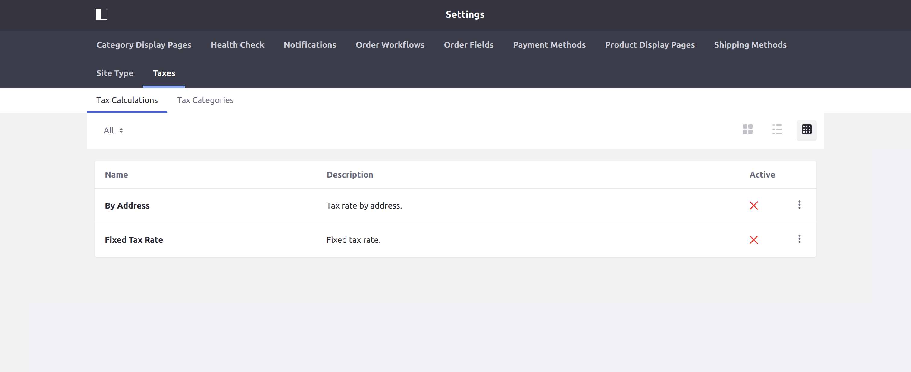
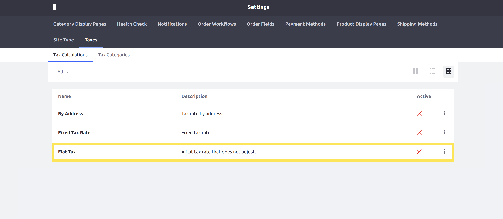

# Implementing a Tax Engine

This tutorial will show you how to add a custom tax engine by implementing the `CommerceTaxEngine` interface.

A tax engine performs the calculation for taxes when a transaction is made. Liferay Commerce provides two default tax engines: the [FixedCommerceTaxEngine](https://raw.githubusercontent.com/liferay/com-liferay-commerce/7.1.x/commerce-tax-engine-fixed-service/src/main/java/com/liferay/commerce/tax/engine/fixed/internal/engine/FixedCommerceTaxEngine.java) for fixed rates, and the [ByAddressCommerceTaxEngine](https://raw.githubusercontent.com/liferay/com-liferay-commerce/7.1.x/commerce-tax-engine-fixed-service/src/main/java/com/liferay/commerce/tax/engine/fixed/internal/engine/ByAddressCommerceTaxEngine.java) for calculating taxes by address.



## Overview

1. **Deploy an Example**
1. **Walk Through the Example**
1. **Additional Information**

## Deploy an Example

In this section, we will get an example tax engine up and running on your instance of Liferay Commerce. Follow these steps:

1. Start Liferay Commerce.

    ```bash
    docker run -it -p 8080:8080 liferay/commerce:2.0.2
    ```

1. Download and unzip the [Acme Commerce Tax Engine]() to your project directory.

    ```bash
    curl liferay-q4b9.zip
    ```

    ```bash
    unzip liferay-q4b9.zip
    ```

1. Go to `q4b9-impl`.

    ```bash
    cd q4b9-impl
    ```

1. Build and deploy the example.

    ```bash
    ./gradlew deploy -Ddeploy.docker.container.id=$(docker ps -lq)
    ```

    >Note: This command is the same as copying the deployed jars to /opt/liferay/osgi/modules on the Docker container.

1. Confirm the deployment in the Liferay Docker container console.

    ```bash
    STARTED com.acme.q4b9.internal.commerce.tax_1.0.0
    ```

1. Verify that the example tax engine was added. Open your browser to `https://localhost:8080` and navigate to _Site Administration_ → _Commerce_ → _Settings_ → _Taxes_ → _Tax Calculations_. The new tax engine ("Flat Tax") will be present in the list shown.



Congratulations, you've successfully built and deployed a new tax engine that implements `CommerceTaxEngine`.

Next, let's dive deeper to learn more.

## Walk Through the Example

In this section, we will take a more in-depth review of the example we deployed. First, we will annotate the class for OSGi registration; second we will implement the `CommerceTaxEngine` interface; and third, we will implement the tax calculation logic.

### Annotate Your Class for OSGi Registration

```java
@Component(
    immediate = true,
    property = "commerce.tax.engine.key=" + Q4B9CommerceTaxEngine.KEY,
    service = CommerceTaxEngine.class
)
public class Q4B9CommerceTaxEngine implements CommerceTaxEngine {

    public static final String KEY = "Example";
```

> It is important to provide a distinct key for your tax engine so that Liferay Commerce can distinguish your new engine from others in the [tax engine registry](https://raw.githubusercontent.com/liferay/com-liferay-commerce/7.1.x/commerce-service/src/main/java/com/liferay/commerce/internal/util/CommerceTaxEngineRegistryImpl.java). Reusing a key that is already in use will override the existing associated tax engine.

### Implement the `CommerceTaxEngine` Interface

The following three methods are required:

```java
public CommerceTaxValue getCommerceTaxValue(
        CommerceTaxCalculateRequest commerceTaxCalculateRequest)
    throws CommerceTaxEngineException;`
```

```java
public String getDescription(Locale locale);`
```

```java
public String getName(Locale locale);`
```

To better understand each of the required methods mentioned above, let's look at [Q4B9CommerceTaxEngine.java](./liferay-q4b9.zip/q4b9-impl/src/main/java/com/acme/q4b9/internal/commerce/tax/engine/Q4B9CommerceTaxEngine.java). We will review the implementation of each required method in sequence.

1. `public CommerceTaxValue getCommerceTaxValue(CommerceTaxCalculateRequest commerceTaxCalculateRequest) throws CommerceTaxEngineException;`

    ```java
    @Override
    public CommerceTaxValue getCommerceTaxValue(
            CommerceTaxCalculateRequest commerceTaxCalculateRequest)
        throws CommerceTaxEngineException {

        // ...

        return null;
    }
    ```

    > This method will be where the business logic is implemented for our tax engine.

1. `public String getDescription(Locale locale);`

    ```java
    @Override
    public String getDescription(Locale locale) {
        ResourceBundle resourceBundle = ResourceBundleUtil.getBundle(
            "content.Language", locale, getClass());

        return LanguageUtil.get(resourceBundle, "a-flat-tax-rate-that-does-not-adjust");
    }
    ```

    > This returns a text description for the tax engine. `ResourceBundleUtil` is a Liferay class that provides support for multiple locales.
    >
    > Note that, for this to work correctly using `LanguageUtil`, we will need to add the language key ourselves. For more information, see [Localizing Your Application](https://help.liferay.com/hc/en-us/articles/360018168251-Localizing-Your-Application).

1. `public String getName(Locale locale);`

    ```java
    @Override
    public String getName(Locale locale) {
        ResourceBundle resourceBundle = ResourceBundleUtil.getBundle(
            "content.Language", locale, getClass());

        return LanguageUtil.get(resourceBundle, "flat-tax");
    }
    ```

    > This returns the name of the tax engine, as a short String. It works similarly to the `getDescription()` method.

### Create Your Tax Calculation

To implement the main logic of the tax engine, we need to add our business logic to the `getCommerceTaxValue()` method of our class. In our simple example, we will use a hard-coded rate as our flat value, although this will have limited use in a real world case.

`public CommerceTaxValue getCommerceTaxValue(CommerceTaxCalculateRequest commerceTaxCalculateRequest) throws CommerceTaxEngineException`

```java
@Override
public CommerceTaxValue getCommerceTaxValue(
        CommerceTaxCalculateRequest commerceTaxCalculateRequest)
    throws CommerceTaxEngineException {

    BigDecimal flatTaxValue = new BigDecimal("1.50");

    if (commerceTaxCalculateRequest.isPercentage()) {
        flatTaxValue = flatTaxValue.divide(new BigDecimal(100.0));

        flatTaxValue = flatTaxValue.multiply(
            commerceTaxCalculateRequest.getPrice());
    }

    return new CommerceTaxValue("flat-tax", KEY, flatTaxValue);
}
```

> The `CommerceTaxCalculateRequest` parameter contains useful information that we will need when making our calculation. For this example, we make use of the price from the request, as well as the value telling us whether to apply the rate as a percentage. To see more methods you can use, see [CommerceTaxCalculateRequest.java](https://raw.githubusercontent.com/liferay/com-liferay-commerce/7.1.x/commerce-api/src/main/java/com/liferay/commerce/tax/CommerceTaxCalculateRequest.java).

## Conclusion

Congratulations! You now know the basics for implementing the `CommerceTaxEngine` interface, and have added a new tax engine to Liferay Commerce.

## Additional Information

* [Localizing Your Application](https://help.liferay.com/hc/en-us/articles/360018168251-Localizing-Your-Application)
* [Taxes](https://commerce.liferay.dev/user-guide/-/knowledge_base/user/taxes)
