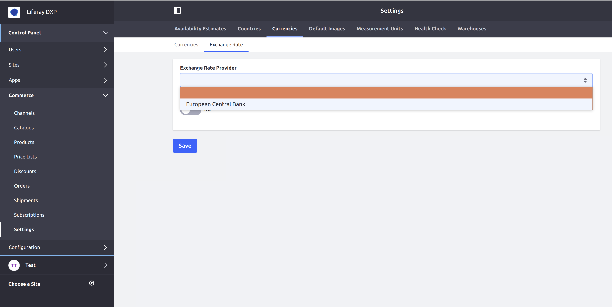

# Implementing an Exchange Rate Provider

This tutorial will show you how to add an exchange rate provider by implementing the `ExchangeRateProvider` interface.

An exchange rate provider uses a data source to perform the exchange calculation between currencies. Liferay Commerce provides one exchange rate provider out of the box, [ECBExchangeRateProvider](https://raw.githubusercontent.com/liferay/com-liferay-commerce/7.1.x/commerce-currency-service/src/main/java/com/liferay/commerce/currency/internal/util/ECBExchangeRateProvider.java).



## Overview

1. **Deploy an Example**
1. **Walk Through the Example**
1. **Additional Information**

## Deploy an Example

In this section, we will get an example exchange rate provider up and running on your instance of Liferay Commerce. Follow these steps:

1. Start Liferay Commerce.

    ```bash
    docker run -it -p 8080:8080 liferay/commerce:2.0.2
    ```

1. Download and unzip the [Acme Commerce Exchange Rate Provider]() to your project directory.

    ```bash
    curl liferay-f2y1.zip
    ```

    ```bash
    unzip liferay-f2y1.zip
    ```

1. Go to `f2y1-impl`.

    ```bash
    cd f2y1-impl
    ```

1. Build and deploy the example.

    ```bash
    ./gradlew deploy -Ddeploy.docker.container.id=$(docker ps -lq)
    ```

    >Note: This command is the same as copying the deployed jars to /opt/liferay/osgi/modules on the Docker container.

1. Confirm the deployment in the Liferay Docker container console.

    ```bash
    STARTED com.acme.f2y1.internal.commerce.currency.util_1.0.0
    ```

1. Verify that the example exchange rate provider was added. Open your browser to `https://localhost:8080` and navigate to _Control Panel_ → _Commerce_ → _Settings_ → _Currencies_ → _Exchange Rate_.

    On this screen, under the Exchange Rate Provider dropdown, the new provider ("Example") will be present.


Congratulations, you've successfully built and deployed a new exchange rate provider that implements `ExchangeRateProvider`.

Next, let's dive deeper to learn more.

## Walk Through the Example

In this section, we will take a more in-depth review of the example we deployed. First, we will annotate the class for OSGi registration; second we will implement the `ExchangeRateProvider` interface; and third, we will implement the exchange logic.

### Annotate Your Class for OSGi Registration

```java
@Component(
    immediate = true,
    property = "commerce.exchange.provider.key=" + F2Y1ExchangeRateProvider.KEY,
    service = ExchangeRateProvider.class
)
public class F2Y1ExchangeRateProvider implements ExchangeRateProvider {

    public static final String KEY = "Example";
```

> It is important to provide a distinct key for your exchange rate provider so that Liferay Commerce can distinguish your new provider from others in the [exchange rate provider registry](https://raw.githubusercontent.com/liferay/com-liferay-commerce/7.1.x/commerce-currency-service/src/main/java/com/liferay/commerce/currency/internal/util/ExchangeRateProviderRegistryImpl.java). Reusing a key that is already in use will override the existing associated provider.

### Implement the `ExchangeRateProvider` Interface and Exchange Logic

All that is needed to implement the `ExchangeRateProvider` interface is to override this method:

```java
@Override
public BigDecimal getExchangeRate(
        CommerceCurrency primaryCommerceCurrency,
        CommerceCurrency secondaryCommerceCurrency)
    throws Exception {

    // ...
}
```

> This method is called to calculate the exchange rate between currencies. The chosen data source for the rates must be able to handle any of the currencies that may be used in your instance of Liferay Commerce.

In our simple example, we will just use a data file with a static list of exchange rates as our data source; note that for a real world use case, though, a provider with a static data source will have limited use, compared to a provider like `ECBExchangeRateProvider`.

```java
@Override
public BigDecimal getExchangeRate(
        CommerceCurrency primaryCommerceCurrency,
        CommerceCurrency secondaryCommerceCurrency)
    throws Exception {

    String primaryCurrencyCode = primaryCommerceCurrency.getCode();
    String secondaryCurrencyCode = secondaryCommerceCurrency.getCode();

    primaryCurrencyCode = StringUtil.toUpperCase(primaryCurrencyCode);
    secondaryCurrencyCode = StringUtil.toUpperCase(secondaryCurrencyCode);

    JSONArray exchangeRatesArray = _getStaticExchangeRates();

    List<String> codesList = JSONUtil.toStringList(
        exchangeRatesArray, "code");

    double primaryRate = _getRateForCode(
        exchangeRatesArray, codesList, primaryCurrencyCode);
    double secondaryRate = _getRateForCode(
        exchangeRatesArray, codesList, secondaryCurrencyCode);

    return new BigDecimal(secondaryRate / primaryRate);
}
```

> We identify the currencies we need by their currency codes, which we then compare to a JSON array of currencies to get their respective rates. Finally we perform the calculation and return the result as a [BigDecimal](https://docs.oracle.com/javase/8/docs/api/java/math/BigDecimal.html). While they are less important details for this example, you can also see this class's implementation of `_getStaticExchangeRates()` and `_getRateForCode()` by visiting [F2Y1ExchangeRateProvider.java](https://github.com/liferay/liferay-help/blob/master/commerce/developer-guide/tutorial/implementing-an-exchange-rate-provider/liferay-f2y1.zip/f2y1-impl/src/main/java/com/acme/f2y1/internal/commerce/exchange/rate/provider/F2Y1ExchangeRateProvider.java).
>
> We need to use the `CommerceCurrency` object for the two currencies to get the information we need, like their currency codes. To find more methods you can use with a `CommerceCurrency` object, see [CommerceCurrencyModel.java](https://raw.githubusercontent.com/liferay/com-liferay-commerce/7.1.x/commerce-currency-api/src/main/java/com/liferay/commerce/currency/model/CommerceCurrencyModel.java).

## Conclusion

Congratulations! You now know the basics for implementing the `ExchangeRateProvider` interface, and have added a new exchange rate provider to Liferay Commerce.

## Additional Information

* [Currencies](../../../user-guide/getting-started/currencies/README.md)
