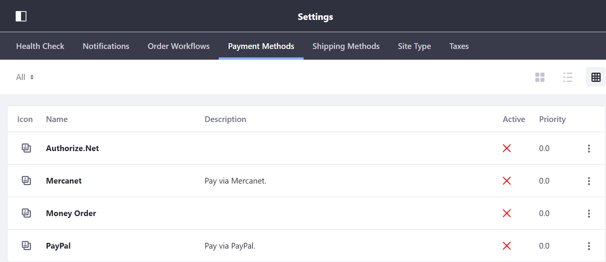

# Implementing a New Basic Payment Method

Liferay Commerce provides several out of the box payment methods including _Authorize.Net_, _Mercanet_, _Money Order_, and _PayPal_.



This tutorial will introduce you to implementing the  `CommercePaymentMethod` interface by customizing an existing payment method.

## Roadmap

1. Implement Required Methods
1. Implement Optional Methods
1. Put it Together
1. Deploy and Test

>DIY Sample or Go Straight In to the Sample
>If you go DIY then you need to setup your dev env
>Once you run the gradle command to create the project module you need to manually create bnd.bnd to enable `./gradlew deploy` so gradle sees the module as an OSGI module.

>You also need to update your build.gradle file to point to all the dependencies in your java class I had no idea. I had to copy from the moneyorder class in the original source repo. I don't know what versions are correct.

>If i want to control where gradle deploy sends the file to, I have to set in build.gradle w/ `deployDir`


## Implement the Required Methods

Implement [`com.liferay.commerce.payment.method.CommercePaymentMethod`]()

```java
	public String getDescription(Locale locale);

	public String getKey();

	public String getName(Locale locale);

	public int getPaymentType();

	public String getServletPath();
```

### Review an Example

An example of implementing [`CommercePaymentEngine`]() can seen in [`MoneyOrderCommercePaymentMethod.java`]().

>Populates the "Description" column in the Payment Methods administration page. `ResourceBundleUtil` is a Liferay class that provides support for multiple locales. Visit [Supporting Multiple Locales on Liferay]() for more information.

```java
	@Override
	public String getDescription(Locale locale) {
		ResourceBundle resourceBundle = ResourceBundleUtil.getBundle("content.Language", locale, getClass());

		return LanguageUtil.get(resourceBundle, "this-is-a-description");
	}
```

<br>

>A unique identifier for the payment method. Reusing a key that is already in use will override the existing associated method. In the registry, this key will be associated with the payment method. The key can be used to fetch the payment method from the registry programmatically if necessary.

```java
	@Override
	public String getKey() {
		return "sample-payment-method-registry-key";
	}
```

<br>

>Populates the "Name" column in the Payment Methods Administration Page.`ResourceBundleUtil` is a Liferay class that provides support for multiple locales. Visit [Supporting Multiple Locales on Liferay]() for more information.

```java
	@Override
	public String getName(Locale locale) {
		ResourceBundle resourceBundle = ResourceBundleUtil.getBundle("content.Language", locale, getClass());

		return LanguageUtil.get(resourceBundle, "sample-payment-method-language-key");
	}
```

<br>

>Payment Type identifies the way in which the Payment Engine will use a given Payment Method. `COMMERCE_PAYMENT_METHOD_TYPE_OFFLINE` informs the payment engine that there are no online processing requirements for this Payment Method. There are two other payment type constants available out of the box: `COMMERCE_PAYMENT_METHOD_TYPE_ONLINE_STANDARD` and `COMMERCE_PAYMENT_METHOD_TYPE_ONLINE_REDIRECT`. For more information see [Implementing a New Online Payment Method]().

```java
	@Override
	public int getPaymentType() {
		return CommercePaymentConstants.COMMERCE_PAYMENT_METHOD_TYPE_OFFLINE;
	}
```

<br>

>When implementing an online payment method, a servlet may be required to enable proper interfacing with an external payment provider. Since no servlet path is required for an offline payment method, `getServletPath` can return `null`.

```java
	@Override
	public String getServletPath() {
		return null;
	}
```

## Implement Optional Methods

The following optional methods should be implemented. There are many more methods that can be implemented that provide additional functionality. These methods come in pairs: one method to enable and the other to implement a given piece of functionality.

>Short description

```java
	@Override
	public CommercePaymentResult completePayment(
			CommercePaymentRequest commercePaymentRequest)
		throws Exception {

		return new CommercePaymentResult(
			null, commercePaymentRequest.getCommerceOrderId(),
			CommerceOrderConstants.PAYMENT_STATUS_PAID, false, null, null,
			Collections.emptyList(), true);
	}
```

<br>

>Short description

```java
	@Override
	public boolean isCompleteEnabled() {
		return true;
	}
```

<br>

>Short description

```java
	@Override
	public boolean isProcessPaymentEnabled() {
		return true;
	}
```

<br>

>Short description

```java
	@Override
	public CommercePaymentResult processPayment(
			CommercePaymentRequest commercePaymentRequest)
		throws Exception {

		return new CommercePaymentResult(
			null, commercePaymentRequest.getCommerceOrderId(),
			CommerceOrderConstants.PAYMENT_STATUS_AUTHORIZED, false, null, null,
			Collections.emptyList(), true);
	}
```

### Annotate Your Class for OSGI Registration

```java
@Component(
	immediate = true,
	property = "commerce.payment.engine.method.key=" + MoneyOrderCommercePaymentMethod.KEY,
	service = CommercePaymentMethod.class
)
public class MoneyOrderCommercePaymentMethod implements CommercePaymentMethod {
```

## Putting it Together

View the full example class: [SampleOfflineCommercePaymentMethod.java]().

## Deploy and Test

>First time going through a Tutorial? Check our [Introduction to Liferay Development]() first, to get started.

1. Start Liferay Commerce | `docker run -it -p 8080:8080 liferay/commerce:2.0.0`
1. Download and unzip the sample | [sample-offline-commerce-payment-method.zip]()
1. Build the sample | `./gradlew deploy`
1. Deploy the sample | In the $dir.sample.was.built run: `docker cp ../bundles/osgi/modules/com.liferay.commerce.sample.payment.method.jar $(docker ps -q):/opt/liferay/osgi/modules`
    >If you are running more than one docker container, then you will need to supply the correct container hash yourself.
1. Review the deployment | Review console for `STARTED STARTED com.liferay.commerce.sample.payment.method_1.0.0`.
1. Validate in Liferay Commerce | Open browser `https://localhost:8080`

"After" Screenshot Here

## More Information

- [Introduction to Liferay Development]()
- [Supporting Multiple Locales on Liferay]()
