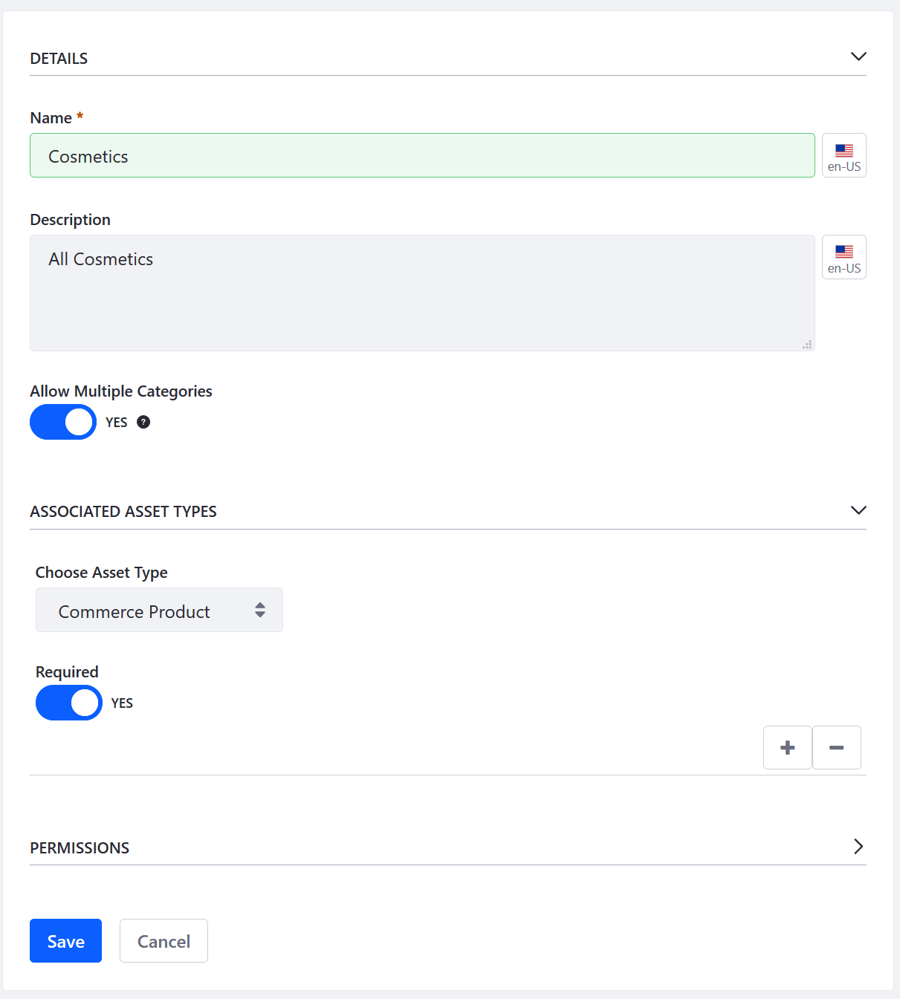
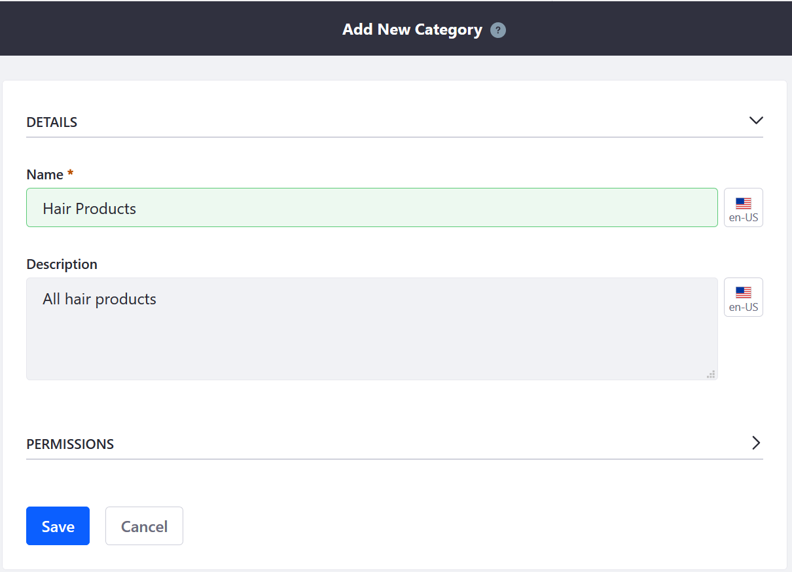
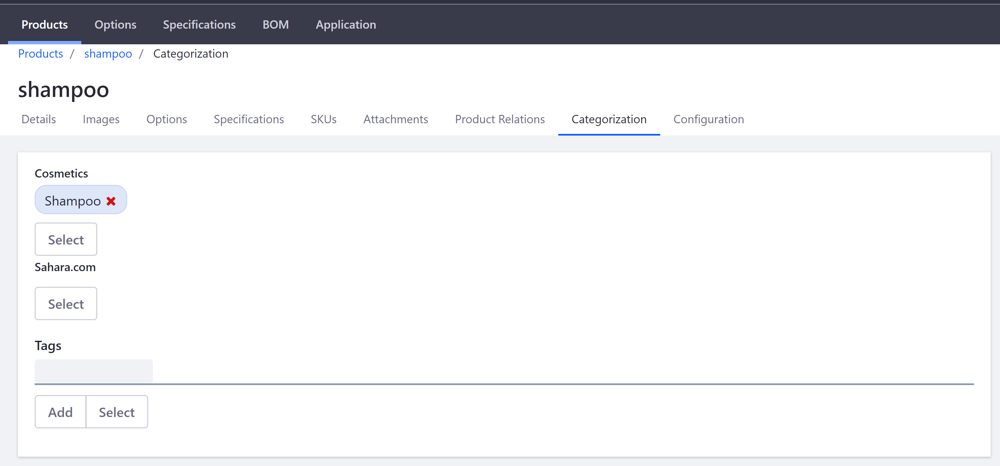

# Creating a New Product Category

Product Categories are used to organize your products. These groupings allow multiple products to be handled as a single unit. For example, a product category could be used to apply discounts or other offers to a set of products, to assist buyers in finding products, or to promote certain products to a specified account or account group.

This article documents how to create a product category.

## Roadmap

1. [Creating a Vocabulary](#creating-a-vocabulary)
1. [Creating a Category](#creating-a-category)
1. [Associate Categories with Products](#associating-categories-with-products)

## Creating a Vocabulary

1. Navigate to the _Control Panel_ →  _Go to Other Site_ → _My Sites_ → _Global_.
1. Once on the _Global_ site, click _Categorization_ → _Categories_.
1. Click the (+) button to create a Vocabulary first.
1. Enter the following:
    * **Name**: Cosmetics
    * **Description**: All Cosmetics
    * **Allow Multiple Categories**: Yes
    * **Choose Asset Type**: Commerce Product
    * **Required**: Yes

        

1. Click _Save_.

The new Vocabulary has been created and Categories can now be added.

## Creating a Category

Because categories can be nested, store owners can organize their categories with subcategories. For example, a category called _Hair Products_ could have its own subcategories such as _Shampoo_, _Hair Gels_, and _Color Dyes_.

To create a Category:

1. Click the Vocabulary where the Categories are to be added. To continue the previous example, click _Cosmetics_.
1. Click the (+) button to add a new Category.
1. Enter the following:
    * **Name**: Hair Products
    * **Description**: All hair products

1. Click _Save_.

The new Category has been created. You can either create another Category for another product that sits parallel in the hierarchy or create a nested subcategory in the description above. To create a subcategory, click the _Hair Products_ link and then click the (+) button to create another Category. Once the new Category has been created, the hierarchy can be observed in the breadcrumb navigation.

## Associating Categories with Products

Once the Categories have been created, begin associating them to the products in the catalog.

1. Navigate to the _Control Panel_ → _Commerce_ → _Products_.
1. Click on a product then the _Categorization_ tab. (If you used Minium to create a site with sample data, click _Transmission Fluid_. Note that the _Transmission Fluid_ product already has been linked to the sample Vocabulary and Category.)
1. Click on the _Select_ button under the label for the appropriate vocabulary, and in the pop-up that appears the check the box next to each category that applies.

    

1. Click _Done_.

The category is now associated with the product.

Repeat as necessary for all other products that might fall under this category.
