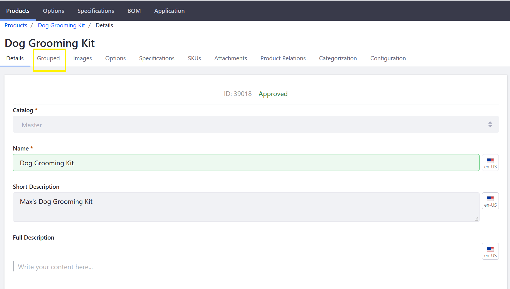
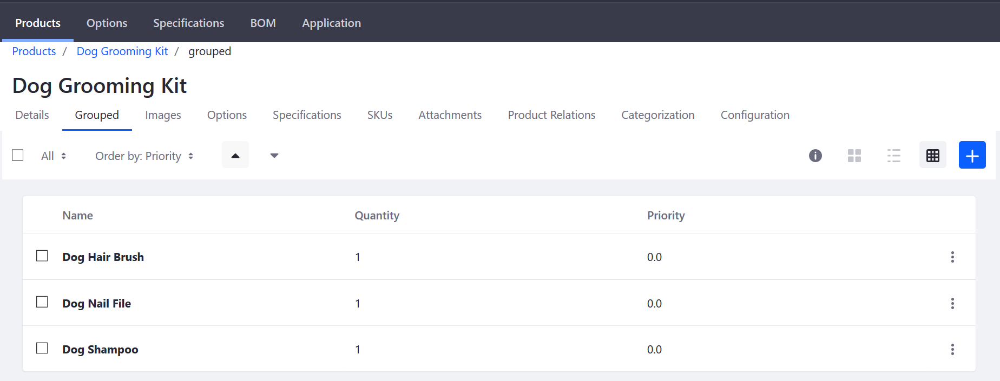
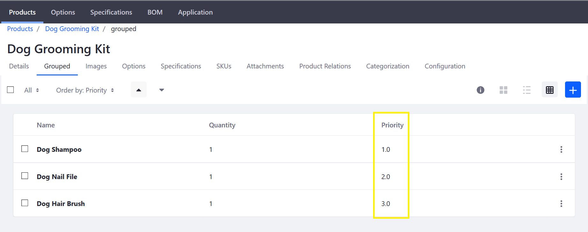
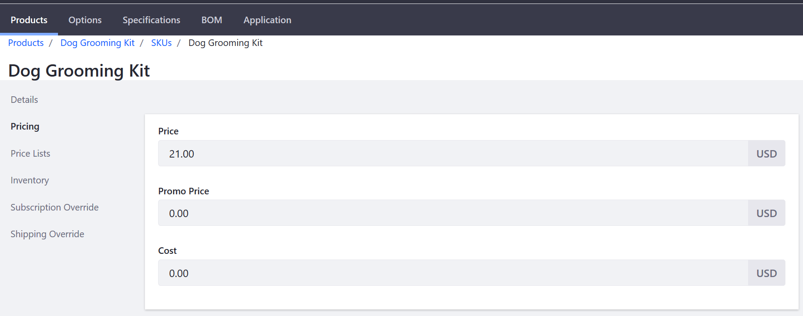
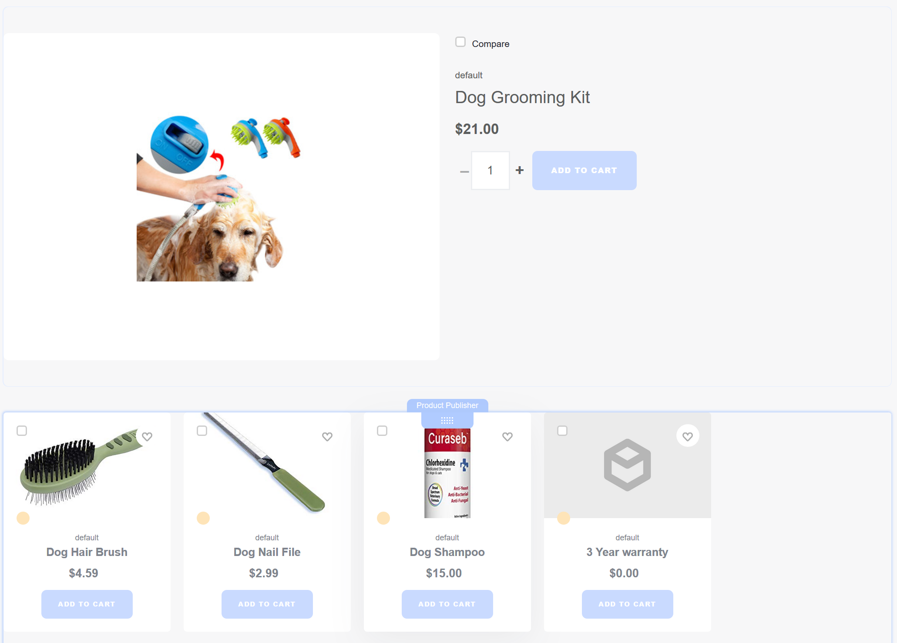

# Creating a Grouped Product

A Grouped Product in Liferay Commerce is two or more products from the catalog that are packaged together to be sold as a single item. Grouped Products are tracked in the inventory. The catalog tracks all of the products contained in the group individually. A Grouped Product can contain simple products, other Grouped Products, or virtual products.

## Prerequisites

Before creating a Grouped Product, ensure that the following conditions have been met:

1. The individual products to be sold as a Grouped Product have been created in the catalog.
    * All SKUs have been generated.
    * All prices have been set.
    * The products can be both simple and virtual.
1. The individual products have sufficient quantities in the inventory.

## Roadmap

* [Create a Grouped Product](#create-a-grouped-product)
* [Associate Products in Group](#associate-products-in-group)
* [Apply Product Options](#apply-product-options)
* [Generate SKUs](#generate-skus)
* [Set Prices and Quantities in the Inventory](#set-prices-and-quantities-in-the-inventory)
* [Configure Product Specifications](#configure-product-specifications)
* [Upload Product Images and Attachments](#upload-product-images-and-attachments)
* [Organize with Categories](#organize-with-categories)
* [Associate with Related Products](#associate-with-related-products)
* [Selling Grouped Products](#selling-grouped-products)

## Create a Grouped Product

1. Navigate to _Control Panel_ → _Commerce_ → _Products_.
1. Click the (+) button then _Grouped_.
1. Enter the following:
    * **Catalog**: Sahara.com
    * **Name**: Dog Grooming Kit
    * **Short Description**: Max's Dog Grooming Kit
    * **Friendly URL**: (auto-generated)
    * **Meta Title**: Dog Grooming Kit
1. Click _Publish_.

Once the Grouped Product entity has been initially created, store administrators will need to associate the individual products to the grouped product entry.

## Associate Products in Group

1. Click the _Grouped_ sub-tab.

   

1. Click the (+) button to add a Grouped Entry.
1. Select the following products: _Dog Hair Brush_, _Dog Nail File_, and _Dog Shampoo_.
1. Click _Add_.

    

Next, specify the priority (the order in which they are displayed), and the quantity sold in each package. Click the _3-dot_ icon then _Edit_ next to any of the products.

In the image above, the product has been given priority 1.0 which means it will be listed first. Assign incremental values to the other products.

## Apply Product Options

[Product Options](../managing-a-catalog/customizing-your-product-with-product-options.md) provide an easy and flexible way to offer products that have a variety of options such as size, quantity, and color. Click the _Options_ sub-tab to add various options to the product.

## Generate SKUs

Once you have applied product options to the product, SKUs have to be generated. For more information about how to generate SKUs, see the article [Adding SKUs to Your Products](../managing-a-catalog/adding-skus-to-your-products.md). Click the _SKUs_ sub-tab to generate the SKUs.

## Set Prices and Quantities in the Inventory

After the SKUs have been generated, set the base price and quantities in the inventory for each item. Depending on how many SKUs were generated based on the various product options, each SKU can have its own prices. Some products are sold in bulk quantities while others are sold individually.

To set product prices and quantities:

1. Click the _3-dot_ icon then _Edit_ next to _default_. (At this point, you can rename the SKU to something more descriptive like _Dog Grooming Kit_ on the _Details_ menu.)
1. Click _Pricing_ on the left menu.
1. Enter the following:
    * **Price**: 21.00
    * **Promo Price**: 0.00
    * **Cost**: 0.00

        

1. Click _Save_. (If Promo Price and Cost fields are left as 0.00, no discounts or promotions are applied at this point.)
1. Click _Price List_ to apply this product to any existing [Price Lists](./adding-products-to-a-price-list.md).

>To learn more about pricing see: [Introduction to Product Pricing Methods](./introduction-to-product-pricing-methods.md)

To learn how to configure inventory for your product, see: [Setting Inventory by Warehouse](./setting-inventory-by-warehouse.md).

## Configure Product Specifications

[Product specifications](../managing-a-catalog/specifications.md) contain useful pieces of product information about the product, such as dimensions, color, weight, capacity, or almost any other attribute. Click the _Specifications_ sub-tab to add specifications.

## Upload Product Images and Attachments

[Product images](../managing-a-catalog/product-images.md) help to ensure that customers know what they are buying. Each product variant (SKU) can have their own associated product image. Click the _Images_ sub-tab to add all product images.

Store administrators can also add attachments that are associated with a particular product. Click the _Attachments_ sub-tab to add documents.

## Organize with Categories

[Product Categories](../managing-a-catalog/creating-a-new-product-category.md) are used to organize products. Product categories may be used to apply discounts or other offers to a set of products, to assist buyers in finding products, or to promote certain products to a specified account or account group.

## Associate with Related Products

[Product Relations](./related-products-up-sells-and-cross-sells.md) can be used to connect products. Once connected, a product displays the links to other products. Every related product must be assigned to a Product Relation Type.

## Selling Grouped Products

The new Grouped Product appears in the catalog. As long as each individual product has enough stock in the inventory, buyers can select the Grouped Product for purchase.

## Additional Information

* [Introduction to Product Types](../managing-a-catalog/introduction-to-product-types.md)
* [Creating a Simple Product](../managing-a-catalog/creating-a-simple-product.md)
* [Creating a Virtual Product](../managing-a-catalog/creating-a-virtual-product.md)
