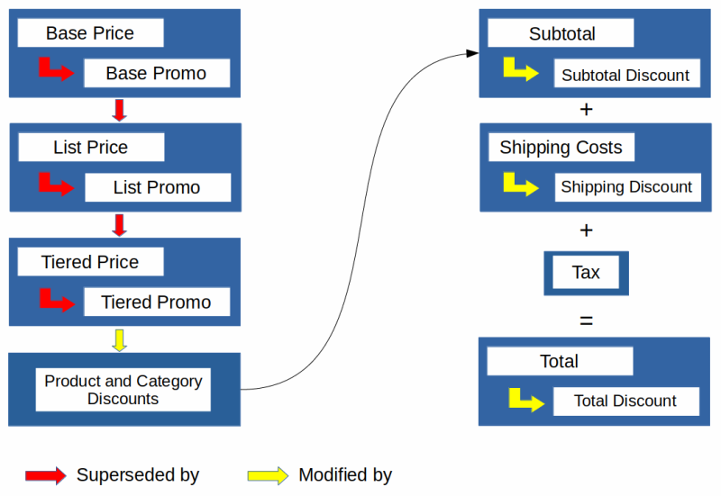

# Introduction to Product Pricing Methods

Liferay Commerce allows store managers to set different prices for the same product using a pricing hierarchy. Each type of pricing method works together to allow managers to offer different pricing methods based on specific sets of conditions. This article explains the pricing hierarchy and each pricing method.

## Pricing Hierarchy

The pricing hierarchy determines which price applies for any given combination of product, quantity, buyer, date/time, order total, etc. If more than one price applies to a given transaction, then the price nearest to the top of the hierarchy supersedes others.

The hierarchy consists of these levels:

**Base Price**: This is the starting price of the product which is [set](./setting-a-products-base-price.md) in the product SKU sub-tab.

**Price List**: This price applies to specific products for buyers in selected [Accounts](../../account-management/creating-a-new-account.md) and [Account Groups](../../account-management/creating-a-new-account-group.md). Prices in the price list can be _higher_ or _lower_ than the base price. If a price list applies to a transaction, it supersedes the base price.

**Tiered Price**: This price applies to orders that meet specified minimum quantity requirements (bulk orders). It is only available in the context of a [price list](./creating-a-price-list.md) and it supersedes the list's price.

**Promo Price**: This price can be applied to a base price, a price list price, and to a tiered price. Once applied, the promo price supersedes each of them. When a base price is superseded by a price list or tiered price, its promo price is superseded as well. _The applicable price and promo price appear together on the product page so that buyers see the markdown._

**Discount**: A discount _operates outside the price hierarchy and modifies a price_ rather than superseding it. Unlike a price list, a discount always reduces the base price. There are two types of discounts: a flat amount or a percentage. A discount can be applied in the following ways:

* By product (individually, by category, or the entire catalog)
* To an order’s subtotal, shipping costs, or to an order total
* To all buyers, or buyers in selected Accounts and Account Groups
* To a select group of customers that meet certain qualifications such as minimum order total or purchase of a required product.

The pricing hierarchy can be visualized in the following diagram:

   

## Pricing Method Reference

| Pricing Method | Summary | Overrides the Base Price? | Where is it set? | Applies to who? | Applies to what? |
| --- | --- | :---: | --- | --- | :---: |
| Base Price | The base price | n/a | Product SKU | All buyers | Product SKU |
| Base Promo | Marked down price | Yes | Product SKU | All buyers | Product SKU |
| Price List (List Price, List Promo) | Special pricing (or currencies) per product and buyer | Yes | Price Lists | Selected buyers (Accounts & Account Groups) | Individual product SKUs |
| Tiered Price List (Tiered Price, Tiered Promo) | Special pricing (or currencies) per product and buyer _at bulk quantities_ | Yes | Price Lists | Selected buyers (Accounts & Account Groups) | Individual product SKUs |
| Discount | Modifies price for a group of products or buyers (Can limit quantity and use coupon codes) | No | Discounts | Selected Buyers (Accounts & Account Groups or those who meet certain qualifications) | Groups of products (or Individual product SKUs) |

## Additional Information

* [Setting a Product's Base Price](./setting-a-products-base-price.md)
* [Creating a Price List](./creating-a-price-list.md)
* [Adding Products to a Price List](./adding-products-to-a-price-list.md)
* [Adding Tiered Pricing](./adding-products-to-a-price-list.md)
* [Creating a Discount](../../promoting-products/creating-a-discount.md)
