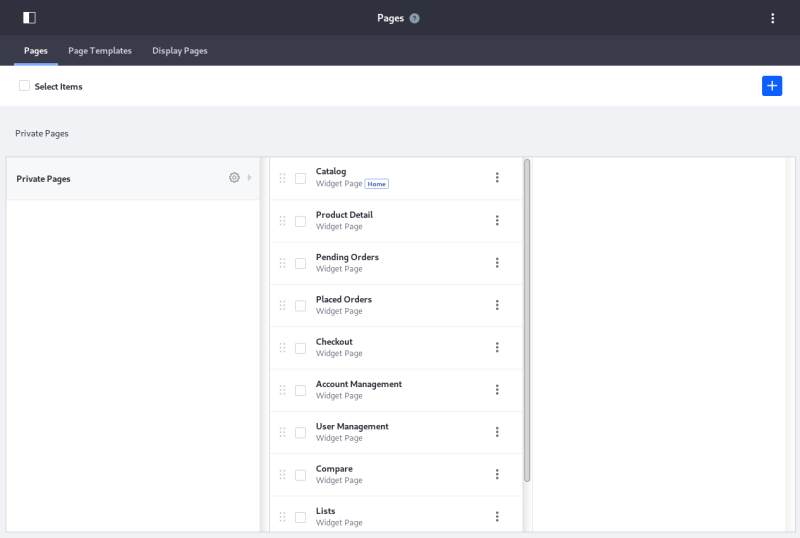
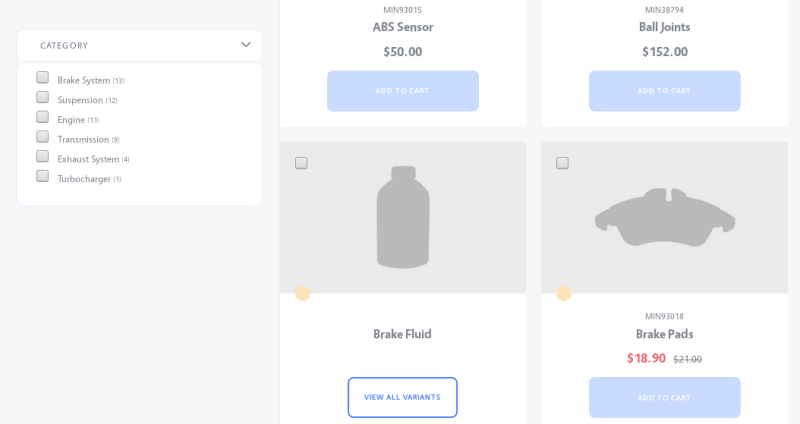
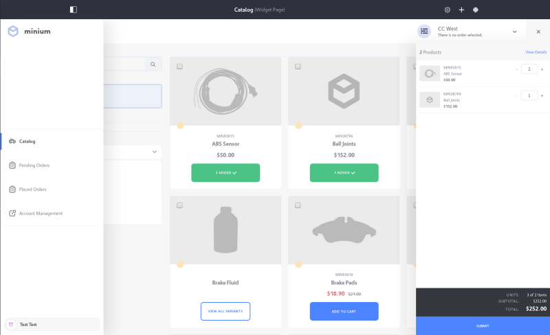
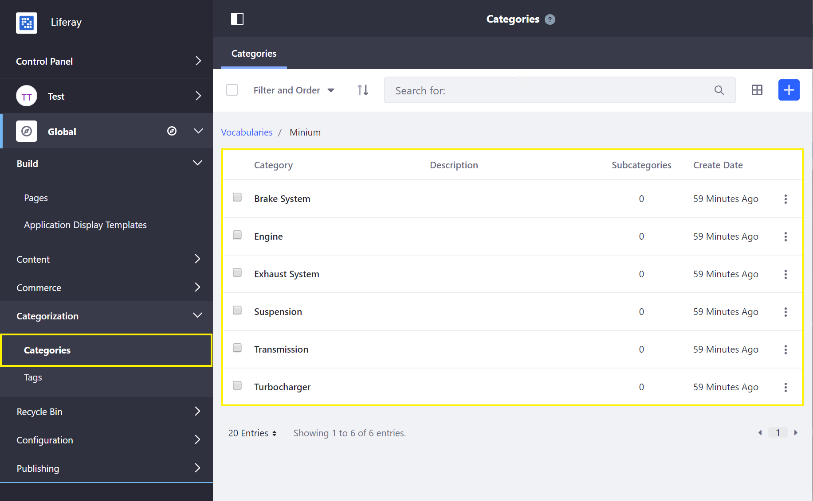
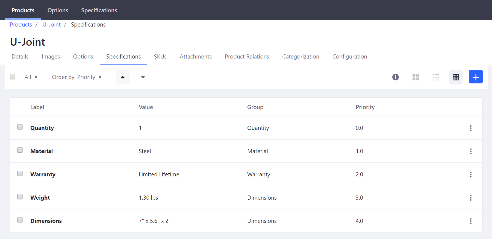
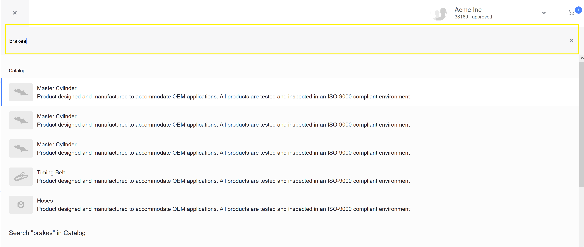

# Using the Minium Accelerator to Jump-Start Your B2B Store

Minium is a Liferay Commerce [Accelerator](./accelerators.md) that quickly and easily sets up a business-to-business (B2B) store designed to meet the needs of a manufacturer, showcasing a modern B2B digital commerce experience. It is designed with features that make the experience as smooth as possible by having elements that are both functional and elegant.

The accelerator accomplishes this by providing the base hierarchy of site pages and design, sample data, and configurations for a site in a single action. Minium also highlights Liferay Commerce's B2B Account Management functionality, enabling streamlined account management and self-service through the use of [Account Roles](../account-management/account-roles.md), [Account Groups](../account-management/creating-a-new-account-group.md), and [Order Workflows](../orders-and-fulfillment/order-workflows.md).

This article serves as a walk-through for the main features of the Minium Accelerator.

## Pages and Design

### Pages

Minium populates a site with several pages and widgets, providing a complete user experience for buyers. To see the full list of pages created, go to *Site Menu → Build → Pages*.

In general, these pages work as their names suggest, with some differences. For example, instead of using a dedicated categories page, the site's homepage displays the entire contents of the catalog. To display products of a single category, select a checkbox in the Category Facet widget.

### Design

The Minium accelerator includes a number of embedded features, including pop-up navigation and cart menus, and an Account selector. The navigation menu provides links to the catalog, pending and past orders, and account management, while the cart menu displays the current order. Lastly, an omni-search bar allows users to find quickly the products they are looking for.

Minium uses a link to the checkout page which is included in the theme-embedded cart menu.

The Account selector displays accounts that the current user can access (administrators can access any account). Once an account is selected, its open orders are displayed. It is very easy for sales agents and buyers who service multiple accounts to switch back and forth between the accounts.

## Catalog Data

Minium's catalog includes a range of sample products organized into several pre-defined categories:

> Note that Categories are defined at the _Global_ scope level. For more information see [Product Categories](../managing-a-catalog/creating-and-managing-products/organizing-your-catalog-with-product-categories.md).

Sample products also come with pre-set [Options](../managing-a-catalog/creating-and-managing-products/customizing-your-product-with-product-options.md), [Specifications](../managing-a-catalog/creating-and-managing-products/specifications.md), and Images.

_The sample data is added for demonstration purposes and can be deleted safely if a store administrator plan to use Minium as a basis for their store site._

## Search

Minium makes it easy for buyers to search the catalog quickly. In addition to the omni-search bar, Minium has a special keyboard shortcut to open the search bar. On the _Catalog_ main page, pressing forward slash (/) will open and focus the Search bar.

## Other Configurations

Minium applies a number of other site configurations that are not set out-of-the-box for a blank site. The following table provides a list of notable additions or configurations that Minium makes to jump-start a B2B store:

| Feature | Details |
| --- | --- |
| [Warehouses](../managing-a-catalog/adding-a-new-warehouse.md) | Italy, United States Northeast, United States Southwest |
| [Site Type](../starting-a-store/sites-and-site-types.md) | B2B |
| [Shipping Method Options](../orders-and-fulfillment/using-the-flat-rate-shipping-method.md) | Standard Delivery, Expedited Delivery |
| Channels | Minium Portal |
| Countries | France, China, United States, and 245 more |
| [Currencies](../starting-a-store/store-administration/adding-a-new-currency.md) | USD, AUD, GBP, and 7 more |
| Default Image | &#10003; |
| [Measurement Units](../orders-and-fulfillment/measurement-units.md) - Dimensions | inches, millimeters, feet, meters |
| [Measurement Units](../orders-and-fulfillment/measurement-units.md) - Weight | ounces, pounds, kilograms, grams |
| [Account Roles](../account-management/account-roles.md) | Buyer, Account Manager, Sales Agent
| Availability Estimates | 3-5 days, 5-7 days, 7-14 days |
| [Product Relation Type](../managing-a-catalog/creating-and-managing-products/related-products-up-sells-and-cross-sells.md) | Up-Sell, Spare, Related, Accessories, Cross-Sell  |
