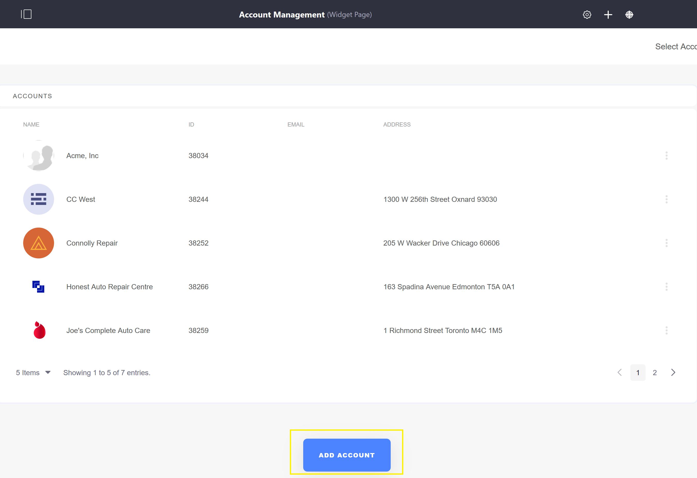
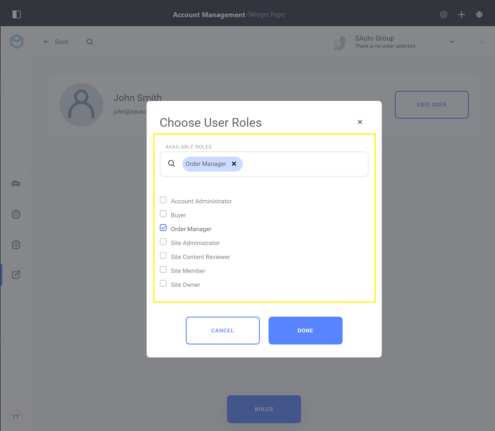

# Introduction to Accounts

In Liferay Commerce, accounts store information about customers and are used to manage and empower business representatives to provide great customer service experiences. Accounts store information including but not limited to: billing address, shipping address, payment information, order information, VAT number (as applicable). There are two types of accounts: Business and Personal. How these accounts function in a store will vary depending on the configured [Site Type](../../../getting-started/site-management-basics/sites-and-site-types/README.md).

## Account Types

* **Business Accounts**: For the _B2B_ site type, an individual customer _must_ be assigned to a _Business_ account in order to make a purchase. Multiple users may be associated with a single business account and these users can be assigned unique [Account Roles](../customers/account-roles.md).

* **Personal Accounts**: For the _B2C_ site type, individual authenticated customers will automatically be associated with a _Personal_ account and be able to make purchases.

  >**Note**: Liferay User Account Profile information is only imported at the time of Personal Account creation, further updates to a Liferay User Account Profile are not propagated to the Personal Account.

## Managing and Empowering Accounts

There are two ways to manage accounts: 1) using the _Account Management_ widget and 2) through the _Control Panel_. Access to the _Control Panel_ is typically restricted to those with administrative permissions for the store or installation.

> Accounts and their associated users may be managed through the _Account Management_ widget.

> Accounts and their associated users may also be managed through the _Accounts_ widget in the _Control Panel_.

Accounts may also be grouped together as needed to facilitate account management or marketing needs. See [Creating a New Account Group](../creating-a-new-account-group/README.md) for more information.

Finally, individual users associated with a given Business Account may be given _Account Roles_ to delegate and self-service their accounts for their business. For more information see [Account Roles](../customers/account-roles.md)

## Common Account Management Actions

See the following articles to learn more about common Account Management actions:

* [Creating a New Account](../creating-a-new-account/README.md)
* [Inviting Users to an Account](../inviting-users-to-an-account/README.md)
* [Assigning Account Roles](../assigning-account-roles/README.md)
* [Adding Addresses to an Account](../customers/adding-addresses-to-an-account.md)
* [Creating a New Account Group](../creating-a-new-account-group/README.md)

## Additional Information

* [Sites and Site Types](../../../getting-started/site-management-basics/sites-and-site-types/README.md)
* [Account Roles](../customers/account-roles.md)
