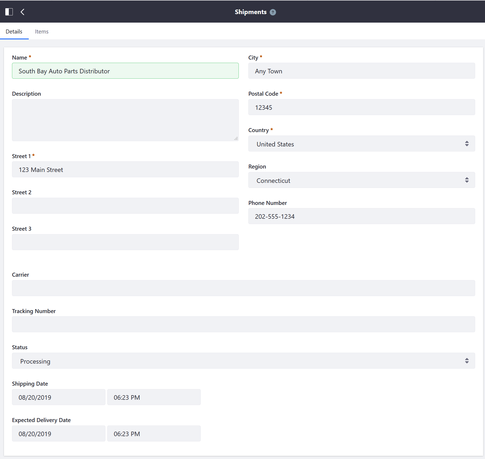

# Creating a Shipment

This article describes how to create a shipment once an order has been received.

## Creating a New Shipment

1. Navigate to the _Control Panel_ → _Commerce_ → _Shipments_.
1. Click the (+) button to add a new shipment.
1. Select an order from the dropdown menu (for example, _41241_).

    

1. Click _Save_.
1. Enter the quantity from the corresponding warehouse.

    

1. Click _Save_.
1. Verify the shipping address.

    

1. Click _Save_.

The new shipment has been created.

Once a shipment has been created, there are several further actions an order manager may do with a shipment.

### Verify the Items

1. Click the _Items_ tab to verify that the items are correct.

    

### Update the Shipping Status

1. Click the _Details_ tab.
1. Enter the name of the carrier in the _Carrier_ field (for example: USPS, FedEx, UPS)
1. Enter the _Tracking Number_.
1. Select a status from the _Status_ dropdown menu (for example: _Ready to be Shipped_).
1. Click _Save_.

The order manager can update the status of the shipment as needed, until the order is completed.

## Additional Information

* [Adding a New Warehouse](../catalog/adding-a-new-warehouse.md)
* [Setting Inventory by Warehouse](../../../../catalog/managing-inventory/setting-inventory-by-warehouse/README.md)
* [Order Life Cycle](../../order-life-cycle/README.md)
* [Order Information](../sales/order-information.md)
