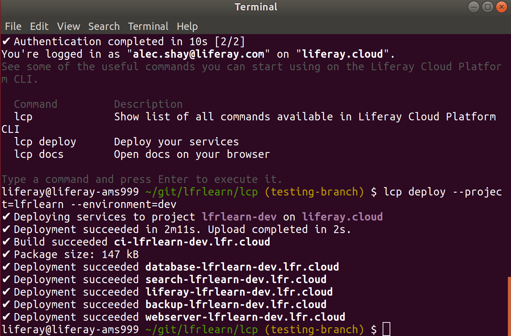
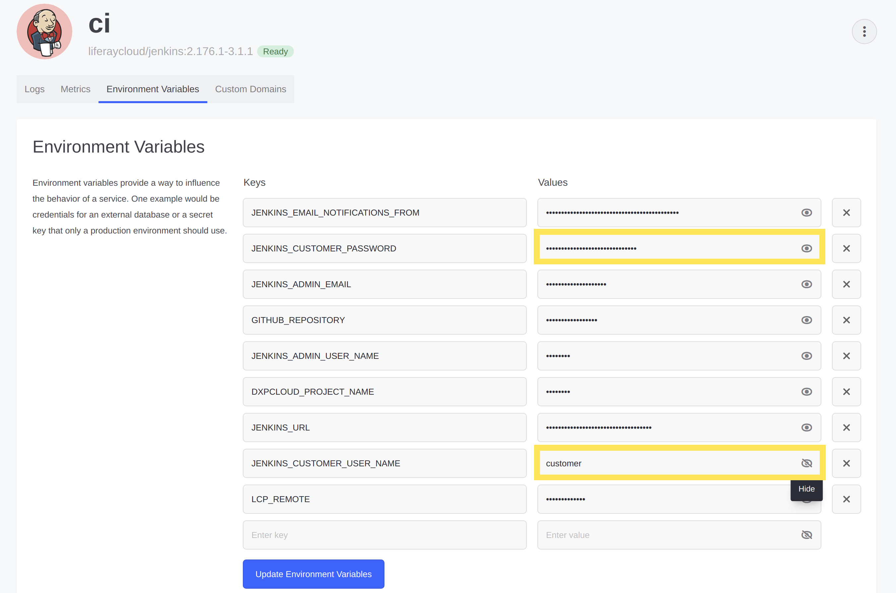

# Deploying Services with the CLI Tool

The following tutorial walks you through deploying services with the Liferay Cloud Platform CLI tool. This example includes the following steps: adding a sample JAR module to the Liferay service in your working repository and deploying your changes to your project's development (`dev`) environment.

Notably, this deployment method skips pushing local changes to a remote repository and using the DXP Cloud console to deploy builds. See [Walking Through the Deployment Life Cycle](./walking-through-the-deployment-life-cycle.md) to learn how to deploy local changes to your project environments via the DXP Cloud console.

```tip::
   In general, pushing to GitHub and using the DXP Cloud console is recommended for deployments.
```

* [Prerequisites](#prerequisites)
* [Adding the Sample Module to Your Working Repository](#adding-the-sample-module-to-your-working-repository)
* [Deploying Your New Build via the CLI Tool](#deploying-your-new-build-via-the-cli-tool)
* [Verifying Your Sample Deployment](#verifying-your-sample-deployment)

## Prerequisites

To get started, you need the CLI tool installed on your device, a local working copy of your project's Git repository, and a sample module compiled into a JAR.

* **Install the CLI Tool**: Ensure the Liferay Cloud Platform CLI tool is installed and ready to use by running `lcp version` in your terminal. If the CLI tool is ready to use, the command returns the CLI version currently installed. If the above command does not return a CLI version, see [Command Line Tool](../reference/command-line-tool.md) for installation instructions.
* **Local Working Repository**: Create a local working copy of your project's central repository. With GitHub, this means creating a forked copy of your project's repository on GitHub and creating a clone of that forked repository on your local device. See [GitHub](https://docs.github.com/en/github/creating-cloning-and-archiving-repositories/cloning-a-repository-from-github), [Bitbucket](https://confluence.atlassian.com/bitbucketserver/clone-a-repository-790632786.html), or [GitLab](https://docs.gitlab.com/ee/university/training/topics/getting_started.html#instantiate-workflow-with-clone) for more information about setting up your local working repository.
* **Sample JAR Module**: Prepare a sample module compiled into a JAR to configure the Liferay DXP service. This tutorial uses the sample "JSP Portlet" module from the [Liferay Blade Samples](https://github.com/liferay/liferay-blade-samples) repository, but you can use any module of your choice. See [Configuring the Liferay DXP Service](../using-the-liferay-dxp-service/configuring-the-liferay-dxp-service.md) for more information about creating your own Liferay service customizations.

### Preparing LCP.json Files in Project Version 3

If you are using version 3.x.x services in your project, then you must first update the `LCP.json` files in your project to deploy using the CLI tool. Otherwise, skip to [the next section](#adding-the-sample-module-to-your-working-repository) to proceed.

Open the `gradle.properties` at the root of your repository, and find properties for the Docker image versions for each of your services, like the following:

```properties
liferay.workspace.lcp.backup.image=liferaycloud/backup:3.2.1
liferay.workspace.lcp.database.image=liferaycloud/database:3.2.1
liferay.workspace.lcp.search.image=liferaycloud/elasticsearch:6.1.4-3.0.3
liferay.workspace.lcp.liferay.image=liferaycloud/liferay-dxp:7.2.10-ga1-3.0.10
liferay.workspace.lcp.webserver.image=liferaycloud/nginx:1.14.2-3.1.1
liferay.workspace.lcp.jenkins.image=liferaycloud/jenkins:2.176.1-3.1.1
```

For each of these properties, copy the value and use it to replace the placeholder value for the `image` property in the corresponding service's `LCP.json` file. This allows the CLI to use the correct Docker images when it searches within the `lcp` directory.

```note::
   The ``liferay.workspace.lcp.jenkins.image`` property corresponds to the ``ci`` service.
```

For example, use the value from the `liferay.workspace.lcp.search.image` property as the new value in `lcp/search/LCP.json` for this line:

```properties
"image": "@liferay.workspace.lcp.search.image@",
```

```important::
   In project version 3, you must also navigate to the `lcp` directory in your repository before running the tool, so that it can traverse the directory and find your services' `LCP.json` files.
```

## Adding the Sample Module to Your Working Repository

The deployment life cycle begins with making and committing changes to your local working repository.

Follow these steps:

1. Run the following command from your local master branch to ensure it is up-to-date with your project's upstream repository.

   ```bash
   git pull upstream master
   ```

1. Create a new working branch based on your up-to-date master branch.

   ```bash
   git checkout -b testing-branch
   ```

1. Copy and add your sample JAR module to the `deploy` folder of your project's development environment using the following path: `liferay/configs/{ENV}/deploy/`.

   ```bash
   cp path-to-module/my-module my-repository-path/liferay/configs/dev/deploy
   ```

1. Add and commit the sample module to your repository with the following command.

   ```bash
   git commit -am "Testing JAR"
   ```

```note::
   If you are using version 3.x.x services, then the appropriate folder path is ``lcp/liferay/deploy/dev``. See `DXP Cloud Project Changes in Version 4 <#project-version-3-differences>`__ for more information on the differences in the directory structure, and `Understanding Service Stack Versions <../reference/understanding-service-stack-versions.md>`__ for how to check the version of your services.
```

## Deploying Your New Build via the CLI Tool

Once the module is added to your local project repository, follow these steps to deploy the Liferay service using the CLI tool.

1. Navigate to the Liferay service folder in your terminal.

   ```bash
   cd <project-folder>/liferay
   ```

   ```note::
      When using the CLI tool, users must deploy each service individually from its folder: ``cd <project-folder>/<service-folder>``.
   ```

1. Run the `lcp login` command to log in to DXP Cloud.

   ```bash
   ? Open your browser and authenticate? (Y/n)
   ```

   Type *Y* to authenticate your login credentials via your browser. If you attempt to deploy to a project environment before logging in, you will be prompted to authenticate your credentials.

1. Run the following commands in sequence to run a gradle build before deploying the Liferay service to the `dev` environment.

   ```bash
   ./gradlew clean deploy createDockerfile
   cp LCP.json build/docker
   cd build/docker
   ```

   ```important::
      While the backup, CI, database, search, and webserver services can be directly deployed using the ``lcp deploy`` command, the liferay service needs to be built before running the ``lcp deploy`` command.
   ```

1. Run the following `lcp deploy` command to deploy your sample Liferay service module to the `dev` environment.

   ```bash
   lcp deploy --project=<project-name> --environment=dev
   ```

   When the command finishes running, the module is copied to the chosen environment and affected services will restart to apply the new module to the Docker images.

   

```tip::
   You can omit the ``--project`` and ``--environment`` parameters from the command usage, as well. Without these parameters, the tool prompts you to enter them while it is running.
```

## Verifying Your Sample Deployment

Once your build has deployed successfully and your services are *Ready*, verify your changes to the Liferay service in your project's `dev` environment.

Follow these steps:

1. Navigate to your `dev` environment.

1. Click on the *Webserver* service in the *Overview* or *Services* page.

1. Click on the webserver URL for your `dev` environment's Liferay DXP instance: `https://webserver-<project-name>-dev.lfr.cloud/`.

   

1. Sign in to your Liferay DXP instance.

   You can find login credentials in the *Environment Variables* tab of the CI service in your project's `infra` environment. Click to view the values for the `JENKINS_CUSTOMER_USER_NAME` and `JENKINS_CUSTOMER_PASSWORD` variables. See [Logging into Your DXP Cloud Services](../getting-started/logging-into-your-dxp-cloud-services.md) for more information.

   

1. Navigate to the *Control Panel* → *Configuration* → *Gogo Shell*.

1. Execute the following command in the *Gogo shell* to confirm your module was deployed.

   ```
   lb | grep "my.module.name"`
   ```

   The output will indicate whether the module is installed.

   

Once you have verified the module deployed successfully, you have completed this tutorial.

## Additional Information

* [Command-Line Tool](../reference/command-line-tool.md)
* [Overview of the DXP Cloud Development Workflow](./overview-of-the-dxp-cloud-deployment-workflow.md)
* [Walking Through the Deployment Life Cycle](./walking-through-the-deployment-life-cycle.md)
* [Starting Module Development](https://help.liferay.com/hc/en-us/articles/360017884192-Starting-Module-Development)
