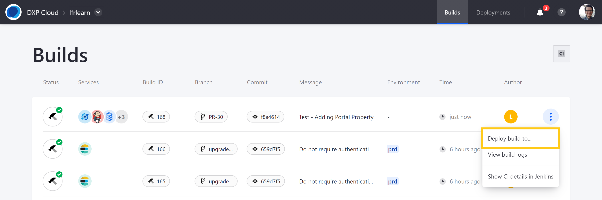

# Overview of the DXP Cloud Deployment Workflow

This article outlines the path developers will take to develop for and deploy to a DXP Cloud project. The development process with DXP Cloud follows three stages:

* [Develop and Configure](#develop-and-configure)
* [Build and Test](#build-and-test)
* [Deploy](#deploy)

## Develop and Configure

Although there are multiple paths for deploying to an environment, all paths begin with adding changes to the GitHub repository [you configured](../getting-started/configuring-your-github-repository.md) with your DXP Cloud project. This repository is used as the basis for any custom additions to a DXP Cloud project, including the Liferay DXP service instance itself.

The repository provides the following:

* Workspace for building Liferay DXP modules, themes, and extensions. 
* Shared version control for configuration and customizations of DXP Cloud services. 
* Single source of truth for DXP Cloud project deployments. 

With the exception of the `common/` directory, changes added to an environment-specific folder (e.g., `dev`, `uat`, `prod`) will _only_ be propagated when deploying to the corresponding environment. Changes added to a `common/` directory will _always_ be deployed, regardless of the target deployment environment. This applies to all subfolders within the `configs/` directory, for all services. See [Deployment](../using-the-liferay-dxp-service/introduction-to-the-liferay-dxp-service.md#deployment-customization-patching-and-licensing) for more information.

### Code Additions

The source for new code additions must be added to folders in the repository's `liferay/` directory: 

* The `modules` folder for new modules
* The `themes` folder for custom themes
* The `wars` folder for exploded WARs 

When the build is deployed, code changes in any of these locations are automatically compiled and added to the Liferay DXP service.

```note::
   If you are still using version 3.x.x services, then these folders are instead located at the root of the repository.
```

### Compiled Additions

You can add compiled files (e.g., pre-built JARs or LPKGs) to a `liferay/configs/{ENV}/deploy/` folder. When the build is deployed to an environment, these files are copied to the corresponding folder within `$LIFERAY_HOME` (depending on the file type). For example, adding a JAR file to `liferay/configs/common/deploy/` will result in the file being copied to `$LIFERAY_HOME/osgi/modules/` for any environment the build is deployed to. 

```note::
   If you are still using version 3.x.x services, then these additions are instead added to the appropriate ``lcp/liferay/deploy/{ENV}`` folder.
```

## Build and Test

The CI service will automatically execute builds for any of the following events: commits are merged into the DXP Cloud repository, pull requests with changes are sent to the repository, or `lcp deploy` is invoked using the Command Line Interface (CLI) to deploy to a DXP Cloud environment. The `CI` service in the `infra` environment can be modified to include additional pipeline steps, including testing. See the article on [Continuous Integration](../platform-services/continuous-integration.md) for more information.

Navigate to the `Builds` tab to see all builds that have been initiated. Pending, passed, or failed builds are all displayed. If the build passes CI, then the Cloud console will offer the option in the UI to deploy the passing build to any applicable environment.



## Deploy

There are two main ways to deploy to services on DXP Cloud: deploying through the CLI, or deploying a successful build from the `Builds` tab in the DXP Cloud Management Console.

### Option 1: Deploying Through the Command Line Interface

The quickest way to deploy services from a repository locally is by using the CLI. See [Using the Command Line Interface](../reference/command-line-tool.md) for more information on setting up the CLI.

After logging in through the CLI, use `lcp deploy` to deploy any additions present in the local repository. The CLI will prompt you to choose one of the environments to deploy to (e.g., `dev`, `uat`, or `prd`). You must have permissions to deploy to the chosen environment for the deployment to be successful.

### Option 2: Deploying From `Builds` in DXP Cloud

Another way to deploy changes is to use a completed build in CI from the DXP Cloud Management Console.

Committed changes to the repository will automatically trigger a new build in CI any time a pull request is sent or merged. This allows changes to be deployed to a testing environment at any point of the review process. See [Continuous Integration](./walking-through-the-deployment-life-cycle.md) for an example tutorial.


## Additional Information

* [Configuring Your GitHub Repository](../getting-started/configuring-your-github-repository.md)
* [Understanding DXP Cloud Environments](../getting-started/understanding-dxp-cloud-environments.md)
* [Using the Command Line Interface](../reference/command-line-tool.md)
* [Walking Through the Deployment Life Cycle](../build-and-deploy/walking-through-the-deployment-life-cycle.md)
