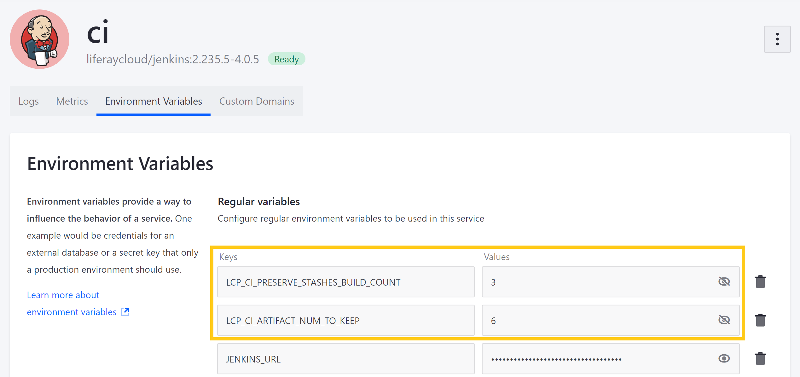
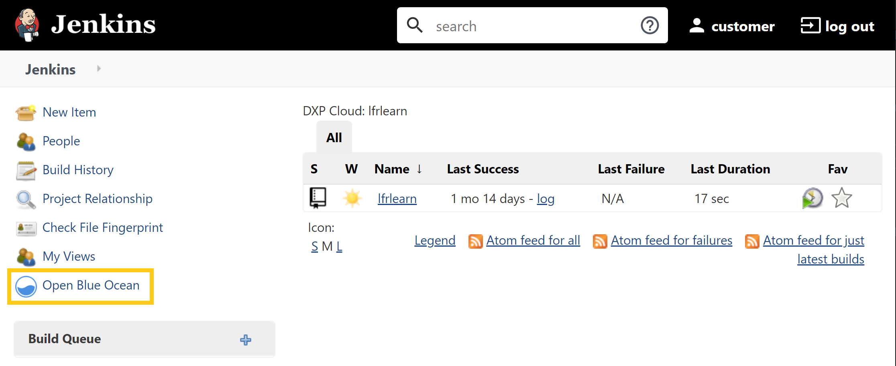
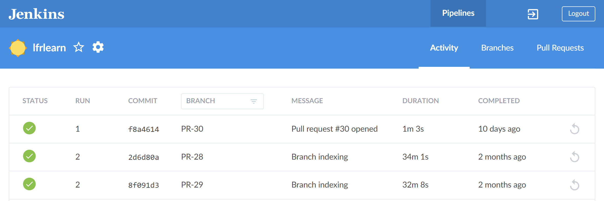
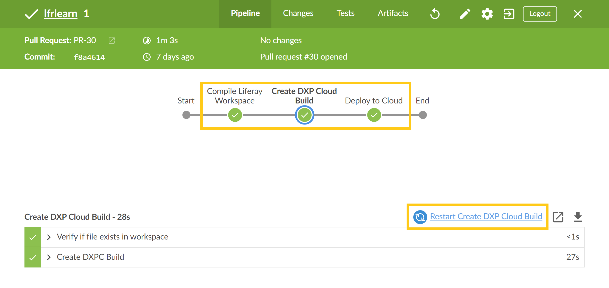
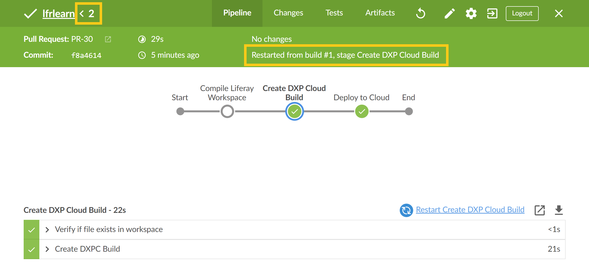

# Restarting Jenkins Stages

With DXP Cloud, you can configure the CI service to preserve Jenkins stashes that you can then use to restart specific stages in a Jenkins build.

## Preserving Jenkins Stashes

Use the following CI service variables to determine the number of completed builds for which stashes and artifacts are preserved:

* `LCP_CI_PRESERVE_STASHES_BUILD_COUNT`
* `LCP_CI_ARTIFACT_NUM_TO_KEEP`

In the following example, stashes are preserved for the last 3 builds, while artifacts are preserved for the last 6.



By default, the `LCP_CI_PRESERVE_STASHES_BUILD_COUNT` value is set to `20`, while the `LCP_CI_ARTIFACT_NUM_TO_KEEP` value is set to `1`. If restarting stages isn't important to you, you can set their values to `0` to prevent the CI from retaining either stashes or artifacts.

```important::
   Stashes cannot be preserved for more builds than allowed by the ``LCP_CI_ARTIFACT_NUM_TO_KEEP`` variable, regardless of the number of builds set for the ``LCP_CI_PRESERVE_STASHES_BUILD_COUNT`` variable.
```

## How to Restart a Jenkins Stage

Follow these steps to restart a Jenkins stage:

1. Access your project's ci page (i.e., `ci-<project>-infra.lfr.cloud`), and click on the *Open Blue Ocean* plugin to view your project's pipelines.

   ```note::
      While pipelines stages can be restarted via the __ <!--w/c--> Jenkins console, the Open Blue Ocean plugin provides a clearer and more intuitive user experience.
   ```

   

1. Select the desired pipeline, and click on the desired build.

   

1. Select the desired stage, and click on *Restart*.

   

   This initiates a new Jenkins run that begins with your selected stage and has the same PR and commit information as the run it is based on. A new description is automatically generated that identifies its preceding run, as well as the name of the restarted stage. You can quickly navigate back to the prior run using the breadcrumb button at the top left of the navigation bar.

   

## Additional Information

* [Continuous Integration](../platform-services/continuous-integration.md)
* [Overview of the DXP Cloud Deployment Workflow](./overview-of-the-dxp-cloud-deployment-workflow.md)
* [Deploying Changes via the CLI Tool](./deploying-changes-via-the-cli-tool.md)
