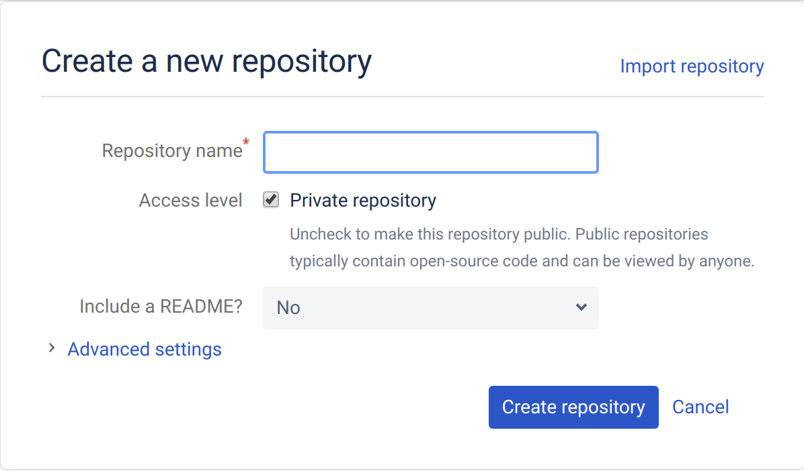
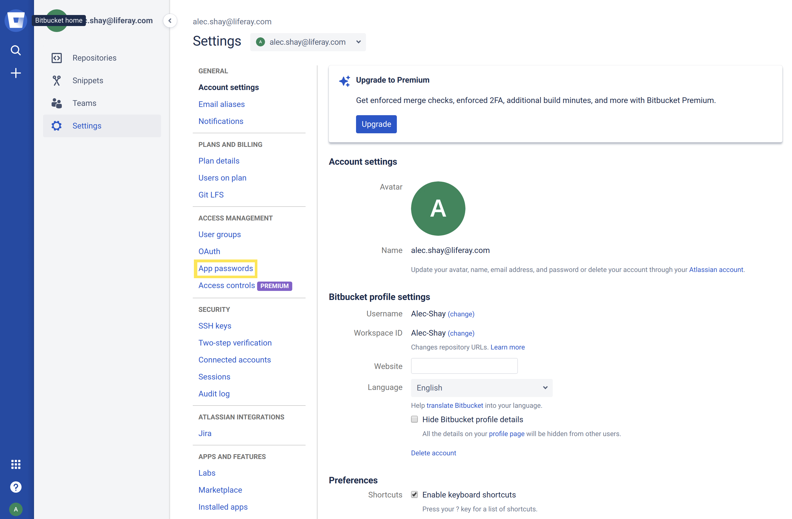
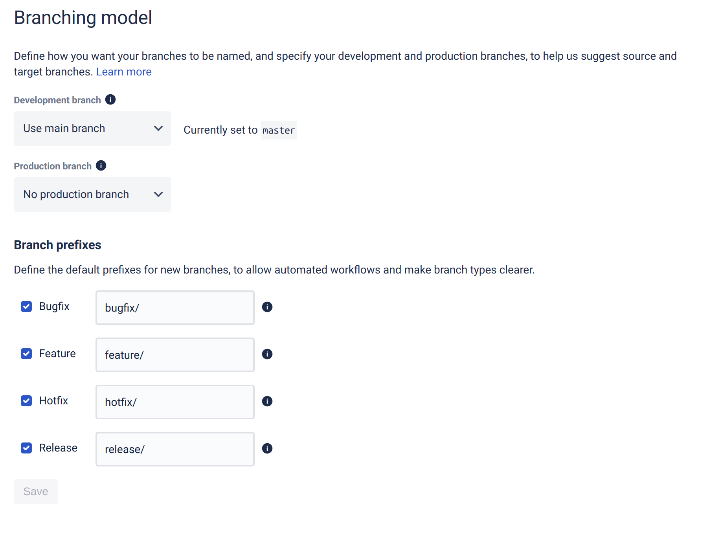
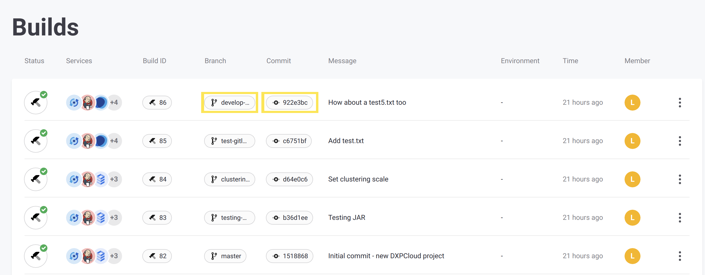

# Configuring Your Bitbucket Repository

Upon receiving a DXP Cloud onboarding email, you're provisioned a GitHub repository hosted in the `dxpcloud` organization. This repository is a template for a team's separate private DXP Cloud development repository and is typically removed after 10 business days. Users must:

1. Transfer the provisioned repository to their own private repository.
1. Integrate their private repository with the Jenkins (CI) service in DXP Cloud using a Webhook.

The provisioned repository will be on GitHub, but you can transfer it to a BitBucket repository as of version 3.2.0 of the Jenkins service.

## Preparing the Jenkins service

If you are using [version 4.x.x services](../reference/understanding-service-stack-versions.md) in your DXP Cloud instance already, then your Jenkins service is already compatible with Bitbucket. See [Upgrading Your DXP Cloud Stack](../reference/upgrading-your-dxp-cloud-stack.md) for more information on upgrading.

If you are using version 3.x.x services, then check the `LCP.json` for your `ci` service, and ensure you're running the following Jenkins service or higher:

```
liferaycloud/jenkins:2.222.1-3.2.0
```

If not, then follow these steps to upgrade:

1. Update the Jenkins service to version `liferaycloud/jenkins:2.222.1-3.2.0`.

1. Delete the `Jenkinsfile` located on the root folder.

1. Add the following environment variable: `LCP_CI_USE_DEFAULT_JENKINSFILE: true`.

1. Deploy the Jenkins service.

```note::
    If you've customized your Jenkinsfile, follow this guide to `extend the Default Jenkinsfile <../platform-services/continuous-integration.md#extending-the-default-jenkinsfile>`__.
```

## Creating a Bitbucket Repository

First, create a new Bitbucket repository.

1. Go to [Bitbucket](https://bitbucket.org).

1. Click the "+" icon in the sidebar under the search icon.

    

1. Click _Repository_ to start creating a new repository.

    

1. Provide a name for the repository.

1. Ensure the access level is set to private.

1. Set _Include a README?_ to _No_.

1. Click _Create repository_.

## Transferring from GitHub to Bitbucket

Follow these steps to transfer the provisioned GitHub repository to your own Bitbucket repository:

1. Clone the provisioned GitHub repository locally:

    ```git clone git@github.com:dxpcloud/example.git```

    ```note::
       If you have already cloned the repository for work with another provider, then you can skip this step and work within the same clone.
    ```

1. Add a new Git remote and point to Bitbucket:

    ```git remote add bitbucket git@bitbucket.org:example/example.git```

1. Push the cloned repository to the new remote repository:

    ```git push bitbucket master```

If you need help creating, cloning, and pushing repositories, see [Bitbucket's documentation](https://confluence.atlassian.com/bitbucket/create-a-git-repository-759857290.html).

## Generating App Password for BitBucket

Next, create an app password that will be used by the Webhook to authenticate with Bitbucket and trigger Jenkins builds. The Bitbucket user that generates the app password **must** have admin-level access to the repository.

Perform the following steps to generate an app password:

1. From your user settings page, under _Access Management_ click _App passwords_.

    

1. Click _Create app password_.

    

1. Provide a label for the app password.

1. Grant the app the following permissions:

    * `Pull request - read, write` (this should also flag Repositories - read, write)
    * `Webhooks -  read, write`

1. Click _Create_.

1. Copy the app password (you won't see it again otherwise). This is BitBucket's equivalent of a personal access token.

```important::
   The user that generated the app password must use their username for the ``LCP_CI_SCM_USERNAME`` environment variable.
```

## Checking Branch Types and Prefixes

In order for DXP Cloud to be able to properly link to your branches, you must provide it with a complete list of the branch prefixes in use in your repository. Each of the branch types used in your repository has its own prefix, which is defined in the repository's settings.

On [the Bitbucket website](https://bitbucket.org), click _Repository settings_ &rarr; _Branching model_ from the menu on the left. This brings you to the _Branching model_ page, where the prefix for each of your branches is listed. Take note of each of these prefixes to add them to the `LCP_CI_SCM_BITBUCKET_BRANCH_PREFIXES` CI environment variable.



## Connecting BitBucket to Your Jenkins service

Lastly, set environment variables in the Jenkins service's to point to your new repository:

1. Log in to the DXP Cloud Console and navigate to your Jenkins service in the `infra` environment.

1. Navigate to the _Environment Variables_ tab.

1. Configure the following environment variables:

| Name | Value |
| ---  | ---   |
| `LCP_CI_SCM_PROVIDER` | bitbucket  |
| `LCP_CI_SCM_REPOSITORY_OWNER` | [repo owner] |
| `LCP_CI_SCM_REPOSITORY_NAME` | [repo name] |
| `LCP_CI_SCM_TOKEN` | [app password] |
| `LCP_CI_SCM_USERNAME` | [auth username] |
| `LCP_CI_SCM_BITBUCKET_BRANCH_PREFIXES` | [list of prefixes] |

Define `LCP_CI_SCM_USERNAME` as the user that [generated the app password](#generating-app-password-for-bitbucket). Define `LCP_CI_SCM_BITBUCKET_BRANCH_PREFIXES` as a list of all [prefixes used in your repository's branches](#checking-branch-types-and-prefixes), separated by spaces.

After updating these environment variables, the Jenkins service will restart. Any pushed branches and pull requests in your new repository should now trigger.

## Connecting to a Private Bitbucket Server

To use a private Bitbucket server, you must set an additional environment variable in your Jenkins service:

| Name | Value |
| ---  | ---   |
| `LCP_CI_SCM_SERVER_HOST` | [private host URL] |

Set the `LCP_CI_SCM_SERVER_HOST` variable to the base URL of your private Bitbucket server (for example, `http://private.bitbucket.org/`). This sets the server URL that CI uses to retrieve your code base when generating builds and linking to your repository's branches. By default, CI uses `https://bitbucket.org/` as the base URL for Bitbucket.

## Verifying Builds

Pushed branches and pull requests trigger builds that you can see or deploy from the _Builds_ tab in the DXP Cloud Console. After setting up integration with the Jenkins service, a good next step is to verify these builds, to ensure that the integration was successful.

### Verifying Builds from Pushed Branches

Verify that new Git pushes trigger Jenkins builds:

1. Make a change to the repository (like adding a file), then commit it to the branch:

    ```bash
    git commit -m "Add file to test builds"
    ```

1. Push the branch up to BitBucket:

    ```bash
    git push bitbucket branch-name
    ```

1. Navigate to the _Builds_ page in the DXP Cloud Console.

1. Verify that the build displays for the pushed branch on the _Builds_ page.

### Verifying Builds from Pull Requests

Verify that new pull requests trigger Jenkins builds:

1. Create a pull request from any branch to the `develop` branch.

1. Verify that a new build is created for the pull request.

1. Navigate to the _Builds_ page in the DXP Cloud Console.

1. Click the links for the branch and commit in the appropriate build.

    

1. Verify that the links redirect to the correct BitBucket pages.

## Additional Information

* [Configuring Your GitHub Repository](./configuring-your-github-repository.md)
* [Configuring Your GitLab Repository](./configuring-your-gitlab-repository.md)
