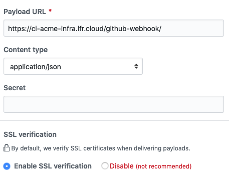
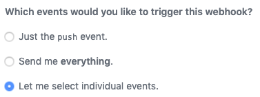
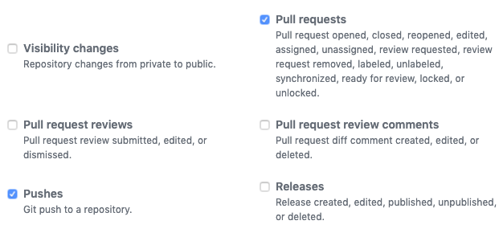

# Configuring Your Github Repository

Upon receiving a DXP Cloud onboarding email, you're provisioned a GitHub repository hosted in the `dxpcloud` organization. This repository should be used as a template for a team's separate private DXP Cloud development repository and is typically removed after 10 business days. Users are expected to:

1. Transfer the initial provisioned repository to their own private GitHub repository. 
1. Integrate that repository with the Jenkins (CI) service in DXP Cloud using a Webhook. 

## Transferring the Repository

Follow these steps to transfer the initial repository to your own GitHub 
repository: 

1. Create a new private GitHub repository. 
1. Clone your initial `dxpcloud` repository locally. 
1. Push the cloned repository from step two to the remote repository you 
    created in step one. 

If you need help creating, cloning, and pushing GitHub repositories, see 
[GitHub's documentation](https://help.github.com). 

## Integrating with the Jenkins Service

Now you must integrate your new repository with the Jenkins service in DXP 
Cloud. To do this, you must set up a webhook in GitHub that pushes to the 
Jenkins service: 

1. In GitHub, go to your repository's *Settings* page and select *Webhooks*. 
1. Click *Add Webhook*. This opens the *Add webhook* form. 
1. In the *Payload URL* field, add the domain of your DXP Cloud `infra` 
    environment's Jenkins service. For example, the URL of the `infra` 
    environment's `ci` service for a project named `acme` is 
    `https://ci-acme-infra.lfr.cloud/github-webhook/`. Note that the relative 
    path `github-webhook` is required to integrate with the Jenkins GitHub 
    plugin. 
1. In the *Content type* selector menu, select *application/json*. 
1. Leave the *Secret* field blank and ensure that *Enable SSL verification* is 
    selected. 

    

1. Under *Which events would you like to trigger this webhook?*, select 
    *Let me select individual events*. A list of events then appears. 

1. Select *Pushes* and *Pull Requests* from the list of events. 

    

    

1. Make sure *Active* is selected, then click *Add webhook*. 

    

### Setting Environment Variables

Lastly, you must set two environment variables in the Jenkins service's 
`LCP.json` to point to your new repository: 

Name | Default Value | Description |
| --- | --- | --- |
| `GITHUB_REPOSITORY` |   | Point to your new GitHub repository (remote) |
| `GITHUB_TOKEN` |   | Point to a personal access token that you created for your GitHub organization. For instructions on creating and accessing this token, see [GitHub's documentation](https://help.github.com/articles/creating-a-personal-access-token-for-the-command-line). |

After updating these environment variables, deploy a new build with the changes. 
Any pushed branches and pull requests in your new repository should now trigger 
a Jenkins build. 
