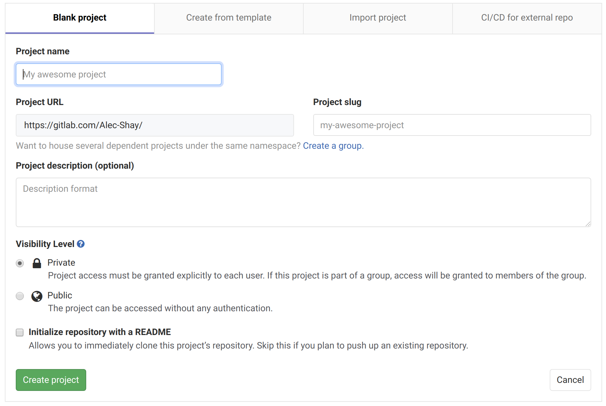
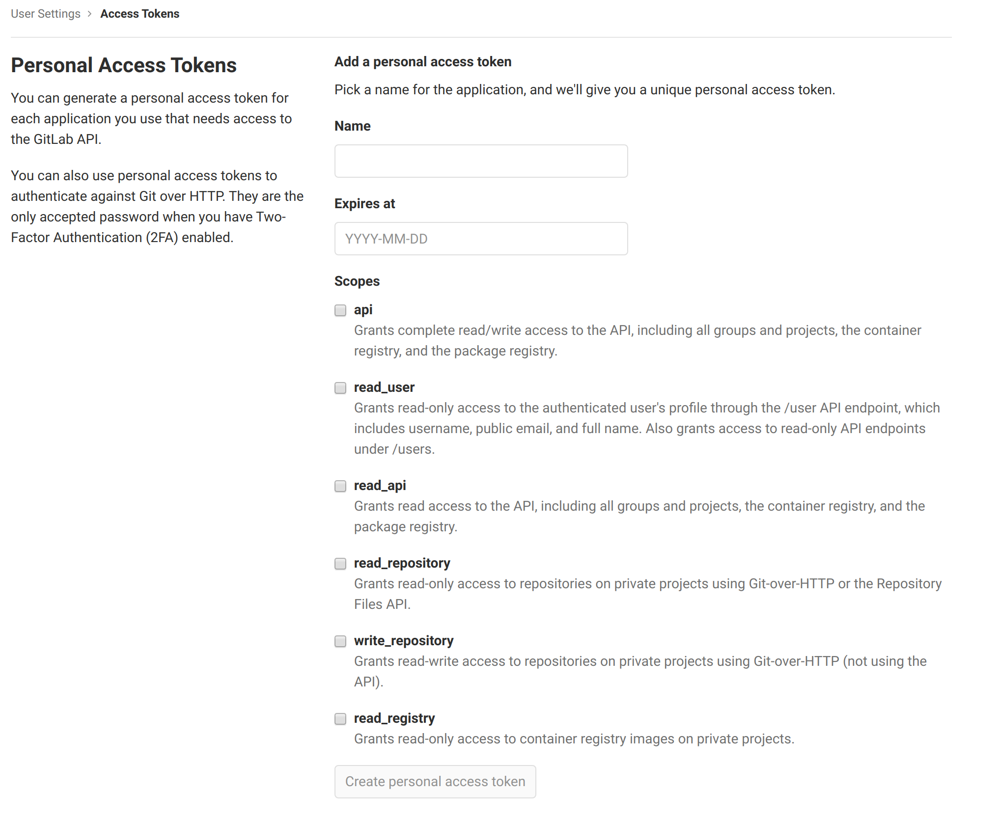
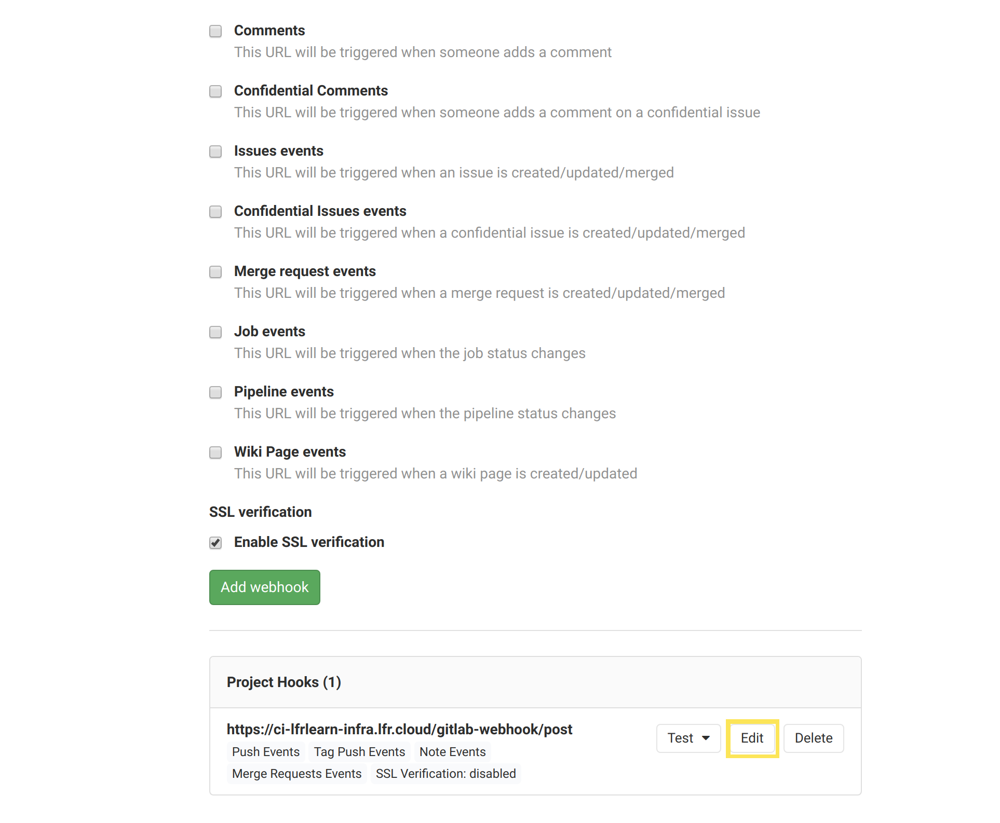
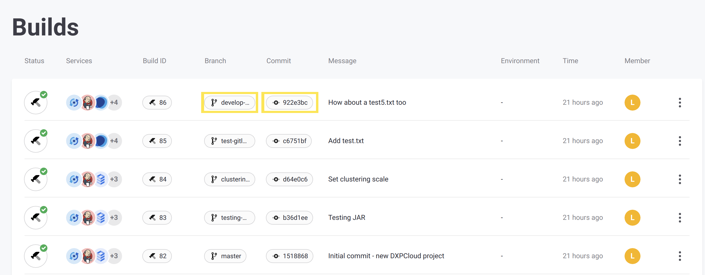

# Configuring Your GitLab Repository

Upon receiving a DXP Cloud onboarding email, you're provisioned a GitHub repository hosted in the `dxpcloud` organization. This repository is a template for a team's separate private DXP Cloud development repository and is typically removed after 10 business days. Users must:

1. Transfer the provisioned repository to their own private repository.
1. Integrate their private repository with the Jenkins (CI) service in DXP Cloud using a Webhook.

The provisioned repository will be on GitHub, but you can transfer it to a GitLab repository as of version 3.2.0 of the Jenkins service.

## Preparing the Jenkins Service

If you are using version 4.x.x services in your DXP Cloud instance already, then your Jenkins service is already compatible with GitLab. See [Upgrading Your DXP Cloud Stack](../reference/upgrading-your-dxp-cloud-stack.md) for more information on upgrading.

If you are using version 3.x.x services, then check the `LCP.json` for your `ci` service, and ensure you're running the following Jenkins service or higher:

```
liferaycloud/jenkins:2.222.1-3.2.0
```

If not, then follow these steps to upgrade:

1. Update the Jenkins service to version `liferaycloud/jenkins:2.222.1-3.2.0`.

1. Delete the `Jenkinsfile` located on the root folder.

1. Add the following environment variable: `LCP_CI_USE_DEFAULT_JENKINSFILE: true`.

1. Deploy the Jenkins service.

```note::
    If you've customized your Jenkinsfile, follow this guide to `extend the Default Jenkinsfile <../platform-services/continuous-integration.md#extending-the-default-jenkinsfile>`__.
```

## Creating a GitLab Repository

First, create a new GitLab repository:

1. Go to [GitLab](https://gitlab.com).

1. Click _New project_.

    

1. Provide a project slug (the repository name in the url).

    

1. Configure the visibility level to private (free users have unlimited private repositories).

1. Ensure _Initialize repository with a README_ is unchecked.

1. Click _Create project_.

## Transferring from GitHub to GitLab

Follow these steps to transfer the provisioned GitHub repository to your own GitLab repository:

1. Clone the provisioned GitHub repository locally:

    ```git clone git@github.com:dxpcloud/example.git```

    ```note::
       If you have already cloned the repository for work with another provider, then you can skip this step and work within the same clone.
    ```

1. Add a new Git remote and point to GitLab:

    ```git remote add gitlab git@gitlab.com:USERNAME/REPOSITORYNAME.git```

1. Push the cloned repository to the new remote repository:

    ```git push gitlab master```

If you need help creating, cloning, and pushing repositories, see [GitLab's documentation](https://docs.gitlab.com/ee/gitlab-basics/start-using-git.html).

## Generating Access Tokens for GitLab

Next, create an access token that will be used by the Webhook to trigger Jenkins builds:

1. Navigate to the [personal access tokens page](https://gitlab.com/profile/personal_access_tokens).

    

1. Provide a name and an expiration date for this access token.

1. Configure the access token to have the following permissions:

    * api
    * read_repository
    * write_repository

1. Click _Create personal access token_.

1. Copy your access token and save it somewhere (you won't see it again otherwise).

## Connecting GitLab to Your Jenkins service

Lastly, set environment variables in the Jenkins service's to point to your new repository:

1. Log in to the DXP Cloud Console and navigate to your Jenkins service in the `infra` environment.

1. Navigate to the _Environment Variables_ tab.

1. Configure the following environment variables:

| Name | Value |
| ---  | ---   |
| `LCP_CI_SCM_PROVIDER` | gitlab  |
| `LCP_CI_SCM_REPOSITORY_OWNER` | [repo_owner] |
| `LCP_CI_SCM_REPOSITORY_NAME` | [repo_name] |
| `LCP_CI_SCM_TOKEN` | [access_token] |

After updating these environment variables, the Jenkins service will restart. Any pushed branches and pull requests in your new repository trigger builds.

## Additional GitLab Webhook Configurations

Liferay DXP Cloud's Jenkins service creates a webhook for your selected git SCM provider; however, it only creates the default one. GitLab's default webhook requires additional configuration to match the functionality of GitHub and BitBucket's webhooks.

1. Navigate to your GitLab repository.

1. Navigate to _Settings_ and select _Webhooks_.

1. Under _Project Hooks_, verify the created webhook is listed.

1. Click the _Edit_ button for the CI webhook.

    

1. Uncheck _Tags push events_ and _Comments_.

1. Check _Enable SSL verification_.

1. Click _Save changes_.

## Verifying Builds

Pushed branches and merge requests (GitLab's equivalent of pull requests) trigger builds that you can see or deploy from the _Builds_ tab in the DXP Cloud Console. After setting up integration with the Jenkins service, a good next step is to verify these builds, to ensure that the integration was successful.

### Verifying Builds from Pushed Branches

Verify that new Git pushes trigger Jenkins builds:

1. Make a change to the repository (like adding a file), then commit it to the branch:

    ```bash
    git commit -m "Add file to test builds"
    ```

1. Push the branch up to GitLab:

    ```bash
    git push gitlab branch-name
    ```

1. Navigate to the _Builds_ page in the DXP Cloud Console.

1. Verify that the build displays for the pushed branch on the _Builds_ page.

### Verifying Builds from Merge Requests

Verify that new merge requests trigger Jenkins builds:

1. Create a merge request from any branch to the `develop` branch.

1. Verify that a new build is created for the merge request.

1. Navigate to the _Builds_ page in the DXP Cloud Console.

1. Click the links for the branch and commit in the appropriate build.

    

1. Verify that the links redirect to the correct GitLab pages.

## Additional Information

* [Configuring Your BitBucket Repository](./configuring-your-bitbucket-repository.md)
* [Configuring Your GitHub Repository](./configuring-your-github-repository.md)
