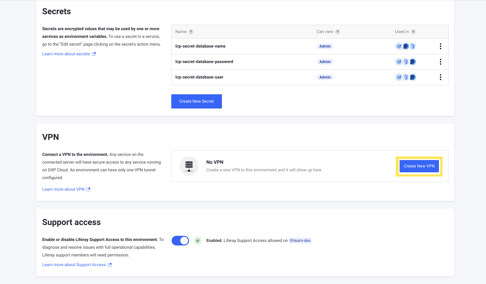
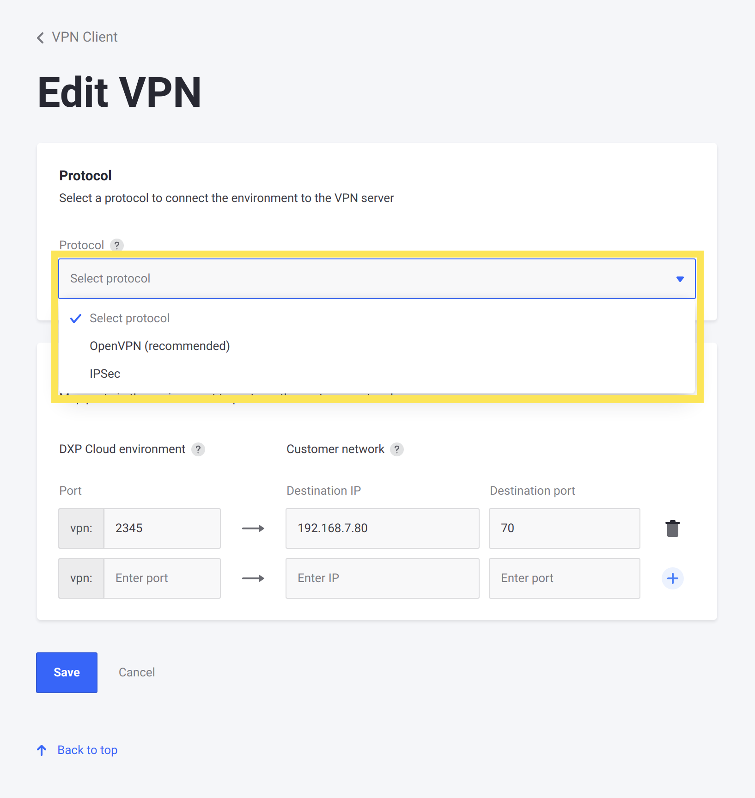
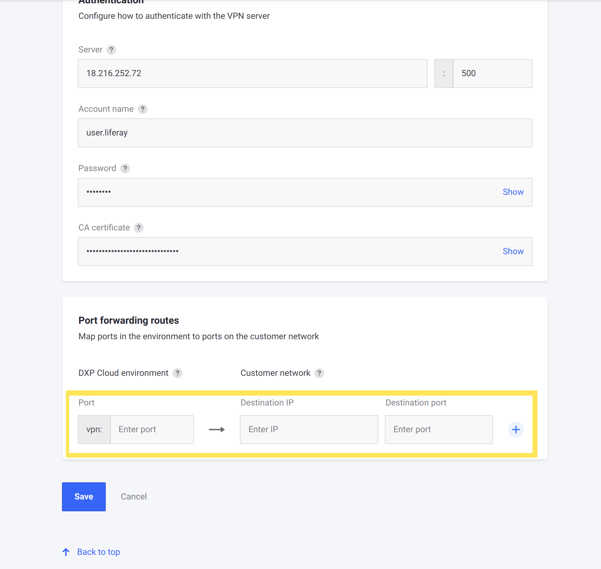
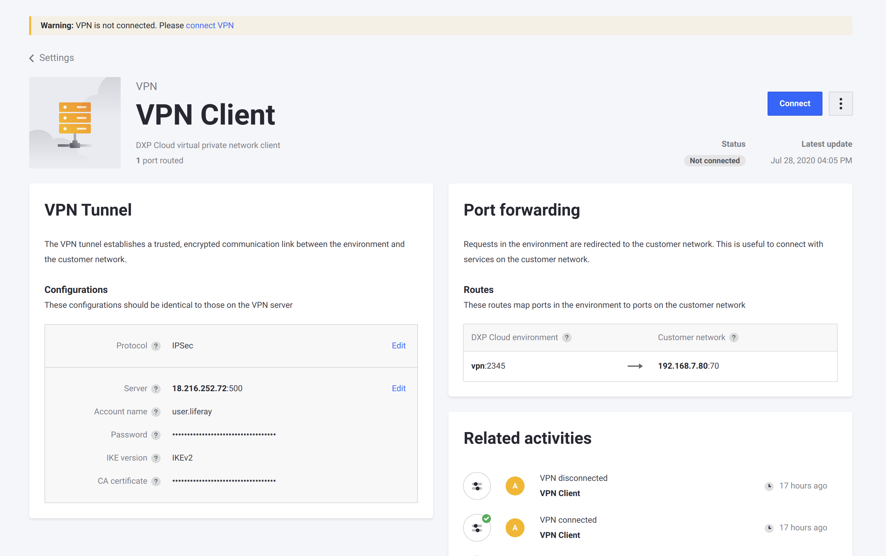
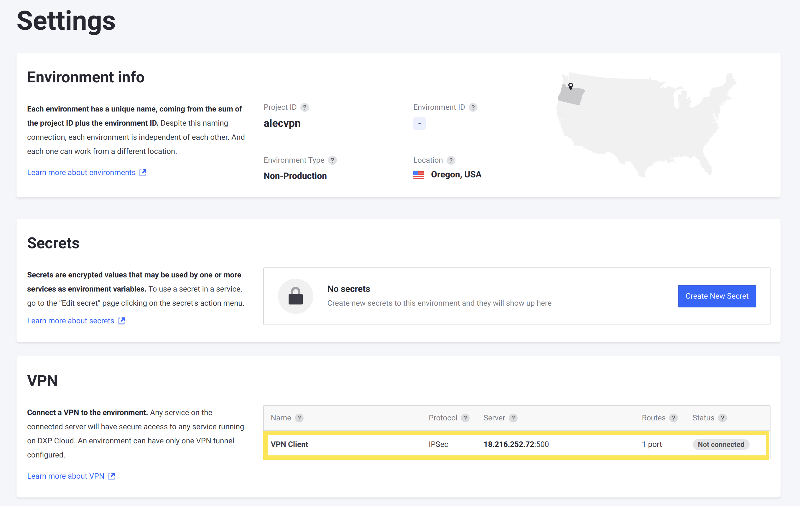
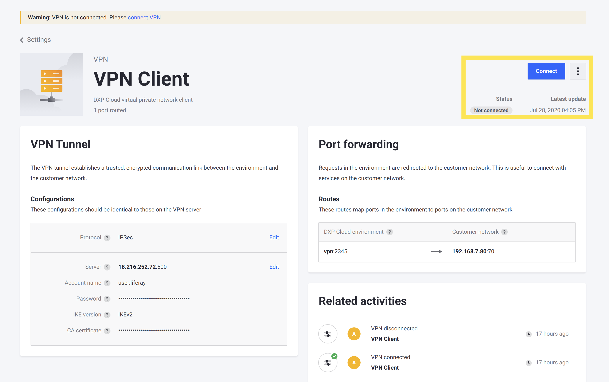
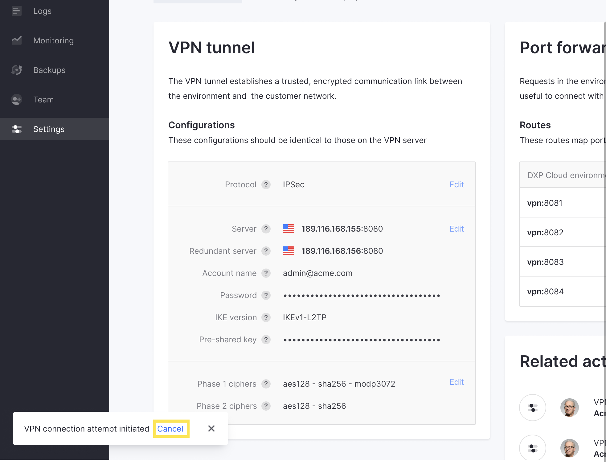
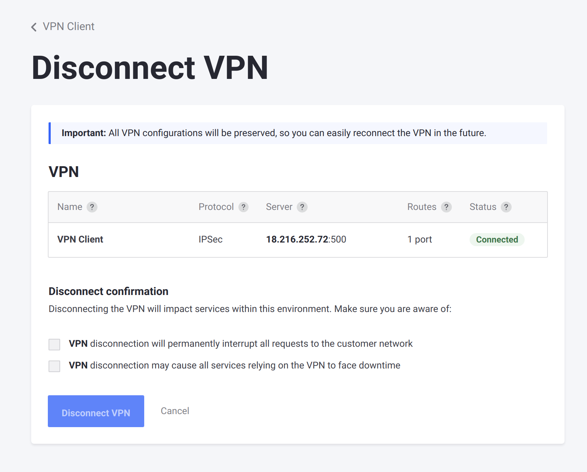

# Connecting a VPN Server to DXP Cloud

You can use DXP Cloud's VPN feature to connect your DXP Cloud services to external services on private networks. This allows you to operate an external system with the Cloud environment as though they exist within the same network.

For example, you may need to connect your DXP Cloud services to directories or applications that are only accessible on a company VPN. You'll learn how to do this here.

## Creating a VPN Configuration

1. Go to your environment's *Settings* tab.

1. Scroll down to the VPN section of the page and click _Create New VPN_.

    

1. Select the connection protocol to use. Here are the supported protocols:

    * [OpenVPN](https://openvpn.net)

    * [IPSec](https://www.cloudflare.com/learning/network-layer/what-is-ipsec/)

    

    Selecting a protocol reveals the required fields to connect with it below.

1. Fill in the VPN's required fields:

    * **Server**: The server's IP address.

    * **Port**: The VPN's local port number.

    * **Account Name**: The administrator's email address.

    * **Password**: The administrator's password.

    * **IKE Version**: The VPN's Internet Key Exchange version. This field only appears when _IPSec_ is selected as the protocol. The supported IKE versions are _IKEv2_ and _IKEv1-L2TP_.

    * **Certificate**: The certificate code.

1. Enter one or more port forwarding routes for your VPN connection. Fill in the required fields for each route:

    * **Forwarded Port**: The port number within the DXP Cloud environment to forward.

    * **Destination IP**: The IP address of the customer network interfacing with the VPN.

    * **Destination Port**: The port of the customer network interfacing with the VPN.

    

    ```tip::
       Add more port forwarding routes by clicking the + icon on the right side. Remove added routes by clicking the Trash icon to the side of the existing route.
    ```

1. Click *Create VPN*.

The VPN configuration has been created. However, the VPN is not connected until you manually connect it from the VPN details page.

## Managing Your VPN Configuration

Once you have created your VPN configuration, you can view the status of the connection and configuration details, edit the configuration, and connect or disconnect from the details page.



Navigate to your environment's _Settings_ page and then click on the configured VPN connection to get to the details page.



```note::
   The status of the VPN (connected or not connected) is visible both from the VPN details page, as well as the VPN section of the `Settings` page of your environment.
```

### Connecting and Disconnecting the VPN

The VPN details page indicates whether or not the VPN is already connected in the top-right corner. If the VPN is not connected, then click the _Connect_ button to establish the connection.



The VPN attempts to connect after clicking the button. If the connection fails, then the failed attempt displays in the _Related Activities_ section of the details page.

```tip::
   You can manually test the connectivity of your services to an IP address through your VPN by using the service's `shell <../../troubleshooting/shell-access.md>`__ to run a command like the following: ``curl -v [address]``.
```

To disconnect the VPN, click _Disconnect_ from the top-right Actions menu. This takes you to the _Disconnect VPN_ page.

```warning::
   Disconnecting the VPN will interrupt communications with any external services with DXP Cloud.
```



Check the boxes confirming the impact of disconnecting the VPN, and then click _Disconnect VPN_ to immediately disconnect it. Once the VPN is disconnected, the configuration can be changed again.

### Editing the Configuration

You can change any details of the VPN configuration (including forwarding ports) after it has been created **as long as the VPN is not currently connected**. If the VPN is connected, then [disconnect it](#connecting-and-disconnecting-the-vpn) before editing the configuration.

To edit the configuration, go to the environment's details page, and then _Edit..._ from the top-right Actions menu. This displays the same screen as creating the VPN configuration for the first time.



## Additional Information

* [VPN Integration Overview](./vpn-integration-overview.md)
* [Configuring a VPN Server](./configuring-a-vpn-server.md)
* [Shell Access](../../troubleshooting/shell-access.md)