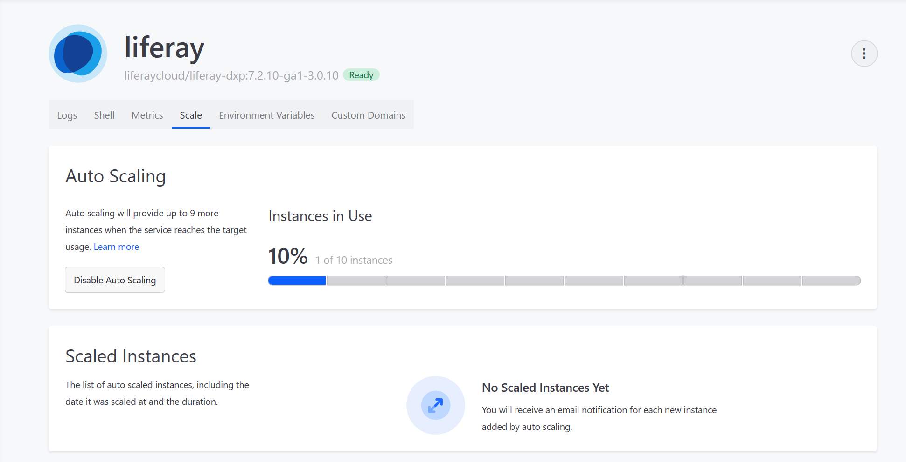

# Auto-scaling

Liferay DXP Cloud's auto-scaling feature automatically creates and destroys instances of the DXP service as needed to optimize performance. This addresses sudden changes such as increased server traffic, memory leaks, or other issues. By default, this feature is *disabled* in every DXP Cloud account.

Using this feature, a service can automatically increase (upscale) the number of Liferay DXP instances to a maximum of 10, or decrease (downscale) to the number specified in the `scale` property in [`LCP.json`](../reference/configuration-via-lcp-json.md). The `scale` property specifies the minimum number of instances to run:

```json
  "scale": 2,
```

> **Note:** Currently, auto-scaling is only available for the Liferay DXP service in production environments.
> **Note:** For more information on how auto-scaling is charged, see [How Auto-scaling is Charged](https://help.liferay.com/hc/en-us/articles/360030843592-How-Auto-Scaling-is-charged-).

## Managing Auto-scaling

Follow these steps to enable or disable auto-scaling in the DXP Cloud Management Console:

1. Navigate to the production environment.
1. Navigate to *Services* &rarr; *Liferay* &rarr; *Scale*.
1. If auto-scaling is disabled, click *Enable Auto Scaling* to enable it. If auto-scaling is already enabled, click *Disable Auto Scaling* to disable it.

With auto-scaling enabled, DXP Cloud monitors your service and scales it automatically according to predefined thresholds.



## Specifying Target Average Utilization

System administrators can specify a *target average utilization*. This value is an average of memory and CPU usage across Liferay DXP services. That value threshold must be crossed before auto-scaling is triggered.

For example, if three service instances utilize 70%, 90%, and 95% of memory, respectively, then the average memory utilization is 85%. If the target average
utilization is set to 90, then no upscaling is needed; upscaling in this situation only occurs when the average memory utilization exceeds the target.

The total available memory is specified by the `memory` property in `LCP.json`, as referenced in [Configuration via LCP.json](../reference/configuration-via-lcp-json.md). 

Specify the target average utilization in the `autoscale` property of the service's `LCP.json`:

```json
"autoscale": {
    "cpu": 80,
    "memory": 90
}
```

If the `autoscale` property isn't set, the target average utilization defaults to 80 for both CPU and memory utilization.

## Handling Activation Keys

The Liferay DXP Cloud team resolves all DXP Activation Keys issues; the team adds new keys and removes old ones as needed for auto-scaling.
