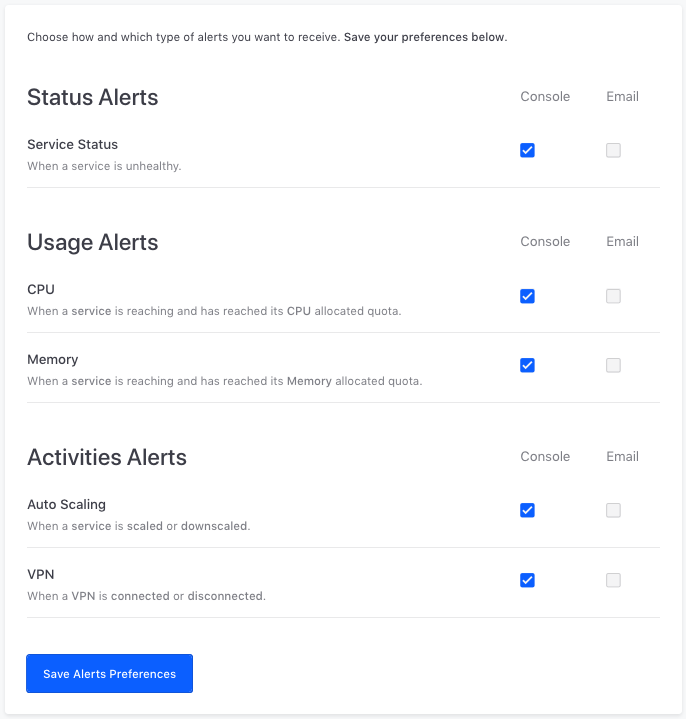

# Real-Time Alerts

Liferay DXP Cloud can alert system administrators of unexpected behaviors in a 
project. Unexpected behaviors include (but are not limited to) auto-scaling events, 
higher than expected memory consumption, CPU reaching an allotted quota, or 
database connection issues. Here, you'll learn how to configure and view alerts. 

## Alert Preferences

You can configure your alert preferences via the DXP Cloud management console. 
Follow these steps to do so: 

1. Click your profile photo at the top-right corner of the navigation bar and 
    select *Alerts Preferences*. 
1. For each alert, select the checkbox for how you wish to receive it (console 
    and/or email). To disable an alert, unselect all its checkboxes. 
1. Click *Save Alerts Preferences* when you're finished. 

## Alerts Page

You can access Alerts delivered to your console from the *Alerts* page. To 
access this page, click the bell icon in the top navigation bar. A table shows 
the following information for each alert: 

* **Status:** The alert's current state. Each alert is triggered by a specific 
    event. If the event is still happening, its alert status is *Ongoing*. If 
    the event is finished, the alert status is *Resolved*. 
* **Started at:** The time the alert began. 
* **Duration:** How long the alert lasted. 

You can perform the following actions via the buttons above the table: 

* **Unread alerts/All alerts:** View only unread alerts, or all alerts.
* **All environments/other environments:** Filter alerts by environment.
* **Mark all as read:** Mark all alerts as read. 
* **Alerts Preferences:** Go to your alert preferences page. 

