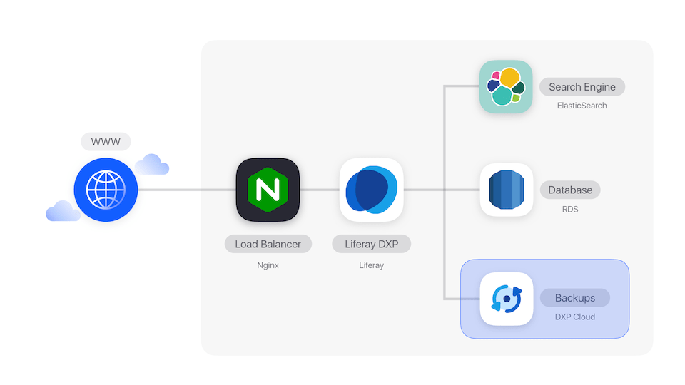
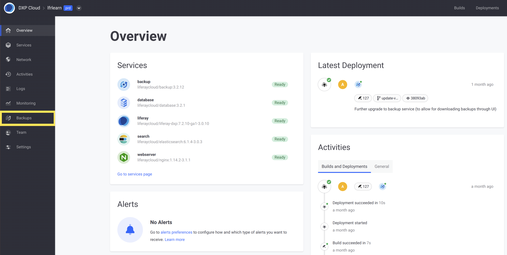

# Backup Service

The backup service creates regular backups of your Liferay DXP database and 
Document Library. Here, you'll learn how to configure the backup service to your 
needs: 

* [Scheduling](#scheduling)
* [Backup APIs](#backup-apis)
* [Environment Variables Reference](#environment-variables-reference)

For instructions on creating and restoring backups manually, see 
[Backup and Restore](./backup-and-restore.md). 



## Scheduling

You can customize the backup service's scheduling via 
[cron scheduling syntax](https://crontab.guru/). 
Scheduling can be used for these variables: 

* `LCP_BACKUP_CREATE_SCHEDULE`
* `LCP_BACKUP_CLEANUP_SCHEDULE`

### Customizing Scheduling

Use this syntax to create a customized schedule: 

    * * * * *
    ┬ ┬ ┬ ┬ ┬
    │ │ │ │ │
    │ │ │ │ └ day of week (0 - 7) (0 or 7 is Sun)
    │ │ │ └───── month (1 - 12)
    │ │ └────────── day of month (1 - 31)
    │ └─────────────── hour (0 - 23)
    └──────────────────── minute (0 - 59)

For example, the following runs a backup every 12 hours (12AM and 12PM): 

    0 0,12 * * *

### Scheduling Syntax Shorthand

Use the following shorthand syntax for common use cases: 

`@yearly`: Run at the start of every year. 

`@monthly`: Run at the start of every month. 

`@weekly`: Run at the start of every week. 

`@daily`: Run at the start of every day. 

`@hourly`: Run at the start of every hour. 

## Backup APIs

The backup service has APIs that you can use to download and upload backups. You 
can invoke these APIs using a command line tool such as `curl`. 

### Getting the Host Name

To invoke the backup APIs, you must have the backup service's host name, which you can find on the Services page:



The service name, project name, and environment name combine to make up the host name. 

Consider this example: 

* Service name: `backup`
* Project name: `lfrjoebloggs`
* Environment name: `prd`
* Host name: `backup-lfrjoebloggs-prd.lfr.cloud`

### Authentication

You can authenticate your request with basic authentication or a user access 
token. Note that token authentication is required if SSO is enabled. You can 
retrieve this token from the cookie `access_token` and use it with the 
`dxpcloud-authorization` header. 

Here's an example that uses token authentication with the upload API: 

```bash
curl -X POST \
  https://backup-<PROJECT-NAME>.lfr.cloud/backup/upload \
  -H 'Content-Type: multipart/form-data' \
  -H 'dxpcloud-authorization: Bearer <USER_TOKEN>' \
  -F 'database=@/my-folder/database.tgz' \
  -F 'volume=@/my-folder/volume.tgz'
```

> **Note:** Passing the user token in the header `dxpcloud-authorization` only 
> works for versions `3.2.0` or greater of the backup service. Previous versions 
> should be upgraded to at least `3.2.0`. Requests to earlier versions must use 
> the header `Authorization: Bearer <PROJECT_MASTER_TOKEN>`. You can find the 
> project master token by running the command 
> `env | grep LCP_PROJECT_MASTER_TOKEN` in any shell in the Liferay DXP Cloud 
> console. 

### Download Database API

The API for downloading a database contains an endpoint that returns a TGZ file. 
The `id` parameter represents the backup ID, which you can find on the Backups 
page. This ID is comprised of three strings separated by two dashes (e.g., 
`dxpcloud-lqgqnewltbexuewymq-201910031723`). 

#### Parameters

Name | Type     | Required |
---- | -------- | -------- |
`id` | `String` | Yes      |

#### curl Example

```bash
curl -X GET \
  https://backup-<PROJECT-NAME>.lfr.cloud/backup/download/database/:id \
  -u user@domain.com:password \
  --output database.tgz
```

### Download Volume API

The API for downloading a volume contains an endpoint that returns a TGZ file. 
The `id` parameter represents the backup ID, which you can find on the Backups 
page. This ID is comprised of three strings separated by two dashes (e.g., 
`dxpcloud-lqgqnewltbexuewymq-201910031723`). 

#### Parameters

Name | Type     | Required |
---- | -------- | -------- |
`id` | `String` | Yes      |

#### curl Example

```bash
curl -X GET \
  https://backup-<PROJECT-NAME>.lfr.cloud/backup/download/volume/:id \
  -u user@domain.com:password \
  --output volume.tgz
```

### Upload Backup API

The upload backup API lets you upload a backup to DXP Cloud. To upload a backup, 
you must follow these steps: 

1. [Create the database file](#creating-the-database-file). 
1. [Create the volume file](#creating-the-volume-file). 
1. [Invoke the backup API](#invoking-the-backup-api) 
    with the database and volume files. 

#### Creating the Database File

To create a MySQL dump file, run this command: 

```bash
mysqldump -uroot -ppassword --databases --add-drop-database lportal | gzip -c | cat > database.gz
```

The `databases` and `add-drop-database` options are necessary for backup 
restoration to work correctly (you can also use the `/backup/download` API to 
see how the backup service creates its MySQL dump file). With these options, the 
resulting dump file contains the following code just before the create table 
statements. 

```sql
--
-- Current Database: `lportal`
--

/*!40000 DROP DATABASE IF EXISTS `lportal`*/;

CREATE DATABASE /*!32312 IF NOT EXISTS*/ `lportal` /*!40100 DEFAULT CHARACTER SET utf8 */;

USE `lportal`;
```

#### Creating the Volume File

Run this command to create the volume file: 

```bash
cd $LIFERAY_HOME/data && tar -czvf volume.tgz document_library
```

#### Invoking the Backup API

**Parameters**

Name       | Type   | Required |
---------- | ------ | -------- |
`database` | `File` | Yes      |
`volume`   | `File` | Yes      |

**curl Example**

```bash
curl -X POST \
  https://backup-<PROJECT-NAME>.lfr.cloud/backup/upload \
  -H 'Content-Type: multipart/form-data' \
  -F 'database=@/my-folder/database.gz' \
  -F 'volume=@/my-folder/volume.tgz' \
  -u user@domain.com:password
```

## Environment Variables Reference

Name                          | Default Value              | Description |
----------------------------- | -------------------------- | ----------- |
`LCP_BACKUP_CREATE_SCHEDULE`  | `[5-55][0-1] * * *`     | The cron schedule for creating a backup. In versions `3.2.1` and above of the backup service, if no value is specified then a random default will be created. |
`LCP_BACKUP_FOLDER`           | `/opt/liferay/data`        | The Liferay folder to back up. |
`LCP_BACKUP_RETENTION_PERIOD` | `30`                       | The number of days to retain your backups. The maximum retention period is 30 days, even if you set this to a longer period of time. |
`LCP_DATABASE_SERVICE`        | `database`                 | The database service's ID. |
`LCP_DBNAME`                  | `lportal`                  | The database name. |
`LCP_MASTER_USER_NAME`        | `dxpcloud`                 | The master username. |
`LCP_MASTER_USER_PASSWORD`    | `LCP_PROJECT_MASTER_TOKEN` | The master password. |

## Additional Information

* [Configuration via LCP JSON](../reference/configuration-via-lcp-json.md)
