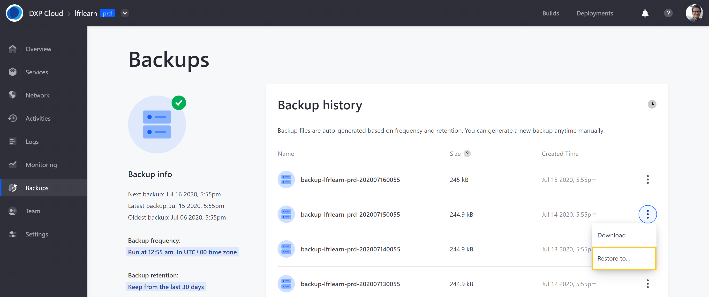
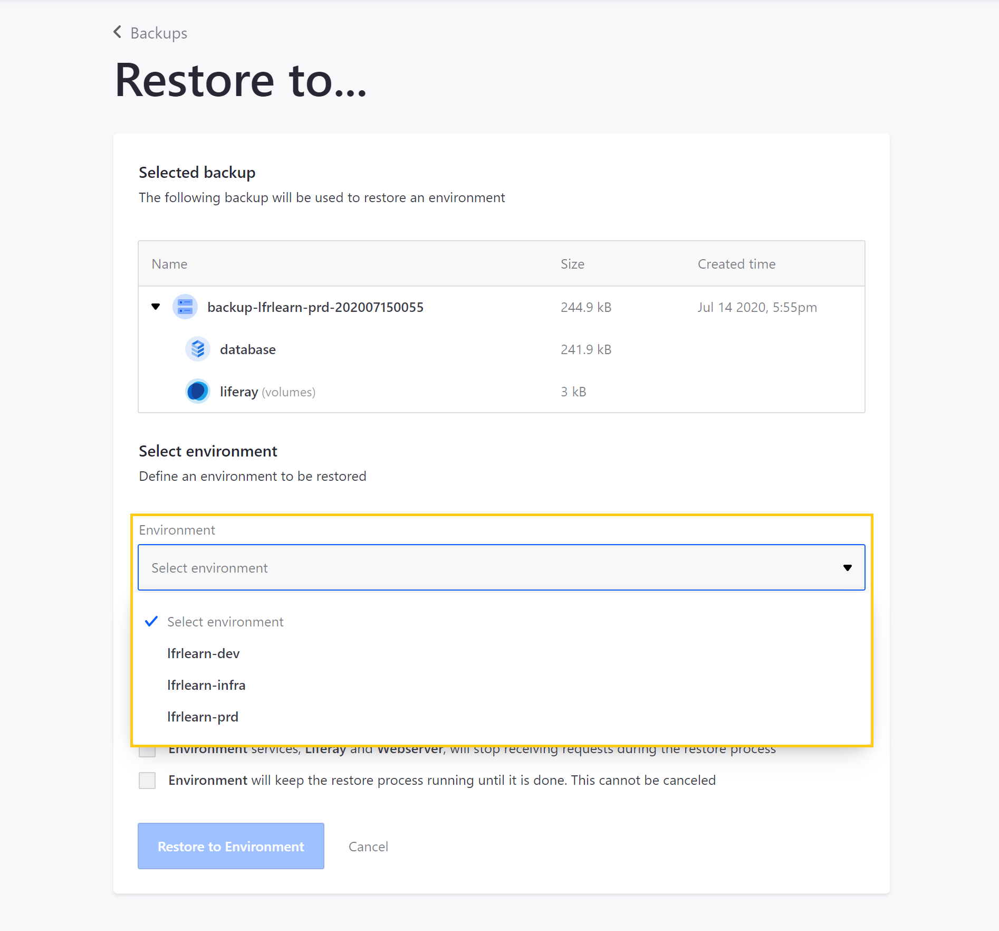

# Restoring Data from a Backup

During project development, there may be times when administrators need to restore data or roll back the project to an earlier state.

Production (`prd`) environment administrators can do this from the Backups page in the DXP Cloud console.

They can also use custom SQL scripts to perform additional updates to a database as part of the data restore.

```note::
   The Backups page is only available in production environments.
```

See [Backup Service](./backup-service.md) and [Downloading and Uploading Backups](./downloading-and-uploading-backups.md) for more information about the Backups page.

## Restoring an Environment from the Backups Page

Follow these steps to restore an environment from a backup:

1. Navigate to your project's `prd` environment.

1. Click on *Backups* in the environment menu.

Follow these steps to restore an environment from the *Backups* page in your `prd` environment:

1. Click on the *Actions* button ( ⋮ ) for the backup you want to use to restore a project environment.

1. Click on *Restore to...*

   

1. Click the drop-down *Environment* menu in the *Restore to...* page, and select the environment you want to restore.

   

   ```note::
      Production environment administrators can only restore environments to which they have access.
   ```

1. Click all *checkboxes* to confirm the restore.

1. Click on *Restore to Environment* to start the restore process.

   

During the restore process, the target environment's services will restart.

You can track the status of the restore in the backup service's *Logs* and the *General* section of the Activities page.

## Applying Custom SQL Scripts with a Data Restore

You can also use custom SQL scripts to perform additional updates to your database with a normal data restore. This approach is ideal for sanitizing sensitive data, since it allows you to apply the scripts to separately maintained database backups.

```note::
   Using this feature requires version 3.0.7 or newer of the backup service.
```

### Preparing SQL Scripts

The following formats are supported for SQL scripts:

* `.sql` is used for individual scripts.
* `.zip`, `.tgz`, or `.gz` are used for multiple scripts within a compressed file.

Note that scripts are run in alphanumerical order when they are executed. SQL scripts must also reference the exact database to run on (for example, with `USE lportal;` or `lportal.User_`).

Follow these steps to prepare your SQL script(s):

1. Navigate to the `lcp` folder.

1. Click on the *Backup* folder.

1. Click on the *Script* folder.

1. Place the SQL script(s) into the appropriate environment subfolder within `lcp/backup/script/`:

   ```
   lcp
   └── backup
      ├── LCP.json
      └── script
         ├── common
         ├── dev
         ├── local
         ├── prd
         └── uat
   ```

### Performing the Data Restore

Once you have prepared your SQL script(s), follow these steps to apply your custom SQL script(s) with a data restore:

1. [Deploy your backup service](../build-and-deploy/overview-of-the-dxp-cloud-deployment-workflow.md) to include the custom SQL script(s) online.

1. Follow the instructions listed above for [Restoring an Environment from the Backups Page](#restoring-an-environment-from-the-backups-page)

Once the database has been restored, the SQL scripts from your backup service's `script` folder will run:

```bash
Jun 20 14:46:41.795 build-39 [backup-57488f8b8-rjq4f] Running Script: SanitizeOrg.sql
Jun 20 14:46:41.970 build-39 [backup-57488f8b8-rjq4f] Running Script: SanitizeUsers.sql
```

## Additional Information

* [Backup Service](./backup-service.md)
* [Downloading and Uploading Backups](./downloading-and-uploading-backups.md)
