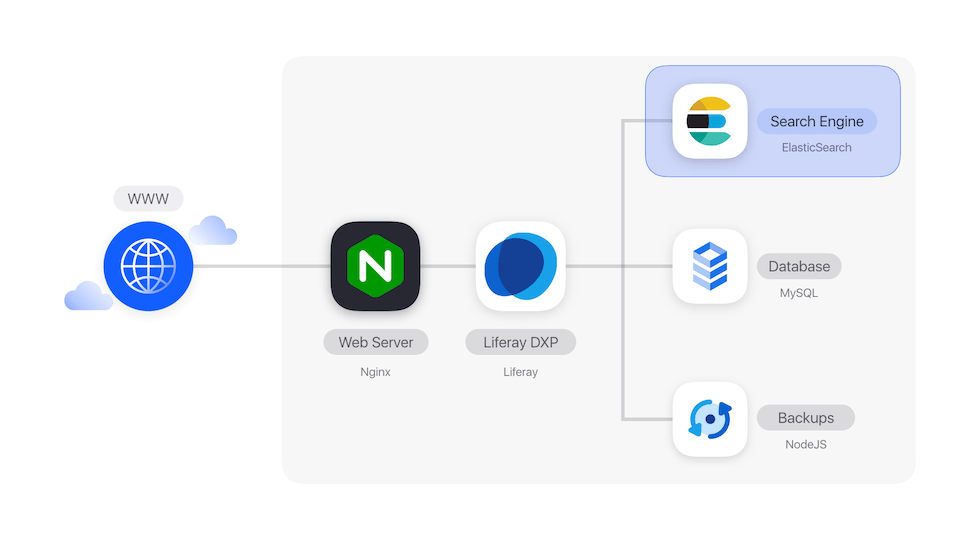

# Search Service (Elasticsearch)

The Elasticsearch service is the text search engine for your Liferay DXP 
application. It's a private service that only communicates with the other 
services in your application, not with the outside internet. 

## Configurations

Although DXP Cloud's services are fine-tuned to work well by default, you may 
need to configure Elasticsearch further. To do so, you can include any YML file 
inside the `config` folder. When you deploy your changes, the file is 
automatically injected into your service and overwrites the default 
configuration. Here's an example folder structure of such a file inside the 
`config` folder: 

    search
    ├── config
    │ └── elasticsearch.yml
    └── LCP.json

## Scripts

You can use scripts for more extensive customizations. However, use caution when 
doing so. This is the most powerful way to customize the search service and can 
cause undesired side effects. 

Any `.sh` files found in the `script` folder are run prior to starting your 
service. For example, to include a script that removes all log files, you could 
place it in this directory structure: 

    search
    ├── script
    │ └── remove-log-files.sh
    └── LCP.json

## Deploying a License to the Search Service

To deploy a license to the search service, you must create the path 
`lcp/search/license/common` and put your license file there. 

## Environment Variables Reference

All environment variables and other forms of configuration for Elastisearch are in the [official Elastisearch documentation](https://www.elastic.co/guide/index.html).
You can set such configurations and environment variables in the `config` directory and `LCP.json`, respectively. Examples include:

| Name | Value | Description |
| --- | --- | --- |
| `ES_JAVA_OPTS` | `-Xms4g -Xmx4g` | Java settings for the ES instance |

## Additional Information

* [Configuration via LCP JSON](../reference/configuration-via-lcp-json.md)
