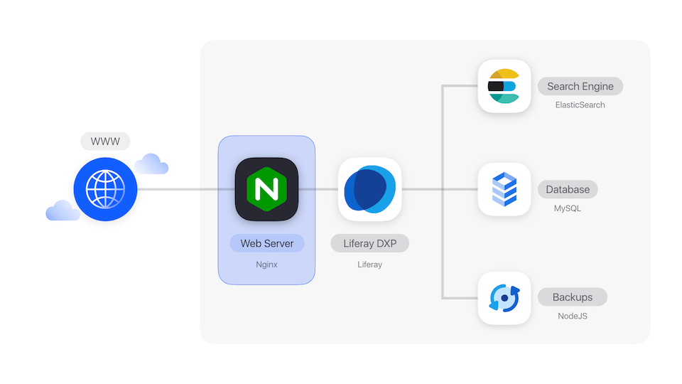

# Web Server Service (Nginx)

The Nginx web server functions as a gateway from the open internet to your DXP 
Cloud services. It handles all traffic from your users and acts as a 
high-performance web server. 

## Configurations

Although DXP Cloud's services are fine-tuned to work well by default, you may 
need to configure Nginx further. To do this, you can include any CONF file 
inside the `config` folder. When you deploy your changes, the file is 
automatically injected into your service and overwrites the default 
configuration. Here's an example folder structure of such a file inside the 
`config` folder: 

    loadbalancer
    ├── config
    │ └── nginx.conf
    └── LCP.json

## Environment Variables

This service has no environment variables specific to DXP Cloud. All environment 
variables and other forms of configuration for Nginx are in the 
[official Nginx documentation](https://docs.nginx.com/). 
You can set such configurations and environment variables in the `config` 
directory and `LCP.json`, respectively. 

## Scripts

You can use scripts for more extensive customizations. However, use caution when 
doing so. This is the most powerful way to customize the web server service and 
can cause undesired side effects. 

Any `.sh` files found in the `script` folder are run prior to starting your 
service. For example, to include a script that removes all log files, you could 
place it in this directory structure: 

    loadbalancer
    ├── script
    │ └── remove-log-files.sh
    └── LCP.json
