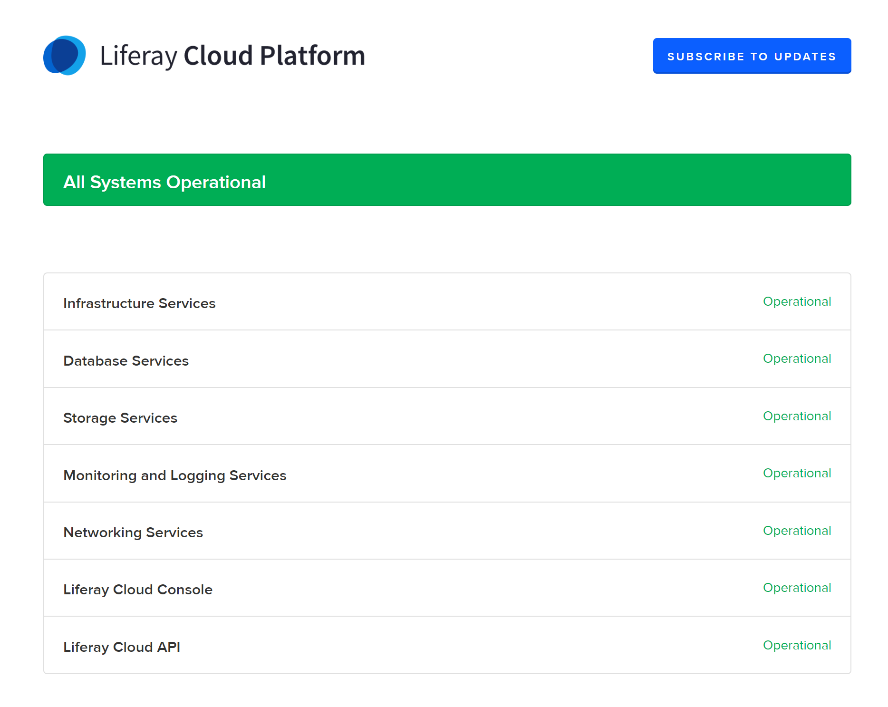
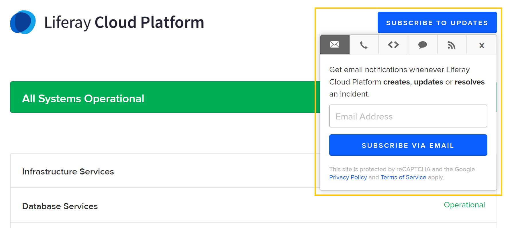
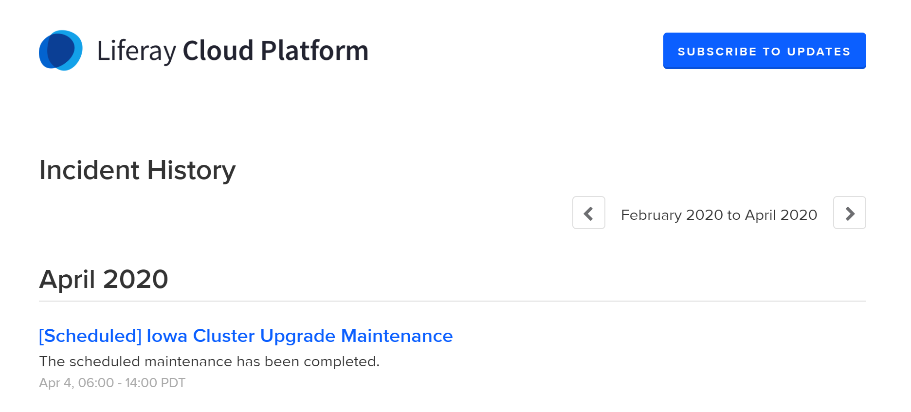
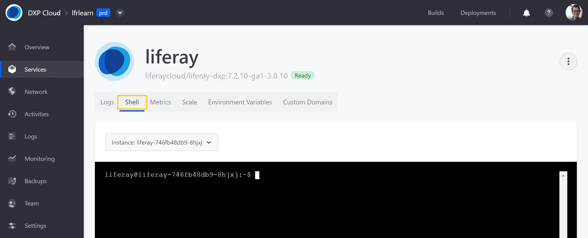
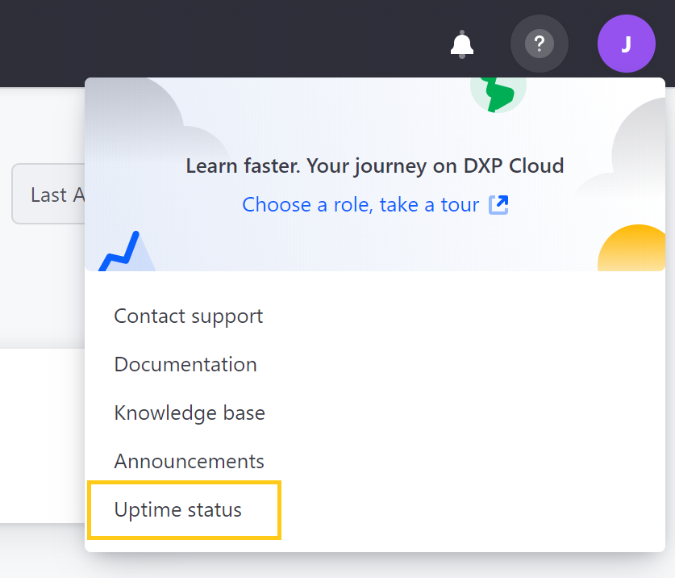
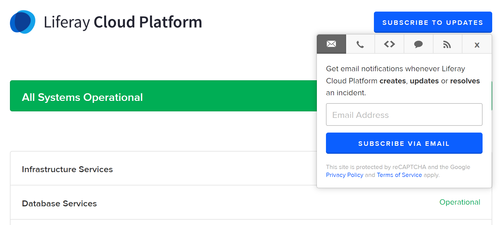

# Tracking DXP Cloud Status and Getting Help

The ability to quickly diagnose and resolve technical issues is vital. Familiarize yourself with available tools and resources for troubleshooting problems pre- and post-launch in your Liferay DXP Cloud projects:

* [Application Metrics](#application-metrics)
* [Real-Time Alerts](#real-time-alerts)
* [Environment Activities](#environment-activities)
* [Environment Logs](#environment-service-logs)
* [Shell Access](#shell-access)
* [Support Access](#support-access)
* [Liferay Cloud Platform Status](#liferay-cloud-platform-status)
* [Self-Healing](#self-healing)
* [Disaster Recovery](#disaster-recovery)
* [Liferay DXP Cloud Updates](#liferay-dxp-cloud-updates)
* [Help Center](#help-center)

With these tools and resources, you can track project activities, configure services, resolve technical issues, and more.

```note::
   Details are subject to your legal agreement with Liferay. For information about legal agreements and services, see `liferay.com/legal <https://www.liferay.com/legal>`_.
```
<!--Check Link Syntax-->
## Application Metrics

With Liferay DXP Cloud’s built-in monitoring, you can track resources used by each environment service. These application metrics include memory and CPU usage, as well as network data transfer.

Metrics are available for the default DXP Cloud stack services: Webserver, Liferay, Search, Database, and Backup.
<!-- Ci metrics are also available in the infra environment. -->


Users can also integrate [Dynatrace’s](https://www.dynatrace.com/) advanced performance monitoring with production environments.

See [Application Metrics](../manage-and-optimize/application-metrics.md) for more information.

## Real-Time Alerts

Liferay DXP Cloud can alert system administrators of unexpected behaviors in a project. Examples of unexpected behaviors include auto-scaling events, higher than expected memory consumption, reaching the allotted CPU quota, and database connection issues.

View all environment alerts and set alert preferences via the DXP Cloud console.



See [Real-Time Alerts](../manage-and-optimize/real-time-alerts.md) for more information.

## Environment Activities

You can monitor team activities and other environment events via the DXP Cloud console.

In the console, activities are sorted into two sections:

* **Builds and Deployments**: this section lists a record of all build and deployment statuses.
* **General**: this section lists automated service events and team related activities besides builds and deployments.



See [Team Activities](../manage-and-optimize/team-activities.md) for more information.

## Environment Logs

Environment logs are crucial for diagnosing and resolving technical issues in a project. You can access and download environment logs via the DXP Cloud console or your OS terminal.

Application, status, and build logs are provided for each DXP Cloud Service:

* Application Logs: These logs list runtime information generated after the application is running and accessed by users.
* Status Logs: These logs list orchestration layer information from the Kubernetes cluster.
* Build Logs: These logs list build information generated as the application boots up.



See [Log Management](./log-management.md) for more information.

## Shell Access

Command-line tools in the DXP Cloud console contribute to the developer's workflow by delivering speed, control, traceability, scripting, and automation capabilities.

Use the shell access tool to see what's going on inside your application, including side effects not easily spotted in logs.



See [Shell Access](./shell-access.md) for more information.

## Support Access

Support Access is an optional setting that expedites troubleshooting by giving Liferay engineers direct access to a DXP Cloud project environment.

DXP Cloud administrators can enable or disable Support Access for individual project environments from the environment *Settings* page.

See [Support Access](./support-access.md) for more information.

## Liferay Cloud Platform Status

To view the status of Liferay Cloud Platform systems, planned maintenance windows, and incident history, see the [Liferay Cloud Platform](https://status.liferay.cloud/) status page.

You can also access the Cloud Platform status page from the DXP Cloud Console:

1. Log in to the DXP Cloud Console
1. Click the top right *Help* icon <!-- Confirm icon name -->
1. Click *Uptime status*.



The Liferay Cloud Platform status page lists the following systems with their statuses:

* Infrastructure Services
* Database Services
* Storage Services
* Monitoring and Logging Services
* Networking Services
* Liferay Cloud Console
* Liferay Cloud API


The Liferay Cloud Platform status page also lists past incidents and planned maintenance windows.


You can also *Subscribe to Updates* to receive the latest notifications of any service status changes.

Click *Subscribe to Updates* and select the method of notification that is most convenient for you.



## Self-Healing

The self-healing functionality of DXP Cloud detects if a service or application has become unresponsive and automatically initiates procedures to recover the unresponsive service. The platform uses probes to monitor the services.

DXP Cloud offers two probes used in conjunction to manage applications:

* **Liveness Probe**: Indicates whether the service is running.
* **Readiness Probe**: Indicates whether the service is ready to receive requests.

See [Self-Healing](./self-healing.md) for more information about configuring each probe.

## Disaster Recovery

Liferay DXP Cloud offers two strategies for disaster recovery: Automatic and Cross-Region.

Liferay DXP Cloud's automatic disaster recovery strategy replicates services between three availability zones within the same region. If an availability zone becomes unavailable, the load balancer will automatically route to the remaining availability zones without the need for user action.

However, in the event of a cross-region disaster, users are required to act using provided tools, though without the need to contact Support. To learn more about cross-region disaster recovery tools, see [Configuring Cross Region Disaster Recovery](./configuring-cross-region-disaster-recovery.md).

See [Disaster Recovery Overview](./disaster-recovery-overview.md) to learn more about both disaster recovery strategies.

## Liferay DXP Cloud Updates

Optimize your Liferay-based projects by getting the latest [Liferay DXP Cloud Updates](https://www.liferay.com/web/l/subscribe-to-liferay-dxp-cloud-updates) updates directly in your email inbox.

These notifications include:

* New Platform Releases
* New Services Updates
* Security Alerts and Patches

Liferay DXP Cloud notifications are only distributed to customers with an active Liferay Enterprise Subscription.

## Help Center

If you have questions not answered by DXP Cloud [Documentation](https://learn.liferay.com/dxp-cloud-latest/) or would like to report an issue, sign in to the Liferay [Help Center](https://help.liferay.com/) to view subscription-only resources or submit a ticket.


From here, you can access the DXP Cloud [Knowledge Base](https://help.liferay.com/hc/en-us/categories/360001132872), [Product Support](https://help.liferay.com/hc/en-us/articles/360030208451-DXP-Cloud-Support-Overview), and [Announcements](https://help.liferay.com/hc/en-us/categories/360001192512).

When submitting a ticket, please provide the build images currently in use, behavior or question you are facing, steps to reproduce the issue, and a description of both the actual behavior and the expected behavior.
