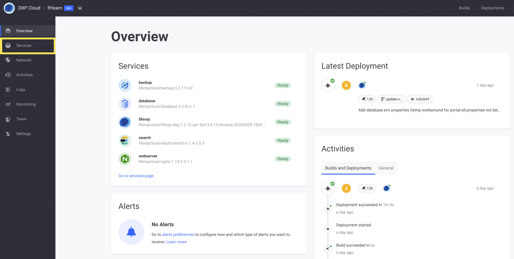
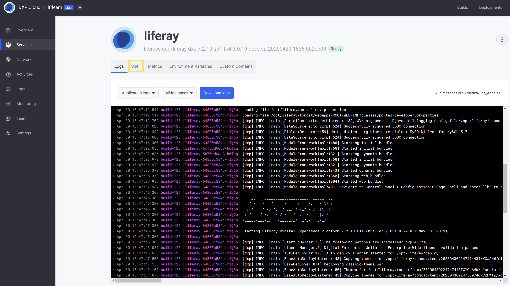
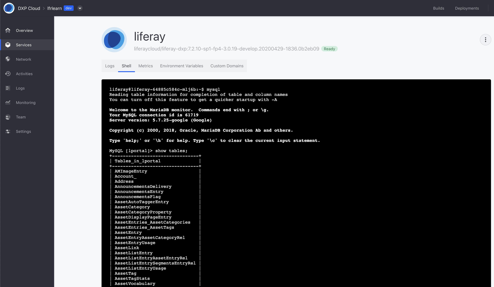

# Using the MySQL Client

Viewing data in the database is sometimes necessary to troubleshoot an issue with your application or do custom development. In order to access the database, you must use an exposed MySQL client to interface directly with the database. This feature is available in up-to-date versions of DXP Cloud, and can be accessed in a few short steps.

```note::
   Only DXP Cloud users with *Admin* and *Contributor* privileges can make use of the MySQL client.
```

## Prerequisites

<!-- JR: Do we have an article that describes clearly how to upgrade a service? -->Before you can use the MySQL Client through the Liferay service, you must have your services upgraded to at least the following supported image versions:

| **Service** | **Minimum Supported Image Version** |
| --- | --- |
| **Database** | liferaycloud/database:3.2.8 |
| **DXP (using 7.0)** | liferaycloud/liferay-dxp:7.0.10-ga1-fp90-3.0.19 |
| **DXP (using 7.1)** | liferaycloud/liferay-dxp-7.1.10-ga1-fp17-3.0.19 |
| **DXP (using 7.2)** | liferaycloud/liferay-dxp-7.2.10-sp1-fp4-3.0.19 |

If you have not yet deployed the database service on a supported version, then you can set your own password for the default user by setting the `LCP_DATABASE_READONLY_USER_PASSWORD` environment variable in the database service's `LCP.json`.

```warning::
   If you have already deployed your database service using a version that supports the MySQL client, then the default user will already be initialized with a default password. This password cannot be changed later, so you can only add the ``LCP_DATABASE_READONLY_USER_PASSWORD`` environment variable before you deploy the database service (either for the first time, or updating from an older image version than the above). Otherwise, you must use the default, generated password.
```

Then, update to the appropriate Docker image versions (or newer) and [re-deploy the services](../build-and-deploy/walking-through-the-deployment-life-cycle.md) so that the MySQL client is available for use.

## Accessing the MySQL Client

1. Log into the DXP Cloud console.

1. Navigate to the correct environment, and click _Services_:

   

1. Click on the **liferay** service.

1. If you set your own password for the default user with `LCP_DATABASE_READONLY_USER_PASSWORD`, then add the same environment variable to your `liferay` service. Otherwise, do not add this variable, so that the service uses the default password.

    You can add this variable from within the _Environment Variables_ tab:

    

1. Click on the _Shell_ tab:

    

1. Type `mysql` into the shell on this screen. This logs you into the MySQL client, where you can perform any read-only queries. For example, you can see all the tables by executing `show tables;`.

    

Please refer to the official [MySQL Client documentation](https://dev.mysql.com/doc/refman/8.0/en/mysql-commands.html) to see all the commands available.

### Logging in with Read and Write Privileges

The default user can only perform read queries on the database, and cannot manipulate data. This prevents accidental modifications that may corrupt data for your services.

However, if it is *critical* to be able to manipulate data in the database, you can login using the database credentials by typing this command into the shell (instead of only typing `mysql`):

```bash
mysql -u USER_NAME -p DATABASE_NAME
```

Enter the database user's password at the prompt to authenticate as a user with read and write privileges.

## Related Information

* [Database Service](../platform-services/database-service.md)