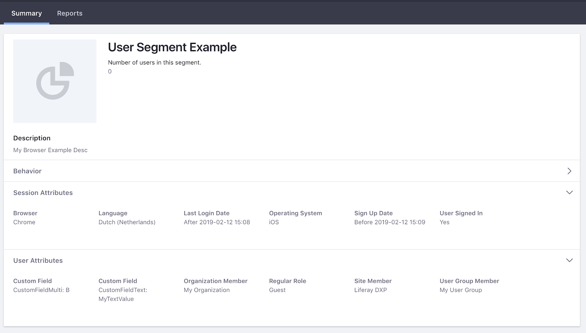

# Migrating User Segments

In Audience Targeting, a user segment represents a subset of users. A user segment is defined by one or more rules that users must match to belong to that user segment. In DXP 7.2, segments work in a similar way, but they are defined by criteria instead of rules. Segment criteria are sets of fields defined by different user actions or properties (profile information, organization information, session information) that can be combined through operations (like equals, not equals, contains, not contains, greater than, and less than) and conjunctions (AND, OR) to define complex filters. 

Due to the similarities between Audience Targeting user segments and Liferay DXP Segments, certain data can be migrated automatically as part of the upgrade process.

## Upgrade Process

As a result of the upgrade process:

- All Audience Targeting User Segments appear under the new Segments administration in 7.2, with the same name.
- For every segment, those Audience Targeting rules with an equivalent in Liferay DXP 7.2 have been migrated into the corresponding criteria fields (see Table below).
- Audience Targeting tables have been removed from your Liferay DXP Database.

| Audience Targeting Rule | DXP 7.2. Segment Criteria Field | Upgrade Path |
| ---                     | ---                     | --- |
| Browser                 | Browser                 | Automated. Use user agent field with `contains` operation as an alternative |
| Custom Field            | Custom Field            | Automated |
| Language                | Language                | Automated |
| Last Login Date         | Last Sign In Date       | Automated |
| Organization Member     | Organization            | Automated |
| OS                      | User Agent              | Automated |
| Previous Visited Site   | Not Available           | Automated |
| Regular Role            | Role                    | Automated |
| Site Member             | Site                    | Automated |
| User Group Member       | User Group              | Automated |
| Age                     | Not Available           | Suggested: custom field |
| Facebook (various)      | Not Available           | Suggested: custom field |
| Gender                  | Not Available           | Suggested: custom field |
| Score Points            | Not Available           | Suggested: cookie |
| Visited Page/Content    | Not Available           | Suggested: cookie |

Here's an example user segment as it would appear in Audience Targeting for DXP 7.1:

And here is the same segment migrated to Liferay 7.2:

For those Audience Targeting rules without a direct equivalent, a manual migration is required. If you have any these rules, you can learn about your next steps in [Manual Migration](./).
