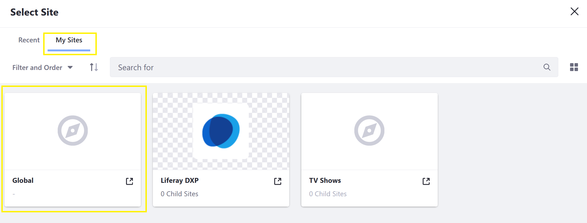
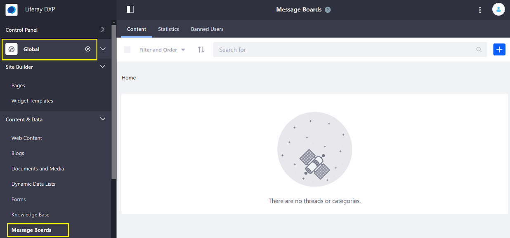
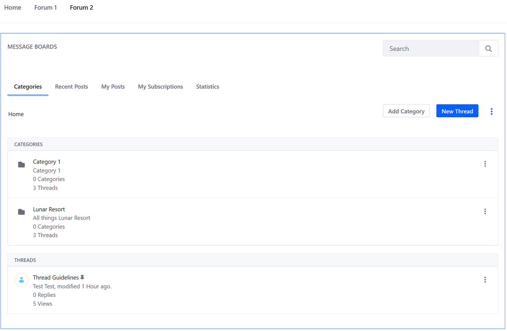
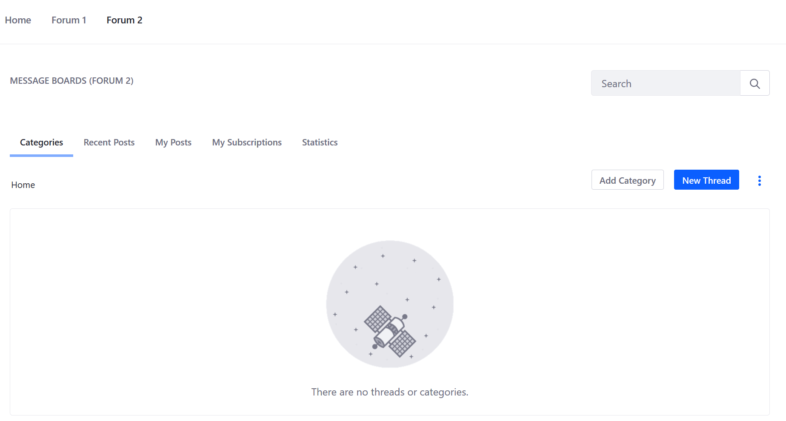
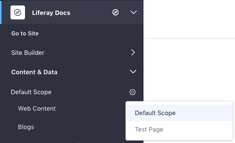

# Scoping Your Message Boards

Forum administrators can create and choose to manage Message Boards in either the [Global, Site, or Page Scopes](https://help.liferay.com/hc/articles/360028819992-Widget-Scope). The following sections show administrators how to manage Message Boards in each of these scopes.

## Globally-scoped Message Boards

All content created on the global site becomes available on all other sites.

To manage a message board in the global scope, follow these steps:

1. Open the _Product Menu_ (), then click the compass icon () on the Site Administration menu. This opens the Select Site dialog.
1. Select the _My Sites_ tab, then select _Global_.

    

1. Select _Message Boards_ from the _Content & Data_ menu. Any changes made here apply to the global scope.

    

## Site-scoped Message Boards

By default, the _Message Boards_ app in _Site Administration_ is scoped to the current Site. Message Boards scoped to a particular site are not visible when viewing Messages Boards that may be deployed on another site in the same instance.

## Page-scoped Message Boards

Creating page-scoped message boards allows forum members to view different message boards on different pages housed on the same site. The example below have the same content on both site pages (_Forum 1_ and _Forum 2_.)

To create a page-scoped message board, follow these steps:

1. Navigate to the page that which will be scoped (_Forum 2_).
1. Click the _Options_ icon () in the widget's title bar and select _Configuration_.
1. Click the _Scope_ tab.
1. Select the page's name or _PageName (Create New)_ if the page scope doesn't exist yet.

   

1. Click _Save_ then close the dialog window.

    

The _Message Boards Categories_ and _Threads_ added on the _Forum 2_ page will be displayed only on that page.

### Managing Page-scoped Content

Note that administrators must still use the _Site Administration_ menu to administer a page-scoped Message Boards widget by setting the _Site Administration_ menu's active scope. Follow these steps to do this:

1. Open the _Product Menu_ (, expand the menu for your Site, then expand _Content & Data_.

1. The current scope appears just below the _Content & Data_ heading. _Default Scope_ is the current Site. To change this, click the gear icon () and then select your desired scope. This changes the Site Administration menu to reflect scope you selected. To work in a page's scope, for example, select that page from the gear icon. That page's name then becomes the _Site Administration_ menu's title.

    

1. Select *Message Boards* from the _Content & Data_ menu. Any changes you make here apply to the scope that you selected in the previous step.

<!-- ## Related Information

* Understanding Scope in Liferay DXP -->
