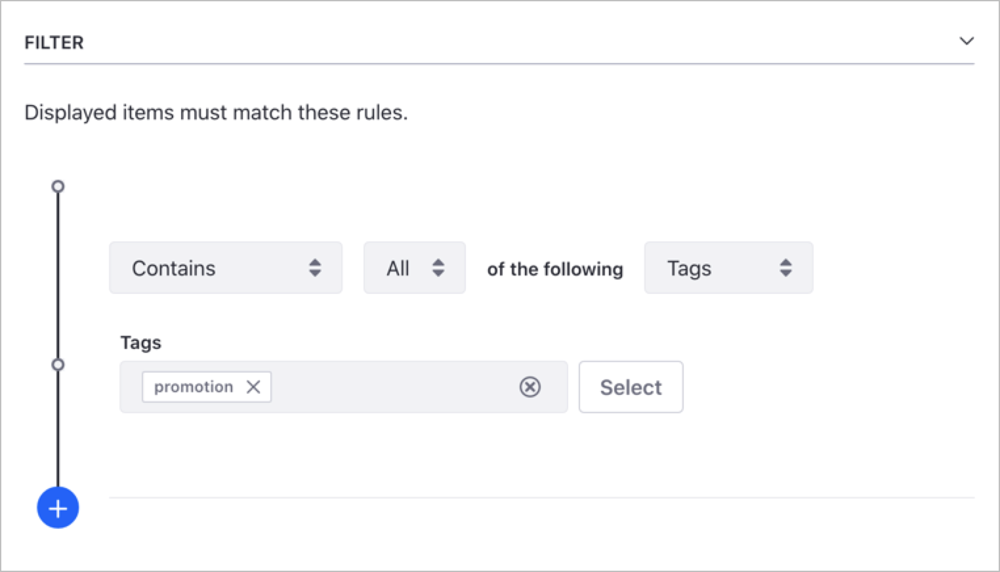
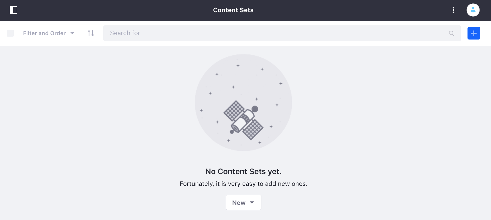
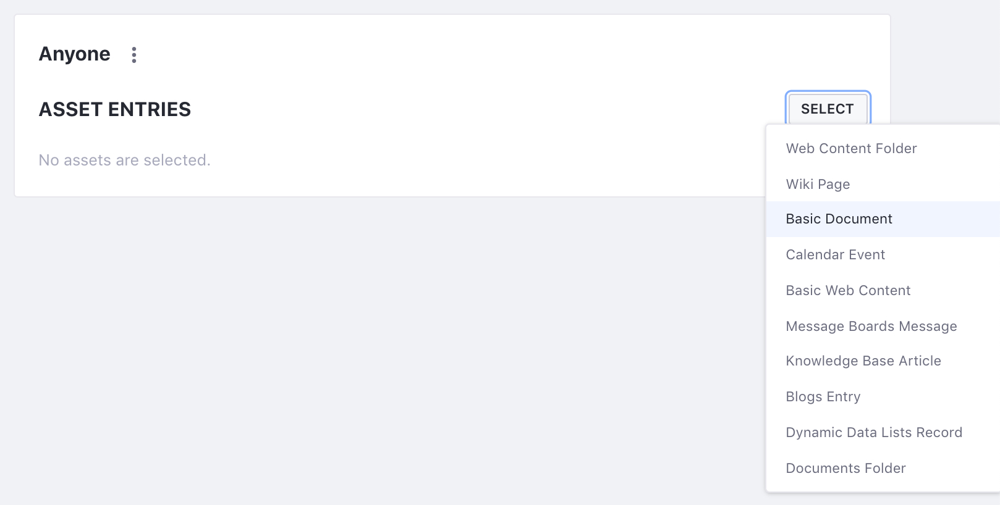
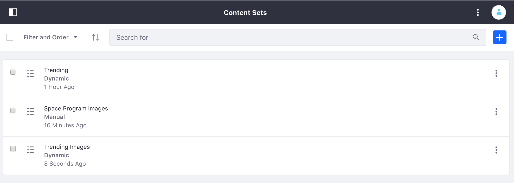

# Creating Collections

```note::
   This information applies to Liferay DXP 7.3+. For previous Liferay DXP versions, see `Liferay DXP 7.2 <#liferay-dxp-7-2>`_.
```

You can create *Manual* or *Dynamic* Collections. For information about the different types of Collections, see [About Collections and Collection Pages](./about-collections-and-collection-pages.md).

## Creating a Manual Collection

1. Go to *Site Administration* &rarr; *Site Builder* &rarr; *Collections*.
1. Click on the *New* button () and select *Manual Collection*.
1. Add a *Title* for your Manual Collection and click *Save*.
1. In the *Item Type* drop-down menu, select the item type you want to include in the Collection.
    - If you want to include only one item type

       1. Select the type under *Single Item Type*.
       1. Optionally, if your *Item Type* includes a subtype, select this in the *Item Subtype* drop-down menu.
       1. Click *Save*.

       

    - If you want to include more than one item type

       1. Select *Select More Than One* under *Multiple Item Types*.
       1. In the dual list box, add or remove the item types you want to include in your collection.

       

1. Click *Save*.
1. Click *Select* next to *Collection Items* and select one of your item types.

   

1. In the selection dialog, check the items you want to include.
1. Click *Add*.
1. If your Manual Collection includes more than one item type, repeat steps 6 to 8 for the other types.

Note that Documents and Media folders and Web Content folders can be added to a Collection.

```note::
   While Documents and Media and Web Content folders can be added to a collection, the content is not displayed when the folder is published on a Collections Page or in an Asset Publisher widget. Even if these assets are added to a collection, they can only be viewed separately. This is a known limitation and will be fixed in a future release.
```

## Creating a Dynamic Collection

1. Go to *Site Administration* &rarr; *Site Builder* &rarr; *Collections*.
1. Click on the *New* button () and select *Dynamic Collection*.
1. Add a *Title* for your Manual Collection and click *Save*.
1. In the *Item Type* drop-down menu, select the item type you want to include in the Collection.
    - If you want to include only one item type,

       1. Select the type under *Single Item Type*.
       1. Optionally, if your *Item Type* includes a subtype, select this in the *Item Subtype* drop-down menu.
       1. To filter you *Item Subtype* by a specific field, enable the *Filter by Field* switch, click *Select*, choose the field, and click *Apply*.
       1. Click *Save*.

       

    - If you want to include more than one item type,

       1. Select *Select Types* under *Multiple Item Types*.
       1. In the dual list box, add or remove the item types you want to include in your collection.

       

1. Configure the criteria for your Dynamic Collection, based on *Scope*, *Filter*, *Content Recommendation*, or *Ordering*.

   **Scope:** Define the source of items in your Dynamic Collection. By default, the source is the current site.

   **Filter:** Configure the rules for the items in the Dynamic Collection. For example, you may want to include only items with the "promotion" tag.

   

    ```tip::
        You can add multiple rules to your Filter clicking on the Add button. The final content in the Dynamic Collection is the result of adding all the rules.
    ```

   **Content Recommendation:** Enable this option to display content based on user behavior. For more information, see [Configuring Content Recommendations](../site-building/displaying-content/configuring-content-recommendations.md).

   **Ordering:** Items in the collection appear using the order criteria you define here.

1. Click *Save*.

## Creating a Collection from an Asset Publisher

You can create a new Collection from an [Asset Publisher Widget](../../site-building/displaying-content/using-the-asset-publisher-widget/displaying-assets-intro.md). This is useful when you have an Asset Publisher customization that you want to use as a Collection in other pages.


1. Go to *Site Administration* &rarr; *Site Builder* &rarr; *Pages*.
1. Click the *Actions* button () next to the page that contains the Asset Publisher and select *Edit*.

   

1. Hover over the *Asset Publisher*, click the *Options* icon () in the widget's menu, and select *Configuration*.

   

1. In the *Asset Publisher - Configuration* dialog, click the *Setup* tab and *Asset Selection* sub-tab.
1. Scroll down and click *Create a Collection from this Configuration*.

   

1. Enter the *Title* for your Collection and click *Save*.
1. Close the *Asset Publisher - Configuration* dialog.
1. Find your new Collection in *Site Administration* &rarr; *Site Builder* &rarr; *Collections*.

## Liferay DXP 7.2

### Creating Content Sets

Content Sets are created by content administrators through the Content Sets interface in Site Administration. Content Sets can use either Manual or Dynamic selection, and you can create any number of Content Sets, and display them through the Asset Publisher or custom applications. Content Sets can also have [personalized variations](../../site-building/personalizing-site-experience/experience-personalization/personalizing-collections.md#content-set-personalization) which provide different experiences for different users based on criteria that you specify. The criteria management is shared with the Asset Publisher, so for more  information on each option, see the official [Asset Publisher Documentation](../../site-building/displaying-content/using-the-asset-publisher-widget/selecting-assets-for-the-asset-publisher.md).

#### Creating a Manual Content Set

To demonstrate the creation of a Manual Content Set, create a Content Set that contains a number of images to be displayed on the Frontpage of the fictitious Space Program website. To prepare for this exercise, upload some appropriate images to *Documents and Media* to use for the Content Set.

1. Go to *Site Administration* &rarr; *Content & Data* and select *Content Sets*.

    

2. Click  and select *Manual Selection*.
3. Name your Content Set *Space Program Images*.

On the next screen, you can select the assets to include in the Content Set.

1. Click *Select* &rarr; *Basic Document*.

    

2. Now, check the boxes for each image that you want to add and click *Add*.

Now this Content Set can be displayed anywhere on the site where it was created. You can add or remove items from the set, and it will automatically update it wherever it is displayed.

#### Creating a Dynamic Content Set

To demonstrate the creation of a Dynamic Content Set, create a Content Set that contains a number of varied assets that are tagged as "trending." In order for this to work, you will need some number of existing assets with the appropriate tag.

1. From the *Content Sets* page, click  &rarr; *Dynamic Selection*.
2. Enter *Trending* for the name and click *Save*.

With Dynamic Content Sets, you can choose the *Source*, *Scope*, *Filter*, and *Ordering* for the items in the set.

1. Leave *Source* as *Any* and *Scope* as *Current Site*
2. Open *Filter*, make sure it is set to *Contains Any of the following Tags*, and then enter "trending" in the *Tags* box.

    

3. Open *Ordering* and set it to *Order By*: *Publish Date*, *And Then By*: *Title*.
4. Click *Save*.

This will create a Content Set which will contain any items that are currently tagged as *trending* and any future items with the *trending* tag will be added to the Content Set automatically.

Now that you have your Content Sets created, you can
[display them on a page](./displaying-collections-and-collection-pages.md#displaying-content-sets).

### Converting Asset Publisher Configurations to Content Sets

In the previous two guides in this section, you've seen [Creating Content Sets](./creating-collections.md#creating-content-sets)
and [Displaying Content Sets](./displaying-collections-and-collection-pages.md#displaying-content-sets) demonstrated. Next, try out converting an existing Asset Publisher configuration to a Content Set.

In this case, you have an Asset Publisher on a page, which is configured to display images tagged as *trending* in reverse alphabetical order by title. This might not be too hard to reproduce in the *Content Set* creator, but it's even easier to create the Content Set definition directly from the Asset Publisher.

1. Go to  &rarr; *Configuration* for the Asset Publisher.
2. Click *Create a content set from this configuration*.

    

3. Enter the title and click *Save*.

And as quickly as that you have a new Content Set that you can use with Asset Publishers anywhere on the site.



Great! You converted your Asset Publisher configuration to a Content Set.

## Related Information

- [About Collections and Collection Pages](./about-collections-and-collection-pages.md)
- [Displaying Collections and Collection Pages](./displaying-collections-and-collection-pages.md)
- [Personalizing Collections](../../site-building/personalizing-site-experience/experience-personalization/personalizing-collections.md)
