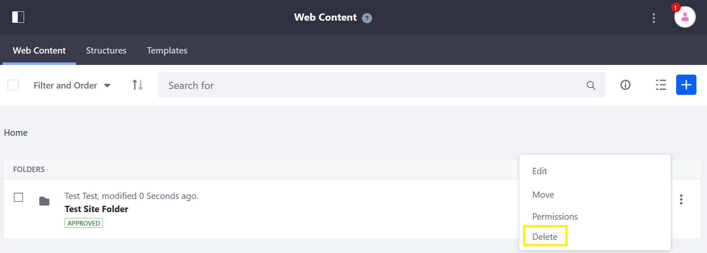

# Introduction to the Recycle Bin

Liferay DXP includes an integrated *Recycle Bin* so you can temporarily store content and data you want to remove from your instance before making that removal permanent. By default, the Recycle Bin is enabled instance-wide, though you can disable it at any time for individual Sites.

While enabled, the *Delete* action is replaced with *Move to the Recycle Bin* for recyclable assets (i.e., folders, web content, blogs, bookmarks, documents, media, message boards, and wikis).


Once recycled, an asset is retained for a specified period of time, during which Users can *Restore* or permanently *Delete* it. However, once an asset has remained in the recycle bin for longer than the specified retention period, it is automatically deleted from your instance. The default retention period is 43,200 minutes (i.e., 30 days).


If the Recycle Bin is disabled on a site, assets that are deleted are permanently deleted and cannot be restored.



## Recycle Bin and Staging

If you have a [Staging](../../../site-building/publishing-tools/staging/staging-overview.md) environment enabled for your Site, you have a separate Recycle Bin for both the Staging environment and the Live environment. This prevents staged assets and live assets from mixing.

To move an asset to the Recycle Bin, first switch to the environment containing the asset. Click on Staging or Live.


[Using the Recycle Bin](using-the-recycle-bin.md) has the same functionality whether you are working in a Staging environment or a Live environment.

Note that the Recycle Bin is enabled for different asset types when the Staging environment is initially configured. See [Managing Data and Content Types in Staging](../../../site-building/publishing-tools/staging/managing-data-and-content-types-in-staging.md) to make any changes.

```warning::
   Check your Recycle Bin before enabling or disabling a Staging environment. You may end up losing assets that are already in the Recycle Bin. 
```

## What's Next

* [Using the Recycle Bin](./using-the-recycle-bin.md)
* [Configuring the Recycle Bin](./configuring-the-recycle-bin.md)
