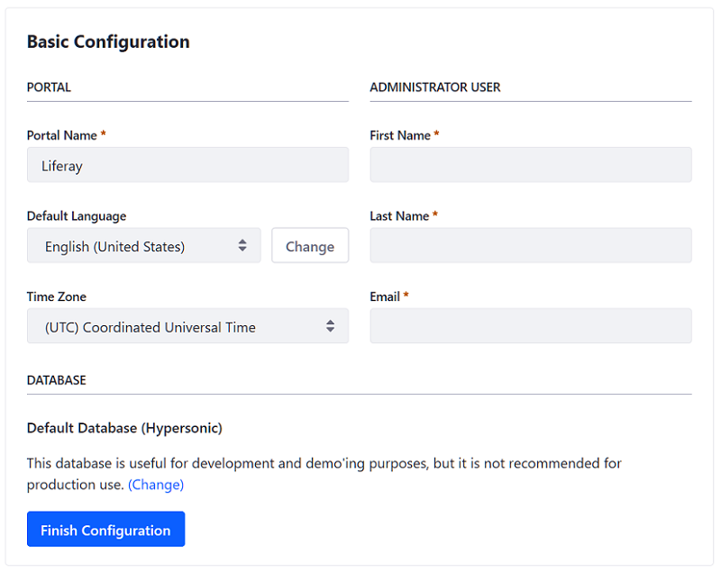
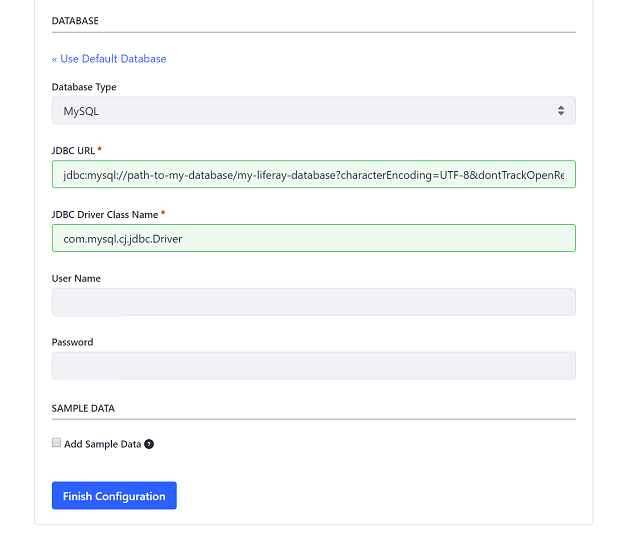

# Running Liferay DXP for the First Time

Once you've [installed Liferay DXP](./installing-a-liferay-dxp-tomcat-bundle.md#installing) and [configured a database](configuring-a-database.md) for it, Liferay DXP is ready to run.

## Start Liferay DXP

1. Run the startup script bundled with your application server. Tomcat bundle example:

    ```bash
    ./liferay-dxp-version/tomcat-version/bin/startup.sh
    ```

    > **Note:** By default, DXP writes log files to `[LIFERAY_HOME]/logs`

    The Setup Wizard appears in your web browser at `http://localhost:8080`.

    

2. Set your portal's *Name*, *Default Language* and *Time Zone*.

3. Set the *Administrator User* first name, last name, and email address.

4. In the *Database* section, click *Change* to display the database form.

    > **Warning:** DO NOT use HSQL in production-grade Liferay DXP instances.

    

5. Specify your database.

| Field | Description |
| --- | --- |
| *Database Type* | Select the database type to connect to |
| *JDBC URL* | Update the path to the database that you have created for Liferay DXP |
| *User Name* | Database user name |
| *Password* | Database user password |

&nbsp;&nbsp;&nbsp;&nbsp;&nbsp;6\. Regarding *Sample Data*: If you're creating a production-grade DXP instance or otherwise don't need the data, leave the sample data field unselected. The sample data includes Users, Sites, and Organizations for demonstration purposes.

&nbsp;&nbsp;&nbsp;&nbsp;&nbsp;7\. Click *Finish Configuration*.

The Setup Wizard stores your configuration values in a `portal-setup-wizard.properties` file in your [Liferay Home](../reference/liferay-home.md).

If you have a Liferay DXP Enterprise subscription, DXP requests your activation key. See [Activating Liferay DXP](./activating-liferay-dxp.md).

Lastly DXP prompts you to restart your server.

## Restart the Server

Restart your server using the shutdown and startup scripts bundled with your application server. Tomcat example commands:

### Shutdown

```bash
./liferay-dxp-version/tomcat-version/bin/shutdown.sh
```

### Startup

```bash
./liferay-dxp-version/tomcat-version/bin/startup.sh
```

DXP initializes using the database and portal configuration values you specified in the Setup Wizard. The DXP home page appears at `http://localhost:8080`.


Congratulations! You have launched your on premises Liferay DXP instance.

## Next Steps

You can [sign in as your administrator user](../../getting-started/introduction-to-the-admin-account.md) and start [building a solution on DXP](../../building-solutions-on-dxp/README.md). Or you can explore [additional Liferay DXP setup](../setting-up-liferay-dxp/setting-up-liferay-dxp.md) topics:

* [Setting up Marketplace](../setting-up-liferay-dxp/setting-up-marketplace.md)
* [Trial Plugin Installation](../setting-up-liferay-dxp/trial-plugin-installation.md)
* Installing and Configuring a Search Engine
* [Securing Liferay DXP](../securing-liferay/01-securing-liferay.md)
* [Introduction to Clustering Liferay DXP](../setting-up-liferay-dxp/configuring-clustering-for-high-availability/01-introduction-to-clustering-liferay-dxp.md)
