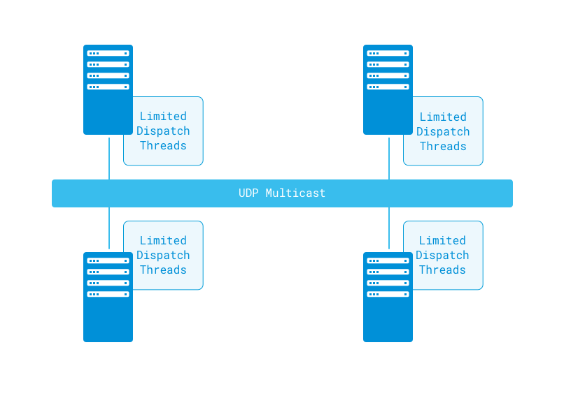

# Configuring Cluster Link

Enabling Cluster Link activates distributed caching. The cache is distributed across multiple Liferay DXP nodes running concurrently. Cluster Link uses [Ehcache](http://www.ehcache.org) replication. The Ehcache global settings are in the [`portal.properties` file](https://docs.liferay.com/portal/7.3-latest/propertiesdoc/portal.properties.html#Ehcache).

By default Liferay does not copy cached entities between nodes. If an entity is deleted or changed, for example, Cluster Link sends a *remove* message to the other nodes to invalidate this entity in their local caches. Requesting that entity on another node results in a cache *miss*; the entity is then retrieved from the database and put into the local cache. Entities added to one node's local cache are not copied to local caches of the other nodes. An attempt to retrieve a new entity on a node which doesn't have that entity cached results in a cache *miss*. The miss triggers the node to retrieve the entity from the database and store it in its local cache.



Clustering in DXP may be configured in different ways depending on your network and the location of your cluster nodes. The following topics concerning cluster link are covered in this article:

**Contents:**

* [Enabling Cluster Link](#enabling-cluster-link)
* [Configuring Cluster Link](#configuring-cluster-link)
* [Conclusion](#conclusion)

## Enabling Cluster Link

To enable Cluster Link, add this [Portal Property](../../reference/portal-properties.md) to a `portal-ext.properties` file:

```properties
cluster.link.enabled=true
```

The [Cluster Link Portal Properties](https://docs.liferay.com/portal/7.3-latest/propertiesdoc/portal.properties.html#Cluster%20Link) provide a default configuration that you can override to fit your needs.

Many of the defaults use `localhost`, instead of a real address. In some configurations, however, `localhost` is bound to the internal loopback network (`127.0.0.1` or `::1`), rather than the host's real address. If you still need this configuration, you can make DXP auto detect the real address with this property:

```properties
cluster.link.autodetect.address=www.google.com:80
```

Set it to connect to some other host that's contactable by your server. By default, it points to Google, but this may not work if your server is behind a firewall. If you use each host's real address, you don't need to set the auto-detect address.

Cluster Link depends on [JGroups](http://www.jgroups.org) and provides an API for nodes to communicate. It can:

* Send messages to all nodes in a cluster
* Send messages to a specific node
* Invoke methods and retrieve values from all, some, or specific nodes
* Detect membership and notify when nodes join or leave

Cluster Link contains an enhanced algorithm that provides one-to-many type communication between the nodes. This is implemented by default with JGroups's UDP multicast, but unicast and TCP are also available.

## Configuring Cluster Link

When you enable Cluster Link, DXP's default clustering configuration is enabled. This configuration defines *IP multicast over UDP*. If you cannot use multicast for your own nodes (for example, because they are separated geographically or by a firewall), then you can instead configure a unicast implementation. See [Configuring Unicast Over TCP](./configuring-unicast-over-tcp.md) for more information.

### Using Multicast Over UDP

DXP uses two groups of [channels from JGroups](http://www.jgroups.org/manual4/index.html#_channel) to implement multicast over UDP: a control group and a transport group. If you want to customize the [channel properties](https://docs.liferay.com/portal/7.2-latest/propertiesdoc/portal.properties.html#Cluster%20Link), you can do so by adding the following Portal Properties to `portal-ext.properties`:

```properties
cluster.link.channel.name.control=[your control channel name]
cluster.link.channel.properties.control=[your control channel properties]
```

Please see [JGroups's documentation](http://www.jgroups.org/manual4/index.html#protlist) for channel properties. The default configuration sets many properties whose settings are discussed there.

Multicast broadcasts to all devices on the network. Clustered environments on the same network communicate with each other by default. Messages and information (e.g., scheduled tasks) sent between them can lead to unintended consequences. Isolate such cluster environments by either separating them logically or physically on the network, or by configuring each cluster's `portal-ext.properties` to use different sets of [multicast group address and port values](https://docs.liferay.com/portal/7.3-latest/propertiesdoc/portal.properties.html#Multicast).

JGroups sets a bind address automatically, using `localhost` by default. If you want to set a manual address, you can set it in `portal-ext.properties`:

```properties
cluster.link.bind.addr["cluster-link-control"]=localhost
cluster.link.bind.addr["cluster-link-udp"]=localhost
```

In some configurations, however, `localhost` is bound to the internal loopback network (`127.0.0.1` or `::1`), rather than the host's real address. If for some reason you need this configuration, you can make DXP automatically detect its real address with this property:

```properties
cluster.link.autodetect.address=www.google.com:80
```

Set it to connect to some other host that's contactable by your server. By default, it points to Google, but this may not work if your server is behind a firewall. If you set the address manually using the properties above, you don't need to set the auto-detect address.

Your network configuration may preclude the use of multicast over TCP, so below are some other ways you can get your cluster communicating. Note that these methods are all provided by JGroups.

### Test Your Cluster Link Configuration

1. If you are binding the IP address instead of using `localhost`, make sure the right IP addresses are declared using these properties:

    ```properties
    cluster.link.bind.addr["cluster-link-control"]=localhost
    cluster.link.bind.addr["cluster-link-udp"]=localhost
    ```

1. Test your load and then optimize your settings if necessary.

## Conclusion

Once you've configured your cluster, you can start it. A log file message shows your cluster's  name (e.g., `cluster=liferay-channel-control`):

```bash
-------------------------------------------------------------------
GMS: address=oz-52865, cluster=liferay-channel-control, physical address=192.168.1.10:50643
-------------------------------------------------------------------
```

Congratulations! Your cluster is using Cluster Link.

## Additional Information

* [Configuring Unicast over TCP](./configuring-unicast-over-tcp.md)
* [Clustering for High Availability](./clustering-for-high-availability.md)