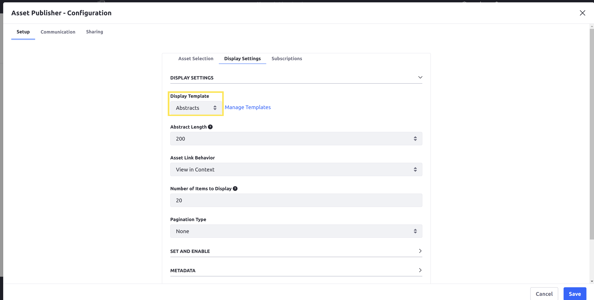

# Customizing a Widget with a Widget Template

Widget templates are used to customize the appearance and functionality of various existing widgets. Once you have a widget template for a specific widget, any instance of that widget can be configured to use that template, giving it your customized appearance and behavior.

## Steps to Use a Widget Template

If you do not have a widget template for the appropriate widget, first follow the steps to [create a widget template](./creating-a-widget-template.md).

Once you have a widget template ready for a widget on one of your pages, follow these steps:

1. Click the Actions  icon on the appropriate widget, then click _Configuration._

1. Find the Display Template drop-down menu, and select the name of the desired template.

    

    ```note::
       This drop-down menu is on the default tab, Setup, for most widgets. However, for the Asset Publisher widget, this setting is found under the Display Settings tab instead.
    ```
1. Click _Save._

Congratulations! You have successfully modified a widget to use a custom appearance. By using more advanced widget template scripts, you can further enhance the capabilities of your widgets.