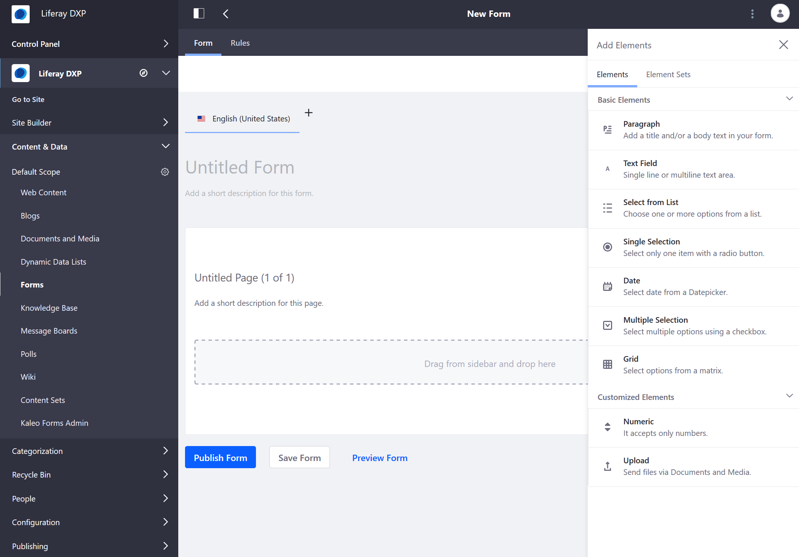
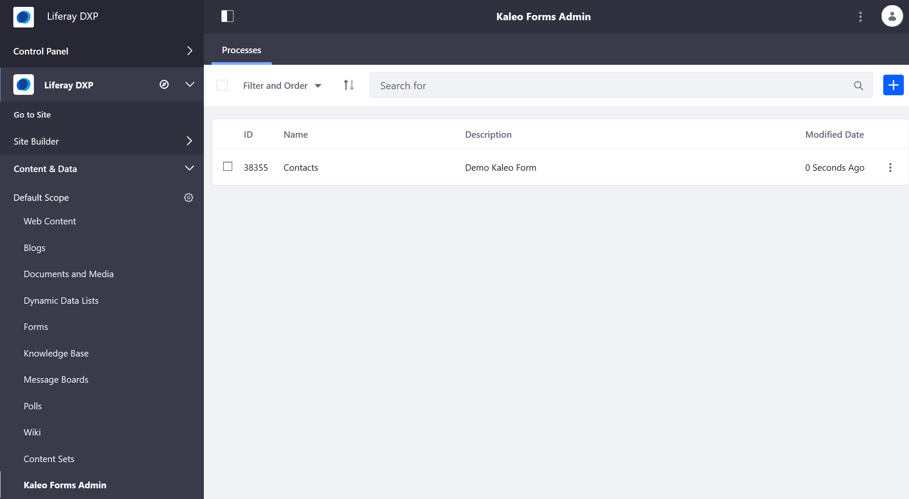

# Introduction to Forms

Liferay Forms gives you robust form building capability so you can gather user data that you need (for example, customer feedback, a job application). The application can be used for simple one or two question surveys to complex, multi-page, homeowners insurance applications containing rules and with lists populated by a REST data provider. You can build a form quickly and then share that form with users.

## Creating Forms

Here are some features when building a basic form:

* Ability to drag and drop fields onto the form layout.
* Adding extra pages to the form.
* Redirecting users to a success page after form submission.
* Duplicating a form instead of starting a similar form from scratch.

    

See the [Creating Forms](./creating-forms.md) article to get started.

## Additional Forms Features

Liferay Forms also include many additional features and tools to enable users to efficiently build high engagement forms. These features include:

* Populating a field options by integrating with a [Data Provider](./data-providers.md)
* [Conditional fields](./advanced-forms-usage/building-forms-with-conditional-fields.md)
* Integration with Liferay's built-in [workflow system](./advanced-forms-usage/using-forms-with-a-workflow.md)
* [And more...](./advanced-forms-usage/README.md)

## Integrating Forms with Business Processes

> Subscription

[Kaleo Forms](https://help.liferay.com/hc/en-us/articles/360028821952-Kaleo-Forms) integrates form building with additional workflow tools to create form-based business processes, like a Conference Room Checkout Form, or a Support Ticket Process so support tickets go through the proper channels on their way to resolution.

## Next Steps

* [Create a form](./creating-forms.md)
* [Sharing a form](./sharing-forms.md)
