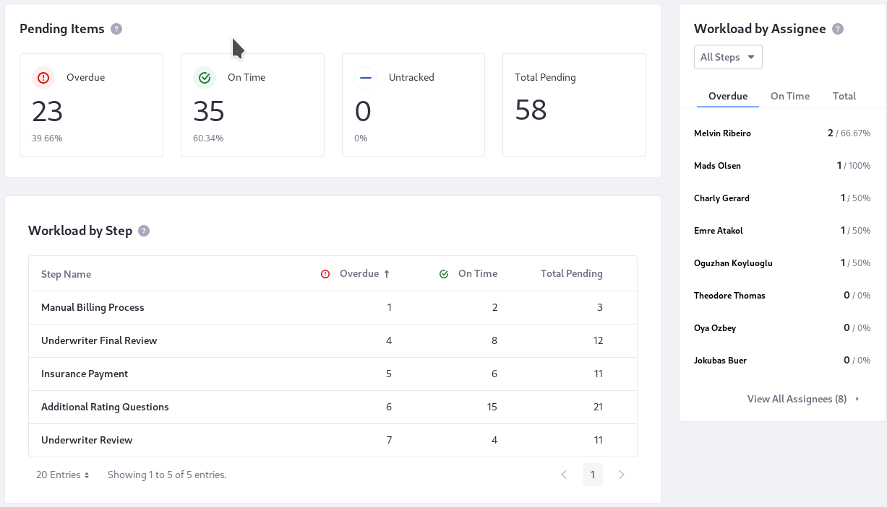
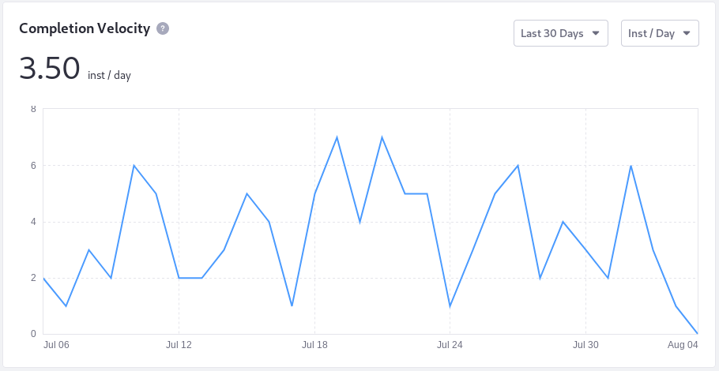
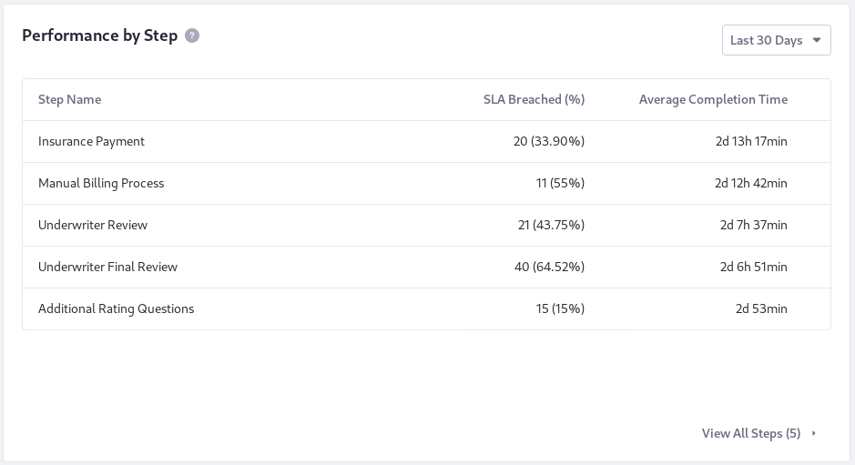
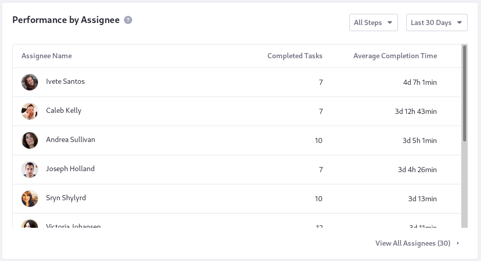
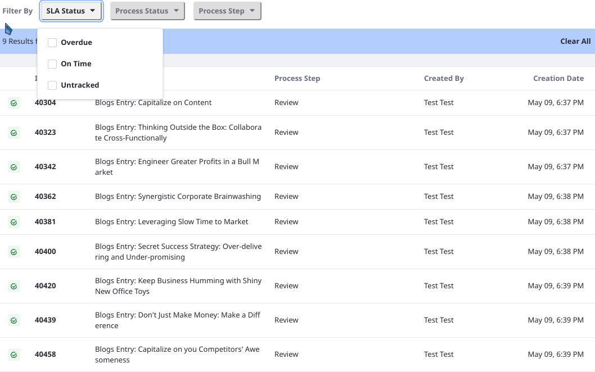
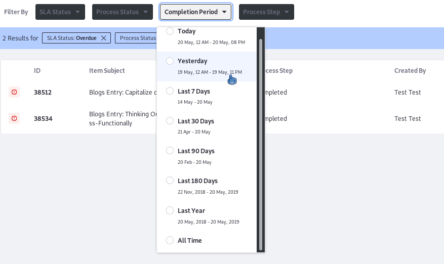
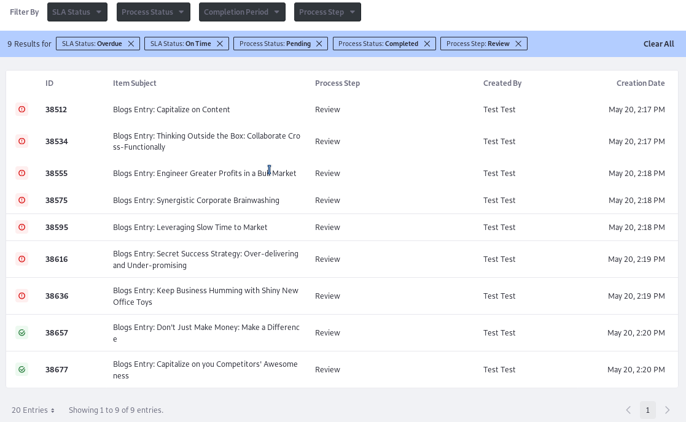
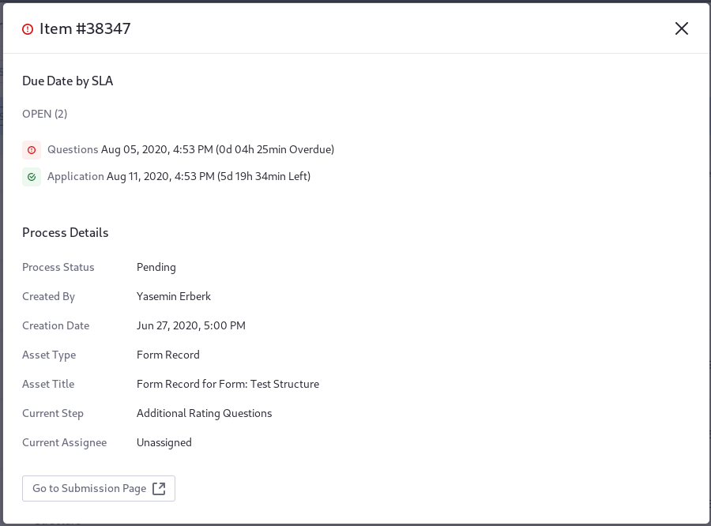

# Workflow Metrics: Reports

Open the Workflow Metrics from the Applications Menu () (Control Panel &rarr; Workflow &rarr; Metrics) and you immediately see metrics on each workflow installed in the system.


A table view of all installed workflow processes shows you how many items are overdue, how many are on time, and how many are pending in the workflow process.

Access more detailed reports by clicking on one of the workflow processes.

The Reports UI has two main views, represented as tabs: _Dashboard_ and _Performance_.

The Dashboard view is displayed by default. Included are items currently in the workflow process, even those untracked by the SLA. Untracked items include those that pre-date the SLA itself or those that are in the process but have not reached the step where the SLA is triggered.

The Performance view shows metrics for items that have completed processing in the workflow.

```note::
   **Requires Elasticsearch:** To use Workflow Metrics, you must be using Elasticsearch to index your Liferay DXP data. Read `here <../../../using-search/installing-and-upgrading-a-search-engine/introduction-to-installing-a-search-engine.md>`_ to learn about installing Elasticsearch.
```

## Understanding the Dashboard

Three valuable reports on pending items are provided in the Dashboard: the Pending Items overview, the Workload by Step table, and the Workflow by Assignee table.



**Pending Items:** Pending Items shows you the overview of items by their SLA status. Drill down by clicking on any of the statuses to see the specific items that are enumerated in Pending Items.

**Workload by Step:** Workload by Step shows a breakdown of the items that are in each step of the workflow process, by their SLA status (Overdue or On Time).

**Workload by Assignee:** The Workload by Assignee chart shows a breakdown of the workflow process's assignees, in descending order by the number of items in their queue. This chart offers a valuable glimpse to identify overloaded assignees. Click the _View all Assignees_ link to see the [All Items](#viewing-all-workflow-items) view, featuring a more robust table with better filtering and search capabilities. Filtering by workflow step, for example, helps identify assignees that are overloaded and assignees that have a lighter load. Re-assigning some tasks could remove a bottleneck.

## Understanding Process Performance

The *Performance* tab shows metrics for items that have completed the workflow process. The time period is configurable for each data presentation (with a default of 30 days).

**Completed Items:** See overview metrics of the SLA status for all completed items. Untracked items are included here as well.


**Completion Velocity:** A line chart displays the completion rate for the workflow process. The default display shows the number of completed workflow instances per day, for the last 30 days.

The overall throughput rate for the time period appears in the top of the chart (as _Inst/timeUnit_), while the trend-line appears in the chart body. The overall performance metric and the chart body are updated when you select a new time period; the time unit changes depending on the total time period you're measuring. For the Last 30 Days duration and longer periods, the time unit is configurable (instances per day, week, or month):



**Performance by Step:** See how many SLA breaches occurred at each step and the step's average completion time. If the step is part of at least one SLA definition, discover how many items had their SLA breached at the step and the proportion (as a percentage) of the total breaches that occurred at this step of the process, in comparison with all items that passed through this workflow step.



To see a full view of all the step performance metrics, click _View All Steps_.

**Performance by Assignee:** See each workflow assignee's average completion time and total completed tasks. Filtering this metric by workflow step gives a fine-grained view into where an assignee's bottlenecks lie.



To see a full view of the workflow assignees, click _View All Assignees_.

## Filtering Metrics by Time

You can filter by time, including events from today, yesterday, the last seven days, the last 30 days, 90 days, 180 days, or the last year. As you change the time period, the metric changes (e.g., Instances per hour, week, etc.) to provide a reasonable view of the data.

## Viewing all Workflow Items

There's a table view for all the items in the workflow that provides handy filters for detailed inquiries. To access it, hover over the SLA status you want, from either the Dashboard or Performance tabs. Click it to enter the All Items screen from the overview report, and a more detailed table appears, including the following columns:

**ID**: This is the workflow item's numeric identifier to the system. Importantly, you can click this to enter the Item Detail view.

**Item Subject**: A human readable summary of the item, to help administrators identify the item.

**Process Step**: Identifies where the item is in the workflow.

**Created By**: Shows the user name of the submitting User.

**Creation Date**: Shows the date and time the item was submitted to the workflow.

The All Items view can be filtered so you can find the subset of items you want to analyze.

### Filtering by SLA Status

Filter items based on whether they're Overdue, On Time, or Untracked.



**Overdue**: Overdue items have breached at least one SLAs defined deadline.

**On Time**: On Time items have not breached _any_ SLA deadline.

**Untracked**: Untracked items are in the workflow process but aren't currently under the purview of an SLA. They might be in the workflow process but haven't reached the step identified as the SLA start, or they might pre-date the SLA definition entirely.

### Filtering by Process Status and Completion Period

Filter items based on whether they're Pending or Completed in the workflow process.

If you filter by the Completed status, you'll get an additional filtering option: filter items by the Completion Period.



### Filtering by Process Step

Filter items based on where they are in the workflow definition. For example, in the Single Approver workflow process, you can choose to see a report including all items in the Review task. This is different for each workflow definition.

### Combining Filters

Use a combination of filters to find just the items you need to see. For example, below are all items in the Single Approver process's Review task that have the status Completed or Pending, whether On time or Overdue. Untracked items aren't shown.



## Item Details

To see the metrics for a single workflow process item, click the ID field while in the All Items view. A pop-up shows you more detailed information on the item.



From here you can view detailed information about the asset and even click *Go to Submission Page*, which redirects you to the item's view in the Submissions section of the Control Panel.

The top of the Item Detail view is important. It shows you the information about the due date for the item in the SLA, and its SLA completion status: _Open_ or _Resolved_.

**Open**: The defined SLA goals are not yet met. Open items can be of status Overdue or On Time.

**Resolved**: The defined SLA goals are completed. Resolved items can be of status Overdue or On Time.

## Re-Indexing Workflow Metrics

A _Re-Index_ action in Liferay DXP completely deletes, then recreates, search indexes based on mapping files. Because metrics are also stored in the database, there's no danger of data loss when re-indexing. To Re-index Workflow Metrics,

1. From the Metrics application, open the Options menu () and click _Settings_.

2. Now in the Workflow Index Actions screen, click _Reindex All_ for the Workflow Indexes entry.

   This option acts on every index in the Workflow Metrics application. More granular options are available as well.

A re-index of Workflow Metrics is required when the [search engine](../../../using-search/installing-and-upgrading-a-search-engine/introduction-to-installing-a-search-engine.md) is first configured and each time it's upgraded. A good rule of thumb is that Workflow Metrics should be re-indexed each time Liferay DXP's main search indexes are re-indexed.

From the overall metrics of a workflow process down to the details on a single item in the workflow, the new Workflow Metrics functionality gives you insights into the time it takes to _get things done_ in Liferay DXP.

## Additional Information

* [Using Workflow Metrics](./using-workflow-metrics.md)
* [Building Workflows](./building-workflows.md)
