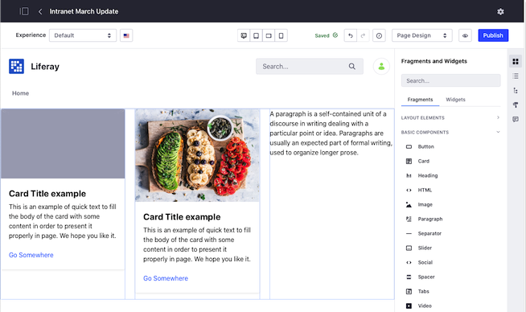
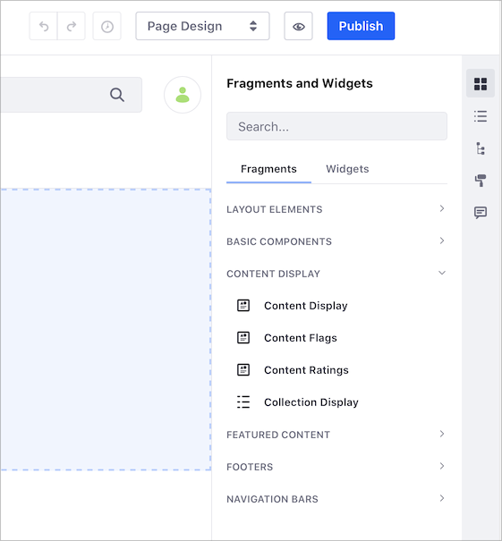
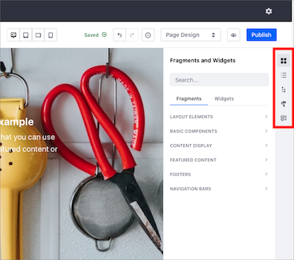
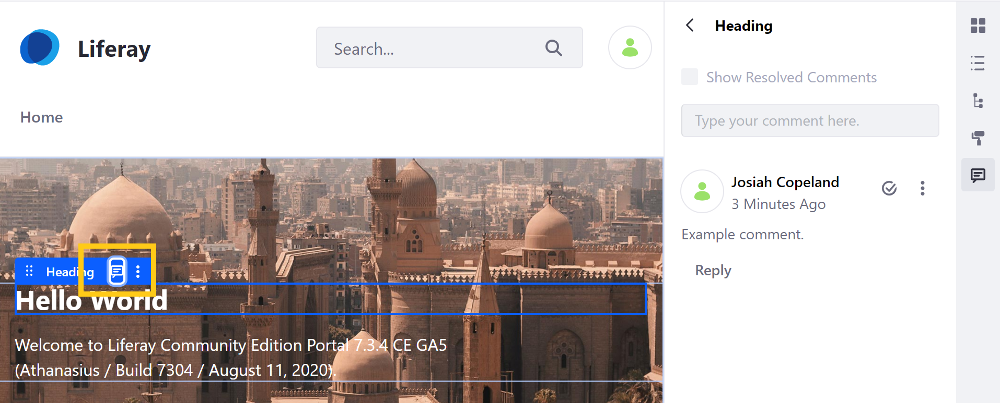

# Content Pages Overview

By default, Liferay DXP uses the *Content Page* type, which provides a convenient UI for editing and managing Page elements, content, and design. With Content Pages, you can use configurable drag-and-drop elements out-of-the-box, or develop your own to create the desired user experience.

Content Pages also support [A/B Testing](./ab-testing), [Workflow](../../../process-automation/workflow/user-guide/introduction-to-workflow.md), and personalized, adaptive Site experiences. See [Understanding Pages](./../understanding-pages/understanding-pages.md) for more information about Page types.

The following material provides an overview of the Content Page UI and features. If you want to build your own Content Page, see [Building Content Pages](./building-content-pages.md) for how to get started.

* [Configuring Content Pages](#configuring-content-pages)
* [Fragments and Widgets](#fragments-and-widgets)
* [Contents](#contents)
* [Page Structure](#Page-structure)
* [Page Design Options](#Page-design-options)
* [Comments](#comments)

## Configuring Content Pages

While you can configure Content Pages like other Page types, Liferay provides unique editing options and UI for Content Pages. To access these options, navigate to the Page you want to customize, and click on the *Edit* button in the top right of the *Application Bar*.


```tip::
   You can also access these edit options via the *Page Tree* in the Product menu. Simply click on the *Actions* button for the Content Page you want to edit, and select *Edit*.
```

By clicking *Edit*, you can access both the Content Page's toolbar and sidebar. Here you can add configurable Page elements, customize displays for different Users and devices, localize your content, and more.


### Content Page Toolbar

With the Content Page toolbar, you can create unique User *Experiences*, set localized language translations, customize a Page's display for different devices, and *Preview* and *Publish* changes.

You can also use the *Page Design* drop-down menu to set your editing mode, selecting between *Page Design* or *Content Edition*. The editing options available in the Content Page sidebar depend on the editing mode you choose.



### Content Page Sidebar

The Content Page sidebar provides access to *Page Fragments* and *widgets*, the primary building blocks of Content Pages, as well as other tools for managing Page content, configuring Page design, and communicating with team members. In the sidebar, these settings are divided into five sections:

*  Fragments and Widgets
*  Contents
*  Page Structure
*  Page Design Options
*  Comments

## Fragments and Widgets

> Available: Liferay 7.3+; previously divided between *Sections* and *Section Builder* panels.

In the *Fragments and Widgets* panel of the Content Page sidebar (  ), you can access both out-of-the-box and custom Page elements that you can use to build your Page.

### Fragments

*Page Fragments* are extensible, reusable, drag-and-drop elements that serve as the primary building blocks for Content Pages. Each Fragment includes editable elements, such as [text](./building-content-pages.md#editing-text), [images](./building-content-pages.md#editing-an-image), or [links](./building-content-pages.md#editing-a-hyperlink), that you can [map to Site content](./building-content-pages.md#mapping-content). Fragment examples include layout elements for defining droppable areas, displays for content collections, and banner images with text overlay and CTA (Call to Action).



While Liferay provides a number of out-of-the-box Fragments, you can create your own. See [Developing Fragments](../../developer-guide/developing-Page-fragments/developing-fragments-intro.md) to learn how.

### Widgets

*Widgets* are drag-and-drop applications you can use to display content or add interactive and dynamic functionality to your Page. Liferay provides a number of configurable out-of-the-box widgets that you can use to create blogs, wikis, message boards, and more. You can access these widgets with basic configuration options and permissions in the *Widgets* tab. See [Using Widgets on Content Pages](./using-widgets-on-a-content-Page.md) for more information.


```note::
   While portlets are rendered according to `render-weight <https://docs.liferay.com/ce/portal/7.3-latest/definitions/liferay-portlet-app_7_3_0.dtd.html#render-weight>`_ on Widget Pages, that is not true for Content Pages. Portlets are rendered in the order they appear on Content Pages (i.e., left to right, top to bottom).
```

## Contents

> Available: Liferay DXP 7.3+

In the *Contents* panel of the Content Page sidebar (  ), you can view, edit, and manage a Page's web content. This includes content displayed in widgets as well as content mapped to content fields. See [Managing Web Content on Content Pages](./managing-web-content-on-content-pages.md) for more information.

## Page Structure

In the *Page Structure* panel of the Content Page sidebar (  ), you can view a hierarchical outline of all Page elements, as well as select, edit, or remove those elements. Click on a field in the Page structure to highlight it on the Page and vice versa.



```note::
   While Headers and Footers appear in the Page structure for custom [Master Page Templates](../defining-headers-and-footers/master-Page-templates.md),they can only be edited or removed via the Master Page Template.
```

## Page Design Options

In the *Page Design* panel of the Content Page sidebar (  ), you can view and change a Page's *Look and Feel* settings. This includes a Page's *Master Template* and *Style Book*, and *Theme*.


You can also click on *More* to access a Page's *Advanced* settings that you can use to define its *Mobile Device Rules*, add custom *JavaScript* code, or set query string parameters. See [Page Configuration UI Reference](./Page-configuration-ui-reference.md) for more information about these Page configuration options.

## Comments

You can comment on Page Fragments while editing a Content Page to collaborate with team members. If comment mentions are enabled, you can also mention Users with Page update permissions as part of your comment. See [Mentioning Users](./../../../collaboration-and-social/notifications-and-requests/user-guide/mentioning-users.md) for more information.

To make a comment, begin editing a Content Page and click on the Page Fragment you want to annotate. Then click on the *Comment* icon for the Fragment. Mentioned Users will be notified.



Once a comment is made, you can edit or delete the comment by clicking on its *Actions* button () in the *Comments* panel of the Content Page sidebar (). Here, you can also view all Page comments, reply to open comments, or change a comment's status.

```note::
   For versions prior to 7.3+, comments are disabled by default. To enable Page comments, go to *Control Panel* &rarr; *Configuration* &rarr; *System Settings* &rarr; *Pages* &rarr; *Content Page Editor*. Then, check the *Comments Enabled* checkbox, and click *Update*.
```

## Workflow

As of Liferay Portal CE 7.3 GA2, [Workflow](../../../process-automation/workflow/user-guide/introduction-to-workflow.md) is supported for Content Pages.

## Related Information

* [Building Content Pages](./building-content-pages.md)
* [Page Fragments](../../displaying-content/using-fragments/using-Page-fragments.md)
* [Using Fragment Comments](./using-Fragment-comments.md)
