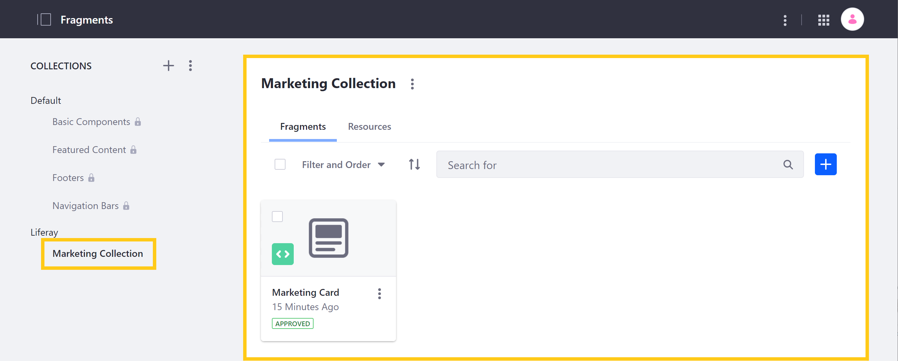
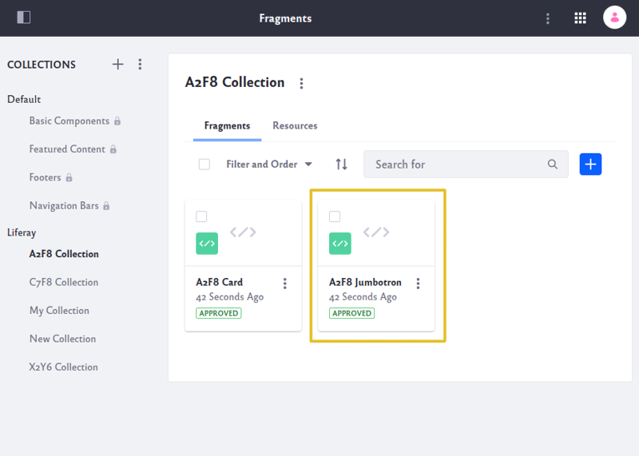

# Automatically Importing Fragments

> Available: Liferay Portal CE 7.3 GA1+ and Liferay DXP 7.3+

If you're [developing Page Fragments with your own tooling](./using-the-fragments-toolkit.md#collection-format-overview), the packaged ZIP file must be imported through the UI manually by default. You can add an auto-deployment descriptor to your Fragment Collection to automatically import it upon deployment instead. If you're using the Fragments Toolkit to develop Fragments, you can use the [`npm run compress` command](././using-the-fragments-toolkit.md) to include an auto-deployment descriptor. Here you'll learn how to add an auto-deployment descriptor to your Fragment Collection:

1. [Deploy an Auto-deployable Fragment Collection](#deploy-an-auto-deployable-fragment-collection)
1. [Modify the Fragment Collection and Redeploy](#modify-the-fragment-collection-and-redeploy)

This example uses a Docker image with a fresh install of Liferay DXP and runs on Liferay DXP 7.3.

## Deploy an Auto-deployable Fragment Collection

First, deploy an example to see how auto-deployable Fragments work:

1. Run the command below to start the Docker container:

    ```bash
    docker run -it -p 8080:8080 liferay/portal:[$LIFERAY_LEARN_PORTAL_VERSION$]
    ```

1. Download and unzip the [example auto-deployable Fragment Collection](https://learn.liferay.com/dxp/7.x/en/site-building/developer-guide/developing-page-fragments/liferay-a2f8.zip):

    ```bash
    curl https://learn.liferay.com/dxp/7.x/en/site-building/developer-guide/developing-page-fragments/liferay-a2f8.zip
    ```

    ```bash
    unzip liferay-a2f8.zip
    ```

    ```bash
    cd liferay-a2f8
    ```

1. Compress the Fragment project into a ZIP:

    ```bash
    zip marketing-fragments
    ```

1. Copy the Collection `zip` file to the Docker container to import the Fragments Collection automatically:

    ```bash
    docker cp marketing-fragments.zip docker-container-name:/path/to/deploy/folder
    ```

1. Confirm the deployment to the Liferay Docker container console. The log message below appears in the Docker console:

    ```bash
    INFO  [com.liferay.portal.kernel.deploy.auto.AutoDeployScanner][AutoDeployDir:263] Processing marketing-fragments.zip
    ```

1. Verify that the Fragment Collection is available. Open your browser to `https://localhost:8080`, open the Product Menu, and go to Site &rarr; *Site Builder* &rarr; *Page Fragments*. The Collection is listed with the other Collections.



## Deployment Descriptor Overview

The project's ZIP has the structure below:

```
`liferay-deploy-fragments.json`
        * `fragment-collection/`
    * `fragment/`
        * Fragment files...
    * `collection.json`
```

The `liferay-deploy-fragments.json` file specifies the scope where you want to automatically deploy the Fragments: System-wide, a virtual instance (Company), or a Site (group). The example has the configuration below that specifies to auto-deploy the Fragments to a Site (group) called "Guest" within a virtual instance (liferay.com):

```json
{
    "companyWebId": "liferay.com",
    "groupKey": "Guest"
}
```

Both keys in this JSON file are optional. You can make Fragments available system-wide (all instances) by making the deployment descriptor an empty JSON object, or adding this configuration:

```json
{
    "companyWebId": "*"
}
```

## Modify the Fragment Collection and Redeploy

Follow these steps to add a new Fragment to the Collection and redeploy:

1. Move the `liferay-a2f8/marketing-jumbotron` Fragment folder in the example's ZIP file into the `marketing-fragments/marketing-collection/` folder. See [Developing Page Fragments with the Fragments Toolkit](./using-the-fragments-toolkit.md) for more information on creating Fragments.
1. Compress the Collection into a ZIP file as you did above:

    ```bash
    zip marketing-fragments
    ```

1. Copy the Collection `zip` file to the Docker container to automatically import the Fragments Collection:

   ```bash
   docker cp marketing-fragments.zip docker-container-name:/path/to/deploy/folder
   ```

1. Open your browser to `https://localhost:8080`, open the Product Menu, and go to Site &rarr; *Site Builder* &rarr; *Page Fragments*. The Collection includes the new Marketing Jumbotron Fragment.

    

Great! Now you know how to configure a Fragment Collection for automatic import.

## Related Information

* [Including Default Resources with Fragments](./including-default-resources-with-fragments.md)
* [Adding Configuration Options to Fragments](./adding-configuration-options-to-fragments.md)
