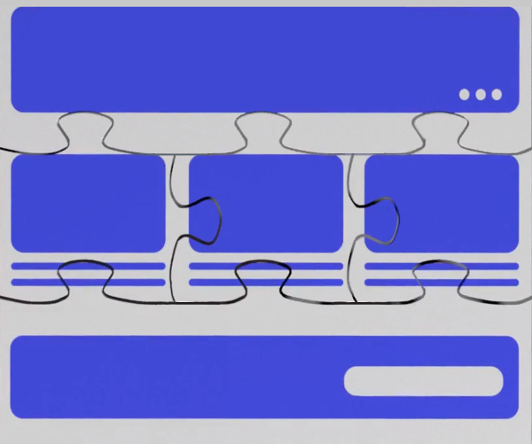

# Developing Fragments

Page Fragments are the building blocks for [Content Pages](../../creating-pages/understanding-pages/understanding-pages.md#content-pages). They're made from the three components of web pages: CSS, HTML, and JavaScript. To create a page you combine multiple fragments, and together they create the design for the page and its functionality. Fragments can make up a larger page element (such as cards or paragraph elements), or they can stand alone on their own (such as a banner).



## Collections

Collections organize Fragments so that groups of related Fragments can be managed and shared. Users navigate Collections when selecting Fragments to add to a page, so you'll create Fragments in Collections that make it easy to combine into Pages. An example appears in the admin page, which shows all the out-of-the-box Fragments (and their code). A Page Fragment's code can be updated through the admin interface. If you want your Page Fragment's code instead to be static (locked and unable to be edited through the interface), you can create a [Contributed Fragment Collection](./creating-a-contributed-fragment-collection.md).

## Tooling

You can use the included Page Fragments to [build Content Pages](../../creating-pages/building-and-managing-content-pages/building-content-pages.md), and you can also create your own Page Fragments. Browser-based tools help you create Fragments directly on your system, and CLI-based tools integrate with your own toolset to preserve your productivity:

* [The Built-in Fragments Editor](./using-the-fragments-editor.md): use the built-in editor to develop Page Fragments inside of Liferay Portal.
* [The Fragments Toolkit](./using-the-fragments-toolkit.md): use the Fragments CLI to generate, import, and export Page Fragments and Fragment Collections from your desktop.

## Features

Fragments can be enhanced using the below resources, making them much more powerful than plain HTML, CSS, and JavaScript:

* [Editable Elements](../reference/fragments/fragment-specific-tags-reference.md): make text, images, links, and "rich" text elements editable, so users can replace the content with custom text and images. This is the key feature of Fragments that makes them reusable. You can also embed widgets.
* [Configuration Options](./adding-configuration-options-to-fragments.md) <!-- TODO: Fix link -->: Add configuration options to the application's Configuration Menu, like modifying the Fragment's font color.
* [FreeMarker](https://freemarker.apache.org/): FreeMarker is a templating language that enhances HTML with variables, conditional statements, and more. From your HTML, you can use the [alternative (square bracket) syntax](https://freemarker.apache.org/docs/dgui_misc_alternativesyntax.html) for FreeMarker.

```important::
   Grant permission to Create or Edit templates in FreeMarker to trusted users only. See `Assigning Permissions to Web Content Structures and Templates <../../../content-authoring-and-management/web-content/web-content-structures/assigning-permissions-to-structures-and-templates.md#security-considerations-for-web-content-templates>`_ for information about Web Content Templates security.
```

## Best Practices

We recommend these best practices when writing your Fragment code:

* Make your code semantic and highly reusable.
* Namespace your Fragments properly so they don't interfere with other elements on the page outside of the Fragment.
* Use the autogenerated Fragment class as the basis for all CSS selectors you add to avoid impacting other Fragments.
* Use JavaScript sparingly, since it isn't easily reusable. Instead, reference external JavaScript libraries.
* [Escape Fragment configuration text values](./escaping-fragment-configuration-text-values-reference.md) <!-- TODO: Fix link -->

## Additional Information

* [Adding Configuration Options to Fragments](./adding-configuration-options-to-fragments.md)
* [Using the Fragments Editor](./using-the-fragments-editor.md)
* [Using the Fragments Toolkit](./using-the-fragments-toolkit.md)
