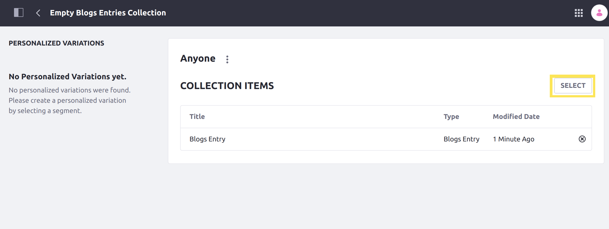
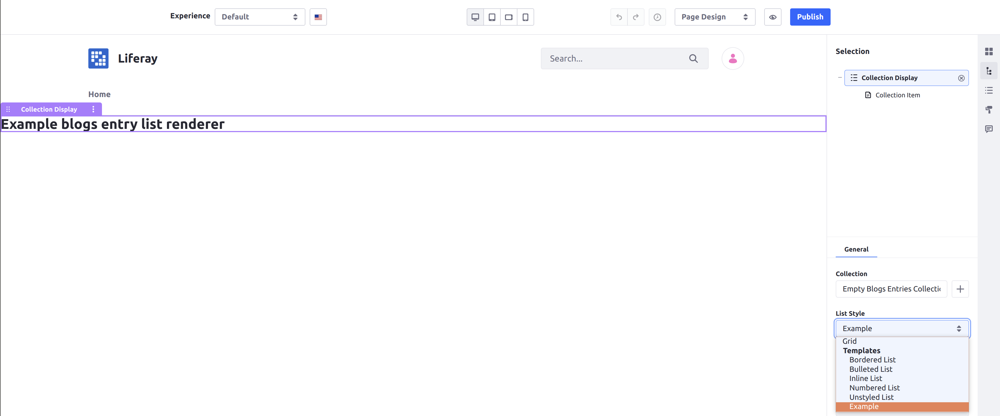

# Implementing a List Renderer for Collections

List renderers are used to present different styles for displaying a whole list of asset entries in a Collection, within a Collection Display fragment.<!-- add link to Collection Display fragment article when available --> For example, Liferay DXP has list renderers to display Collections in a numbered list, bulleted list, or grid format out-of-the-box.

Implementing a list renderer involves implementing the [`InfoListRenderer`](https://github.com/liferay/liferay-portal/blob/[$LIFERAY_LEARN_PORTAL_GIT_TAG$]/modules/apps/info/info-api/src/main/java/com/liferay/info/list/renderer/InfoListRenderer.java) interface and deploying it to Liferay DXP.

## Start with a Sample Module

In order to create a list renderer, you must deploy a module with your list renderer provided in it. This example uses an [MVC Portlet](../../../../developing-a-java-web-application/using-mvc/creating-an-application-with-mvcportlet.md) with a JSP view as a starting point.

To begin, download the sample module:

```bash
curl https://learn.liferay.com/dxp/7.x/en/site-building/displaying-content/displaying-collections-and-collection-pages/developer-guide/implementing-a-list-renderer-for-collections/resources/liferay-e8m8.zip -O
```

Once you have the example module, you are ready to begin adding a list renderer to it. Implementing the list renderer requires changes to both the Java code (in the example module, [`E8M8InfoListRenderer.java`](https://github.com/liferay/liferay-learn/tree/master/docs/dxp/7.2/en/site-building/displaying-content/displaying-collections-and-collection-pages/developer-guide/implementing-a-list-renderer-for-collections/resources/liferay-e8m8.zip/e8m8-web/src/main/java/com/acme/e8m8/info/list/renderer/E8M8InfoListRenderer.java)) and the rendering implementation for the list (which is handled in [`blogs_entry_list.jsp`](https://github.com/liferay/liferay-learn/tree/master/docs/dxp/7.2/en/site-building/displaying-content/displaying-collections-and-collection-pages/developer-guide/implementing-a-list-renderer-for-collections/resources/liferay-e8m8.zip/e8m8-web/src/main/resources/META-INF/resources/blogs_entry_list.jsp) in the sample module). The following walkthrough shows how to complete a list renderer using the example module.

## Declare the OSGi Component

Each `InfoListRenderer` implementation corresponds to a specific type of `AssetEntry` that it is used to display. When you declare your class, make sure you declare the generic type that corresponds to the displayed objects.

Declare the class as an OSGi component:

```java
@Component(immediate = true, service = InfoListRenderer.class)
public class E8M8InfoListRenderer implements InfoListRenderer<BlogsEntry> {
```

In this example, the renderer is used to display a list of Blogs entries, so the generic type chosen is [`BlogsEntry`](https://github.com/liferay/liferay-portal/blob/[$LIFERAY_LEARN_PORTAL_GIT_TAG$]/modules/apps/blogs/blogs-api/src/main/java/com/liferay/blogs/model/BlogsEntry.java).

## Define a Key

Override the `getKey` method to define a key for your list renderer. The key you provide is what users see when selecting a renderer from the "List Style" drop-down in the Collection Display fragment configuration.

```java
@Override
public String getKey() {
    return "Example";
}
```

## Define Compatible Item Renderers

You can also specify a list of item renderers that can be used to display the items in the Collection.

To define valid item renderers that can be used together with your list renderer, override the `getAvailableInfoItemRenderers` method. Use a reference to an [`InfoItemRendererTracker`](https://github.com/liferay/liferay-portal/blob/[$LIFERAY_LEARN_PORTAL_GIT_TAG$]/modules/apps/info/info-api/src/main/java/com/liferay/info/item/renderer/InfoItemRendererTracker.java):

```java
@Override
public List<InfoItemRenderer<?>> getAvailableInfoItemRenderers() {
    return infoItemRendererTracker.getInfoItemRenderers(
        BlogsEntry.class.getName());
}
```

In this example, all item renderers that can display a `BlogsEntry` object are chosen as valid item renderers.

You can skip this step if you do not intend for your list renderer to work together with item renderers (for example, if you will have the list renderer itself display each of the items in the Collection).

If you do not override this method, then when you select your list renderer, the List Item Style drop-down will not appear because there are no applicable item renderers for it.

## Implement the Render Logic

Override the `render` method to provide your implementation of the list itself. You can use this method to call code using any rendering strategy you choose.

In this example, a JSP is used to provide a placeholder renderer for the list. In this case, a reference to the `ServletContext` is used to retrieve the JSP from the module.

```java
@Override
public void render(
    List<BlogsEntry> entries, HttpServletRequest httpServletRequest,
    HttpServletResponse httpServletResponse) {

    RequestDispatcher requestDispatcher =
        _servletContext.getRequestDispatcher("/blogs_entry_list.jsp");

    httpServletRequest.setAttribute("entries", entries);

    try {
        requestDispatcher.include(httpServletRequest, httpServletResponse);
    }
    catch (Exception e) {
        throw new RuntimeException(e);
    }
}
```

Then, you only must implement the style you want in the view you call (in this example, `blogs_entry_list.jsp`). The `blogs_entry_list.jsp` in the provided sample module contains placeholder text that you can keep to show the list renderer is working.

## Test Your Application

Now deploy your sample module to see the list renderer in action.

### Deploy the Sample Module

1. Start a Liferay DXP Docker container with the following command:

    ```bash
    docker run -it -p 8080:8080 [$LIFERAY_LEARN_DXP_DOCKER_IMAGE$]
    ```

1. Run the following commands from the root of the module to build and deploy to your Docker container:

    ```bash
    ./gradlew deploy -Ddeploy.docker.container.id=$(docker ps -lq)
    ```

    ```tip::
       This command is the same as copying the deployed jars to ``/opt/liferay/osgi/modules`` on the Docker container.
    ```

1. Confirm the deployment in the Liferay Docker container console.

    ```bash
    STARTED com.acme.e8m8.web_1.0.0 [1017]
    ```

The example module is now deployed to your Docker image. Now you can see the list renderer in action in Liferay DXP.

### Create a Collection of Blogs Entries

The example module uses a list renderer specifically for a Collection of Blogs entries. Thus, to use it with a Collection Display fragment, you must have a Collection of Blogs entries to apply it to.

Create a Collection of Blogs entries to test with:

1. Open your browser to `https://localhost:8080` and log in.

1. Open the Site menu by clicking the icon () icon, and navigate to *Content & Data* &rarr; *Blogs*.

1. Click the Add icon () to add at least one Blogs Entry.

1. From the Site menu, navigate to *Site Builder* &rarr; *Collections*.

1. Click the Add icon (), and click to create a *Manual Collection*.

1. Add a title, and click *Save*.

1. Under the *Item Type* drop-down, select *Blogs Entry* from the list. This narrows down the types of asset entries that the Collection applies to, which changes the list renderers that may be used to display it.

    

1. Click *Save*.

1. Click the *Select* button, and then select the Blogs entry you created.

    

You now have a Collection of Blogs entries to use to select your list renderer. You must have at least one entry in the list for the list renderer to display in the Collection Display fragment.

### Display the Collection with Your List Renderer

Finally, use a Collection Display fragment to use the list renderer you created:

1. Navigate to any widget page.

1. Click the Edit icon () to edit the page.

1. Click the icon () to open the Fragments and Widgets menu.

1. Drag the *Collection Display* fragment from the list onto an editable area on the page.

    

1. Click on the (empty) Collection Display fragment you added.

1. In the configuration menu on the right, click to select a collection, and select the Collection [you created previously](#create-a-collection-of-blogs-entries).

1. Under the *List Style* drop-down that appears in the configuration menu, select the *Example* list renderer from the list.

    

The list renderer now displays the content in your view in the Collection Display fragment (in this example, placeholder text).

Congratulations! You now know the basics for implementing a list renderer for Collections, and have added a new list renderer to Liferay DXP.

## Next Steps

The provided example module displays placeholder text to demonstrate that it is working, but does not actually display any asset entry information. However, to display your of asset entries, the next step is to implement logic to display each individual asset entry within the list, within the style you have implemented.

In addition to providing the styling or format of your choice to present the list, your  implementation is also responsible to display each individual item from the list. You can either display it within the same JSP (using the entries you set as the request attribute), or call other code that retrieves the appropriate [`InfoItemRenderer`](https://github.com/liferay/liferay-portal/blob/[$LIFERAY_LEARN_PORTAL_GIT_TAG$]/modules/apps/info/info-api/src/main/java/com/liferay/info/item/renderer/InfoItemRenderer.java) to do the job for each entry.

To implement a specific `InfoItemRenderer` for each item in a Collection, see [Implementing an Item Renderer for Collections](./implementing-an-item-renderer-for-collections.md).
