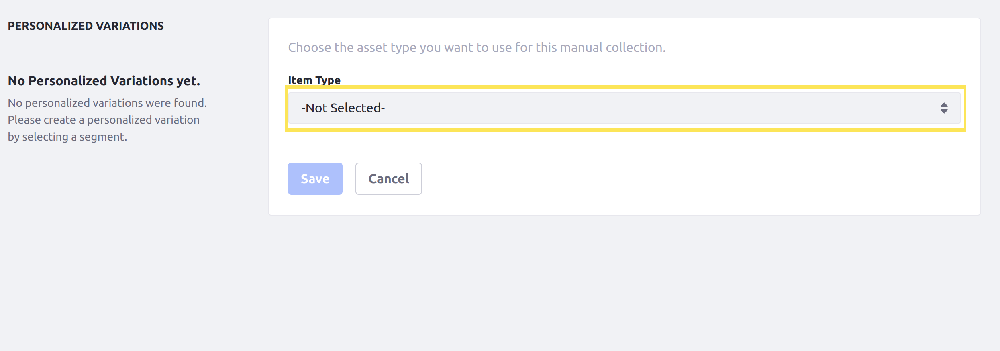
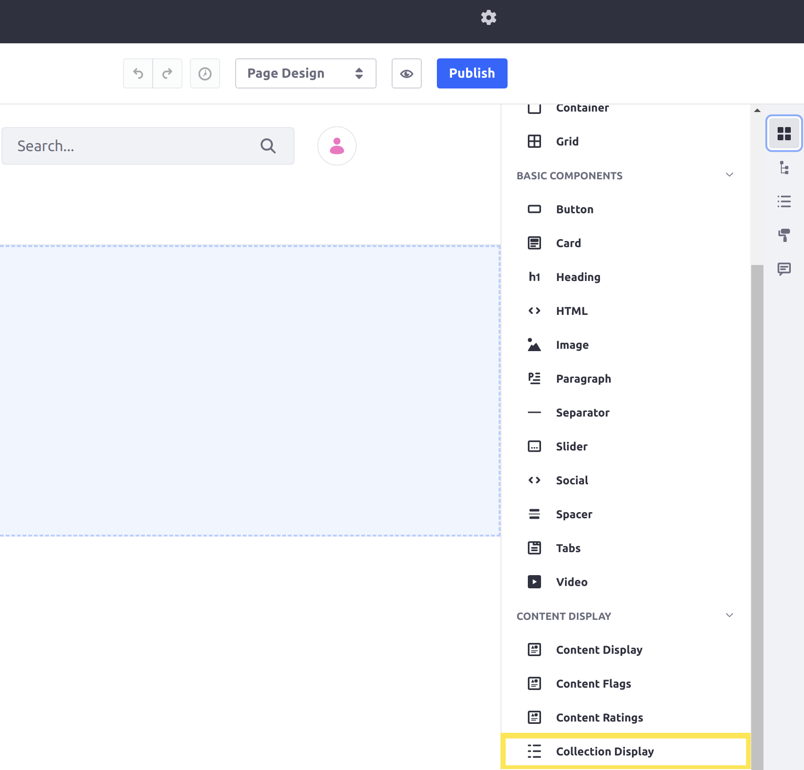
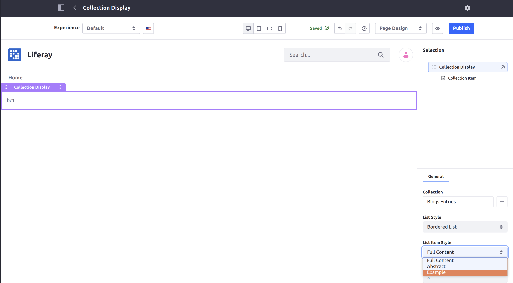

# Implementing an Item Renderer for Collections

Item renderers are used to present different styles for displaying specific elements of a Collection in a Collection Display fragment.<!-- add link to Collection Display fragment article when available --> For example, an item renderer for web content articles may display the article's abstract, just the title, or the full contents of the article.

You can use a custom list renderer to call an applicable item renderer, as well. See [Implementing a List Renderer for Collections](./implementing-a-list-renderer-for-collections.md) for more information.

Implementing an item renderer involves implementing the [`InfoItemRenderer`](https://github.com/liferay/liferay-portal/blob/[$LIFERAY_LEARN_PORTAL_GIT_TAG$]/modules/apps/info/info-api/src/main/java/com/liferay/info/item/renderer/InfoItemRenderer.java)interface and deploying it to Liferay DXP.

## Start with a Sample Module

In order to create an item renderer, you must deploy a module with your item renderer provided in it. This example uses an [MVC Portlet](../../../../developing-a-java-web-application/using-mvc/creating-an-application-with-mvcportlet.md) with a JSP view as a starting point.

To begin, download the sample module:

```bash
curl https://learn.liferay.com/dxp/7.x/en/site-building/displaying-content/displaying-collections-and-collection-pages/developer-guide/implementing-an-item-renderer-for-collections/resources/liferay-v7a2.zip -O
```

Once you have the example module, you are ready to begin adding an item renderer to it. Implementing the item renderer requires changes to both the Java code (in the example module, [`V7A2InfoItemRenderer.java`](https://github.com/liferay/liferay-learn/tree/master/docs/dxp/7.2/en/site-building/displaying-content/displaying-collections-and-collection-pages/developer-guide/implementing-an-item-renderer-for-collections/resources/liferay-v7a2.zip/v7a2-web/src/main/java/com/acme/v7a2/info/item/renderer/V7A2InfoItemRenderer.java)) and the rendering implementation for the asset entry (which is handled in [`blogs_entry_item.jsp`](https://github.com/liferay/liferay-learn/tree/master/docs/dxp/7.2/en/site-building/displaying-content/displaying-collections-and-collection-pages/developer-guide/implementing-an-item-renderer-for-collections/resources/liferay-v7a2.zip/v7a2-web/src/main/resources/META-INF/resources/blogs_entry_item.jsp) in the sample module). The following walkthrough shows how to complete an item renderer using the example module.

## Declare the OSGi Component

Each `InfoItemRenderer` implementation corresponds to a specific type of `AssetEntry` that it is used to display. When you declare your class, make sure you declare the generic type that corresponds to the displayed objects.

Declare the class as an OSGi component:

```java
@Component(immediate = true, service = InfoItemRenderer.class)
public class V7A2InfoItemRenderer implements InfoItemRenderer<BlogsEntry> {
```

In this example, the renderer is used to display a list of Blogs entries, so the generic type chosen is [`BlogsEntry`](https://github.com/liferay/liferay-portal/blob/[$LIFERAY_LEARN_PORTAL_GIT_TAG$]/modules/apps/blogs/blogs-api/src/main/java/com/liferay/blogs/model/BlogsEntry.java).

## Define a Key

Override the `getKey` method to define a key for your item renderer. The key you provide is what users see when selecting a renderer from the "List Item Style" drop-down in the Collection Display fragment configuration.

```java
@Override
public String getKey() {
    return "Example";
}
```

## Implement the Render Logic

Override the `render` method to provide your implementation to render each asset entry. You can use this method to call code using any rendering strategy you choose.

In this example, a JSP is used to provide a placeholder renderer for a given Blogs entry. In this case, a reference to the `ServletContext` is used to retrieve the JSP from the module.

```java
@Override
public void render(
    BlogsEntry blogsEntry, HttpServletRequest httpServletRequest,
    HttpServletResponse httpServletResponse) {

    RequestDispatcher requestDispatcher =
        _servletContext.getRequestDispatcher("/blogs_entry_item.jsp");

    httpServletRequest.setAttribute("blogsEntry", blogsEntry);

    try {
        requestDispatcher.include(httpServletRequest, httpServletResponse);
    }
    catch (Exception e) {
        throw new RuntimeException(e);
    }
}
```

Then, you only must implement the style you want in the view you call (in this example, `blogs_entry_item.jsp`). The `blogs_entry_item.jsp` in the provided sample module contains placeholder text that you can keep to show the item renderer is working.

## Test Your Application

Now deploy your sample module to see the item renderer in action.

### Deploy the Sample Module

1. Start a Liferay DXP Docker container with the following command:

    ```bash
    docker run -it -p 8080:8080 [$LIFERAY_LEARN_DXP_DOCKER_IMAGE$]
    ```

1. Run the following commands from the root of the module to build and deploy to your Docker container:

    ```bash
    ./gradlew deploy -Ddeploy.docker.container.id=$(docker ps -lq)
    ```

    ```tip::
       This command is the same as copying the deployed jars to ``/opt/liferay/osgi/modules`` on the Docker container.
    ```

1. Confirm the deployment in the Liferay Docker container console.

    ```bash
    STARTED com.acme.v7a2.web_1.0.0 [1017]
    ```

The example module is now deployed to your Docker image. Now you can see the item renderer in action in Liferay DXP.

### Create a Collection of Blogs Entries

The example module uses an item renderer specifically for a Collection of Blogs entries. Thus, to use it with a Collection Display fragment, you must have a Collection of Blogs entries to apply it to.

Create a Collection of Blogs entries to test with:

1. Open your browser to `https://localhost:8080` and log in.

1. Open the Site menu by clicking the icon (), and navigate to *Content & Data* &rarr; *Blogs*.

1. Click the Add icon () to add at least one Blogs Entry. Create multiple Blogs entries to see your item renderer work for multiple Blogs entries.

1. From the Site menu, navigate to *Site Builder* &rarr; *Collections*.

1. Click the Add icon (), and click to create a *Manual Collection*.

1. Add a title, and click *Save*.

1. Under the *Item Type* drop-down, select *Blogs Entry* from the list. This narrows down the types of asset entries that the Collection applies to, which changes the item renderers that may be used to display it.

    

1. Click *Save*.

1. Click the *Select* button, and then select the Blogs entry you created.

    

You now have a Collection of Blogs entries to use to select and use your item renderer. You must have at least one entry in the list to demonstrate using the item renderer in a Collection Display fragment.

### Display the Collection with Your Item Renderer

Finally, use a Collection Display fragment to use the item renderer you created:

1. Navigate to any widget page.

1. Click the Edit icon () to edit the page.

1. Click the icon () to open the Fragments and Widgets menu.

1. Drag the *Collection Display* fragment from the list onto an editable area on the page.

    

1. Click on the (empty) Collection Display fragment you added.

1. In the configuration menu on the right, click to select a collection, and select the Collection [you created previously](#create-a-collection-of-blogs-entries).

1. Under the *List Style* drop-down that appears in the configuration menu, select any list renderer that individually displays each item, such as the *Bulleted List* renderer. 

1. Under the *List Item Style* drop-down, select the *Example* item renderer from the list.

    

The item renderer now displays the content in your view in the Collection Display fragment for each asset entry in the Collection (in this example, placeholder text).

Congratulations! You now know the basics for implementing an item renderer for Collections, and have added a new item renderer to Liferay DXP.

## Additional Information

* [Implementing a List Renderer for Collections](./implementing-a-list-renderer-for-collections.md)