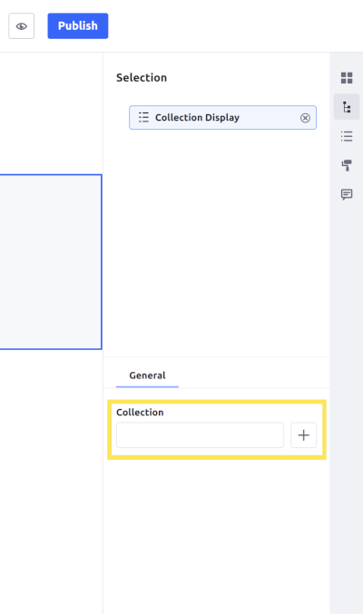
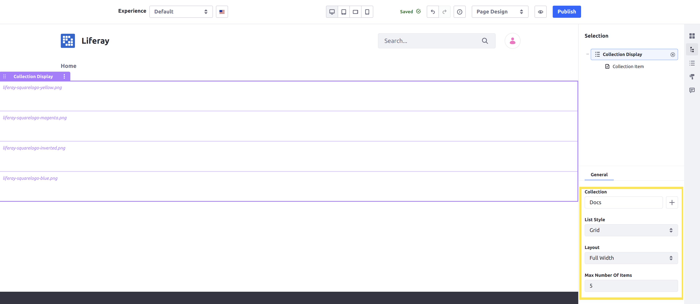

# Collection Display Fragments

The Collection Display fragment is a convenient and flexible way out-of-the-box to display Collections on your Site. For more information about Collections, see [About Collections and Collection Pages](../../../content-authoring-and-management/collections-and-collection-pages/about-collections-and-collection-pages.md).

## Displaying a Collection in a Collection Display Fragment

Use the following steps to display a Collection in a Collection Display fragment on any Content Page:

1. Add a collection if you don't already have one. See [Creating Collections](../../../content-authoring-and-management/collections-and-collection-pages/creating-collections.md) for more information.

1. Click the Edit icon () on a Content Page.

1. Click the icon () to open the Fragments and Widgets panel.

1. Under the *Content Display* category in the Fragments menu, drag the *Collection Display* fragment to a place on the page.

1. Click on the Collection Display fragment to show the configuration in the *Selection* panel.

1. Click the button to select a Collection for the fragment to display in the *General* section of the panel:

    

The Collection Display fragment is now on the page and displaying the selected Collection.

## Configuring a Collection Display Fragment

After you have added a Collection Display fragment to a page, you can configure it while you are still editing the page.

Selecting a Collection divides the fragment into sections for each asset in the collection. The style to display the assets in, the number of columns, and the max number of assets to display in the fragment are all configurable via new options that appear under the *General* configuration after you've selected a Collection.

Publish the page when you're ready for the assets in the Collection to be displayed as configured.

## Additional Information

* [About Collections and Collection Pages](../../../content-authoring-and-management/collections-and-collection-pages/about-collections-and-collection-pages.md)
* [Creating Collections](../../../content-authoring-and-management/collections-and-collection-pages/creating-collections.md)
* [Displaying Collections and Collection Pages](./displaying-collections-and-collection-pages.md)
<!-- Add link to developer tutorial(s) when they are available -->