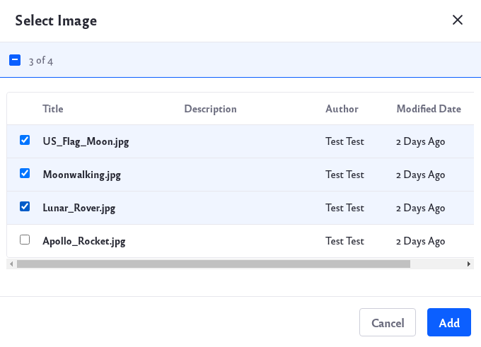
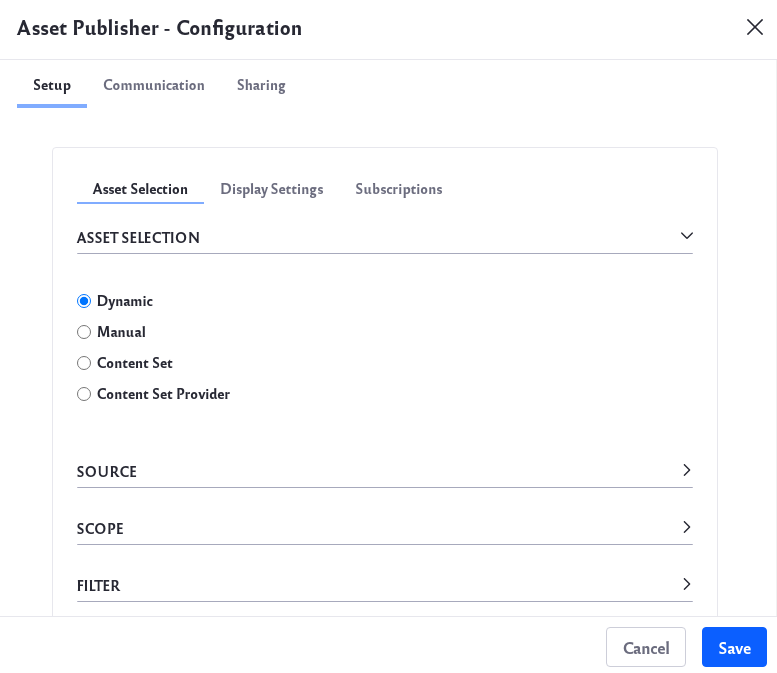

# Selecting Assets for the Asset Publisher

To select assets to publish in the *Asset Publisher* widget,

1. Click the *Options* button () at the top-right corner of the widget.

1. Select *Configuration* to display the Configuration window.

    

    Under the Setup tab, there are a few sub-tabs with different options to configure. Under the Asset Selection section, you can select how you want to filter through your assets:

    **Dynamic:** Here you can set parameters that automatically include specific assets. In the Source section, use the Asset Type drop-down list to select one or more types of assets to be included. Choose across your different Sites in the Scope section. In the Filter section, you can also filter your assets by things such as category, keywords, or tags. As new assets are added, the widget updates itself.

    **Manual:** Here you can set parameters and manually filter specific assets. Choose across your different Sites in the Scope section. Under Asset Entries, click the *Select* button to filter for specific types of assets. For example, if you wanted to filter for images, you could select *Images* and add a check to each image you want included.

    

    Once you are finished making your selection, click the *Add* button. A new collection is created based on your selection.

    **Collection:** Select this option to choose from your previously saved collections. Under Select Collection, click on the *Select* button and choose a collection.

    

    To learn more, go to the [About Collections](../../../content-authoring-and-management/collections-and-collection-pages/about-collections-and-collection-pages.md) page.

    **Collection Provider:** This is a new feature in Liferay 7.3 that allows developers to create specific collections with more advanced criteria. 

1. Choosing Dynamic for Asset Selection gives additional settings to configure.

    * **Source:** Choose to display all asset types or just a few selected asset types
    * **Scope:** Choose to display assets from an individual Site or other Sites
    * **Filter:** Filter which assets to show by categories, keywords, or tags
    * **Custom User Attributes:**  Filter assets based on custom user profile attributes
    * **Ordering:** Choose how your assets will be ordered

1. Once you've selected your assets and configured the widget, click the *Save* button. You can also click on the *Create a collection from this configuration* link to save the configuration as a new collection.

<!-- ## Liferay DXP 7.2

You can configure the Asset Publisher to select assets dynamically based on specific criteria, or you can select assets manually, specifying exactly what assets to display. You can also display assets from [Content Sets](../../../content-authoring-and-management/collections-and-collection-pages/about-collections-and-collection-pages.md#liferay-dxp-7-2).

To select assets to publish in the *Asset Publisher* widget,

1. Click the *Options* button () at the top-right corner of the widget.

1. Select *Configuration* to display the Configuration window.

    

    Under the Setup tab, there are a few sub-tabs with different options to configure. Under the Asset Selection section, you can select how you want to filter through your assets:

    **Dynamic:** Here you can set parameters that automatically include specific assets. In the Source section, use the Asset Type drop-down list to select one or more types of assets to be included. Choose across your different Sites in the Scope section. In the Filter section, you can also filter your assets by things such as category, keywords, or tags. As new assets are added, the widget updates itself.

    **Manual:** Here you can set parameters and manually filter specific assets. Choose across your different Sites in the Scope section. Under Asset Entries, click the *Select* button to filter for specific types of assets. 

    **Content Set:** Here you can select a Content Set you previously created to be displayed by the widget. 

    **Content Set Provider:** Here you can select a Content Set Provider. For example, a developer might create a dynamic content set from more advanced criteria.

1. Choosing Dynamic for Asset Selection gives additional settings to configure.

    | Setting | Description |
    | ------- | ----------- |
    | Source | Choose to display all asset types or just a few selected asset types |
    | Scope | Choose to display assets from an individual Site or other Sites |
    | Filter | Filter which assets to show by categories, keywords, or tags |
    | Custom User Attributes | Filter assets based on custom user profile attributes |
    | Ordering | Choose how your assets will be ordered |

1. Ordering controls how assets are arranged in the Asset Publisher. For example, you can display a series of "How To" articles in descending order based on whether the article has a certain tag. The second ordering is applied to any assets for which the first ordering isn't sufficient. For example, if you order assets by title and there are multiple assets with the same title, the second ordering takes effect. You can display the assets in ascending or descending order by these attributes:

    * Title
    * Create Date
    * Modified Date
    * Publish Date
    * Expiration Date
    * Priority

    Ordering rules are one way to control how your content appears. You can combine ordering with [grouping](./configuring-display-settings.md#grouping) to organize your assets further. See [Asset Publisher Display Settings](./configuring-display-settings.md) for other display options.

1. Once you've configured the widget, click the *Save* button. You can also click on the *Create a content set from this configuration* link to save the configuration as a new content set.

```note::
  The following actions are applied immediately to the Asset Publisher and don't require saving:

  * Changing the value of the *Asset Selection* option
  * Changing the value of the *Scope* option
  * Selecting, adding, sorting or deleting asset entries (only when selecting assets manually)
``` -->
