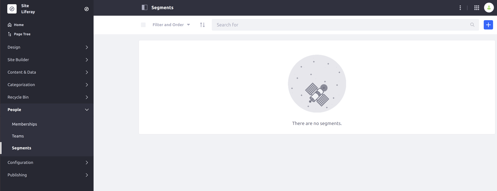
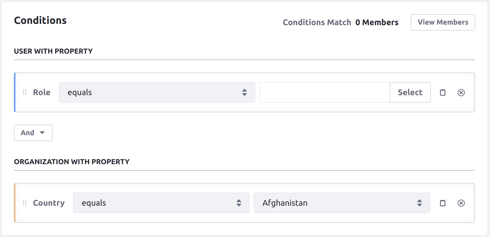
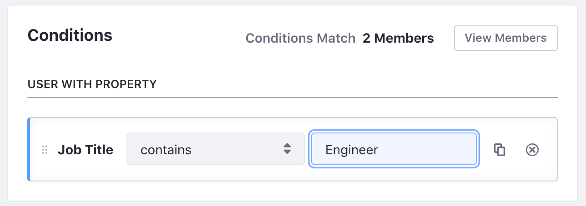
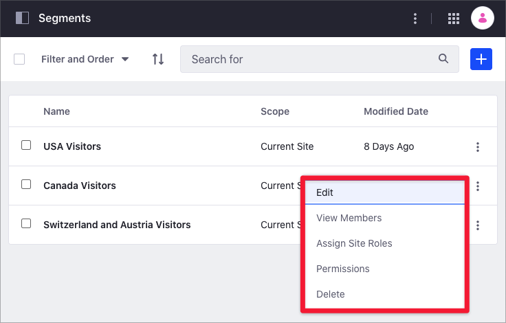

# Creating and Managing User Segments

Segments use User data like the *Job Title* field and Organization membership for evaluating segments. These steps describe how to create a new User Segment:

1. From the Site Menu on the left side of the screen, go to *People* &rarr; *Segments*.

    

1. Click the *Add* button ().

1. Click in the top text area and enter a name for your User Segment.

1. Drag the *User*, *Organization*, and/or *Session* properties that you need to the Conditions box, and configure the fields to create the condition for the User Segment. See the [The Segments Editor UI Reference](./segments-editor-ui-reference.md) for more information on using the editor and an explanation of all the properties you can use. You can add properties to the default list by creating a Custom Field<!-- link todo --> for Users or Organizations.

    

    The example in the figure below creates a User Segment for Users that have "Engineer" as their job title.

    

    As you edit, a count of members meeting the criteria appears at the top of the page. You can click on *View Members* to see the list. This helps you determine if you are correctly defining the Segment.

    

1. Click *Save* to save your User Segment.

After you create your User Segment, you can see it in the list of User Segments on the *Segments* page. From here, you can manage the User Segment (edit it, delete it, [assign Site Roles](../../../users-and-permissions/roles-and-permissions/assigning-roles-to-user-segments.md) or change the permissions (who can access the User Segment) for it) through its Actions Menu (). You can also click on the User Segment's name to edit it.

    

```note::
  You can't delete a User Segment if it's used in an experience.
```

## Related Information

* [Assigning Roles to User Segments](../../../users-and-permissions/roles-and-permissions/assigning-roles-to-user-segments.md)
* [Getting Analytics for User Segments](./getting-analytics-for-user-segments.md)
* [Content Page Personalization](../experience-personalization/content-page-personalization.md)
