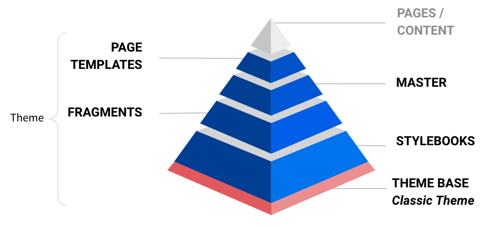

# Introduction to Themes

Themes customize the default look and feel of your Site. They allow you to define the style and visual identity of your brand or label across your whole Site.

## Themes and Site Design

Themes are available and used out-of-the-box on any Site you create. There are also a number of other ways (such as [Style Books](../style-books/creating-a-style-book.md)) to define the look and feel of your Site, but themes provide the most flexibility when you need a fully customized solution.



Themes are one of the most broad and flexible ways to add customizations, in the hierarchy of ways to design your Site's appearance. Themes are most commonly used for providing the most foundational basis for your Site that more specific tools (such as Master Pages<!--Add link when available--> and [Style Books](../style-books/creating-a-style-book.md)) can build on top of. However, you may also use themes to add more customizations that are not possible with those other methods.

## Developing Themes

Themes can be used to customize your Site in a variety of ways, including styling your pages, creating templates, and even extending functionality at runtime.

### Styling Your Site

Themes provide the basis for styling on any Site. You can define the UI details for your Site's pages, customized portlet decorators<!--Add link when available-->, and define the color scheme<!--Add link when available--> for your Site.

You can also configure a custom [Style Book Token Definition](../style-books/style-book-token-definitions.md) based on your theme. <!--Add link when available: See Hooking Style Book Tokens into Your Theme for more information.-->

### Designing Pages

Themes are also a complement to Page Templates<!--Add link when available--> or Master Pages<!--Add link when available--> for designing a template for your Site's pages. It can be used in conjunction with these other methods, which add on top of the design from your theme.

For example, you can [embed widgets in your theme](./theme-development/designing-pages/embedding-widgets-in-your-theme.md) to make them a permanent fixture of your Site's pages.

<!-- I'm not sure if the other topics listed under Templating in the Journeys would all go under here, as some of them seem like they are not theme-specific topics. -->

```note::
    You can also create templates for your pages using `Master Pages <link>`__ or `Page Templates <link>`__.
```

### Bundling Resources

Resources may be bundled into your theme or from other sources to bring together many sources of code at once. This allows you to adapt your strategy depending on how you want to deploy different changes.

* [Themelets](./theme-development/bundling-resources/adding-a-themelet-to-a-theme.md) allow you to customize a small number of files, in a modular way that can apply to many themes.

* Theme contributors<!--Add link when available--> allow you to package UI resources and customizations that can be deployed independently of a theme.

* The Resources Importer<!--Add link when available--> uses Site Templates to import files and content necessary to implement a theme.

```warning::
   The Resources Importer is deprecated as of Liferay DXP 7.1. There is not yet a direct replacement for it.
```

### Modifying Behavior

Themes are also potentially a powerful tool for modifying the behavior of different parts of your Site. 

* You can add context variables usable in your Page Templates<!--Add link when available--> so that these templates can hook into the functionality of your theme.

* You can set variable values<!--Add link when available--> with your theme to influence the behavior of existing functionality in DXP.

* You can add [token values](../style-books/style-book-token-definitions.md) that are used to define categories for styling with [Style Books](../style-books/creating-a-style-book.md).

## Upgrading Themes

The first step to upgrade your theme is to use the Liferay Theme Generator to run the upgrade task. This task updates your theme's version so that you can deploy it to the new version of DXP. See [Upgrading a Theme](./upgrading-a-theme.md) for more information.

<!-- If and when at least one more article is made for the extra work for upgrades, maybe add:

    Using the Liferay Theme Generator allows your theme to be deployed, but more work may be required to accommodate other changes in the new version, such as UI or functionality changes. See this article for more information... -->

## Tools

A variety of tools are used in developing or extending themes. See these topics for more information:

* Liferay Theme Generator<!--Add link when available-->
* Setting up an NPM environment<!--Add link when available-->
* Grade plugins<!--Add link when available-->
* Building a Theme with Maven<!--Add link when available-->
