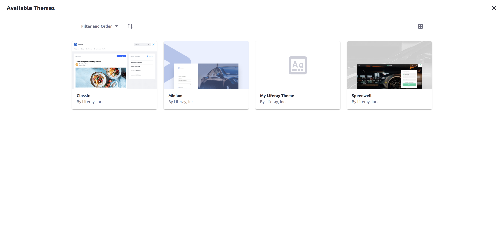

# Creating a Thumbnail for Your Theme

A theme's thumbnail is the visual representation of how the theme looks when it is deployed to a Site. The thumbnail is shown in the theme selection menu when you choose a theme for a Site's Public Pages. 



Follow these steps to create a thumbnail and apply it to your theme:

1. Take a screenshot of your theme to use for the thumbnail.

1. Resize the screenshot to a height of 480 pixels and a width of 270 pixels. Screenshots outside of these dimensions may not display properly.

<!-- Very skeptical as to the accuracy of this limitation, since it seems like thumbnails definitely exist outside of these dimensions, and images still seem awkwardly cropped in the UI whether they are set to this size or not. -->

1. Save the image with the name `thumbnail.png` in your themes `src/images/` folder. If the folder doesn't exist yet, create it.

1. Redeploy your theme to DXP:

    ```bash
    gulp deploy
    ```

1. Confirm the deployment in the Docker container console.

    ```
    STARTED my-liferay-theme_1.0.0
    ```

1. Once the theme is deployed, navigate to the Site Menu &rarr; *Site Builder* &rarr; *Pages*, then click on the configuration icon () to configure the Site's Public Pages.

1. Click the *Change Current Theme* button to view all available themes with their thumbnails and verify the change.

The chosen file now displays in the theme selection screen as the thumbnail.
