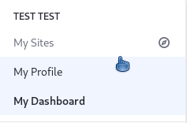
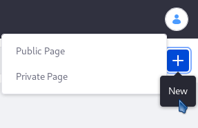

# User Group Sites

<!-- The main struggle I have with this article is I have no idea what the value proposition is for this functionality - what is the problem or use case this solves for? -->

At the bottom of the [User Group form](./creating-and-managing-user-groups.md) are two fields where you can choose a Site Template to populate two sets of pages: *My Profile* and *My Dashboard*.


User Group Sites are specific page sets that populate Users' *My Profile* (public) and *My Dashboard* (private) personal Sites.

Users can have personal Sites that consist of public (Profile) and possibly private (Dashboard) pages. These must be enabled for both [public](https://docs.liferay.com/portal/7.3-latest/propertiesdoc/portal.properties.html#Default%20User%20Public%20Layouts) and [private](https://docs.liferay.com/portal/7.3-latest/propertiesdoc/portal.properties.html#Default%20User%20Private%20Layouts) Sites.

<!-- The first part of this paragraph feels redundant to information presented a couple paragraphs prior.
A *User Group Site* isn't really a Site: it's a set of pages that gets added to either the public (profile) or private (dashboard) Sites of Users. A mixed approach can also be used, where both private and public pages are added for the User Group Site. If Users belong to multiple User Groups, all the pages from those User Group Sites are made part of their personal Sites.
-->



You can create User Group Sites while [creating the User Group](./creating-and-managing-user-groups.md) by selecting [Site Templates](../../site-building/building-sites/building-sites-with-site-templates.md) from the *My Profile* and *My Dashboard* selector menus. You can also create a User Group Site later, either manually or via a Site Template.

## Creating User Group Sites From Site Templates

To create a User Group Site from a [Site Template](../../site-building/building-sites/building-sites-with-site-templates.md)), for a User Group that already exists,

1. Open *Control Panel* &rarr; *Users* &rarr; *User Groups*.

1. Click *Actions* () &rarr; *Edit* for the User Group to open the edit form.

1. Give Users public pages by selecting a Site Template from the *My Profile* menu.

1. Give Users private pages by selecting a Site Template from the *My Dashboard* menu.

1. Click *Save*.

Now, when one of the group's Users navigates to their *My Profile* or *My Dashboard* Sites, the content of those Sites reflect the Site Template(s) you selected.

User Group Site pages function similarly to regular Site Template pages, with an important exception: User Group Site pages aren't copied for each User. They're shown dynamically along with any custom pages that Users may have on their personal Site. For this reason, Users can't modify pages inherited from the User Group. If needed, the User Group administrator can define certain areas of a page as customizable, like with regular Sites, and then Users can add and configure widgets in the specified area of the page.

This allows great flexibility in configuring a User's personal Site without having to modify it directly. When Users are assigned to a User Group, they'll immediately have access to the User Group's Site pages from their personal Sites.

```note::
   Site Templates have an option that propagates changes made to the Site Template. If you use a Site Template with this option enabled, the User Group Sites update automatically when that template changes. If you disable this option but enable it again later, the template's pages are copied to the Users' Sites, overwriting any changes they may have made.
```

## Creating User Group Sites Manually

Instead of basing User Group Sites on a Site Template, you can create them manually:

1. Go to *Control Panel* &rarr; *Users* &rarr; *Users Groups*.

1. Click *Actions* () &rarr; *Manage Pages* for the User Group. This *Pages* window is the same one you use for [creating pages](../../site-building/creating-pages/understanding-pages.md).

    

1. Create the public and/or private pages that you want to use for the Users' *My Profile* and/or *My Dashboard* Sites. Public pages you create here become pages on users' *My Profile* Site, while private pages become pages on users' *My Dashboard* Site.

When you return to User Groups in the Control Panel, you can access a User Group's public and/or private pages via these links in the User Group's *Actions* button ():

**Go to Profile Pages:** Opens the User Group's public *My Profile* page(s) in a new browser window.

**Go to Dashboard Pages:** Opens the User Group's private *My Dashboard* page(s) in a new browser window.

In the new window, you can add more pages and portlets and configure Site settings.

## Legacy User Group Sites Behavior

There is no impact on performance for inheritance of User Group Site pages, even with millions of users. Versions of Liferay Portal and Liferay DXP prior to 7.0, however, required User Group pages be copied to each User's personal Site.

If you're on Liferay DXP 7.2 and must keep that behavior, enable it by adding the following line to your `portal-ext.properties` file:

```
user.groups.copy.layouts.to.user.personal.site=true
```

This property was removed in Liferay DXP 7.3.

When this property is set to `true`, the template pages are copied to a User's personal Site once, and then may be modified by the User. This means that if changes are made to the template pages later, they only affect Users added to the User Group after the change is made. Users with administrative privileges over their personal Sites can modify the pages and their content if the *Allow Site Administrators to Modify the Pages Associated with This Site Template* box has been checked for the template. When a User is removed from a User Group, the associated pages are removed from the User's personal Site. If a User is removed from a group and is subsequently added back, the group's template pages are copied to the User's Site a second time. Note that if a User Group's Site is based on a Site Template and an administrator modifies the User Group's Site Template after users have already been added to the group, those changes only take effect if the *Enable propagation of changes from the Site Template* box for the User Group was checked.
