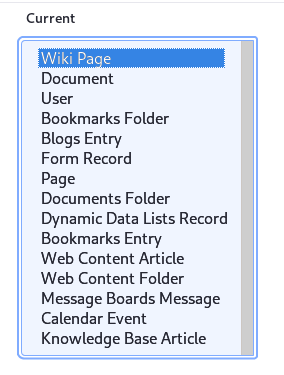
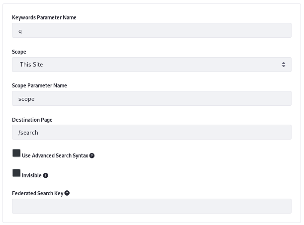

# Searching for Content

All indexed content (a.k.a. _assets_ in Liferay DXP) can be returned as search results. [Custom content can also be indexed](https://help.liferay.com/hc/en-us/articles/360032260612-Model-Entity-Indexing-Framework), so your installation might have additional asset types beyond the ones included by default. 



<!-- move to search results documentation, most likely-->
<!--
**Searching for Users:** When you click an asset in the search results, it's displayed in an Asset Publisher (unless the *View in Context* option is selected in the Search Results portlet). Users are different, though. Think of them as invisible assets, not intended for display in the Asset Publisher application.  While Users appear as search results with other indexed assets, when you click one you're taken to the User's profile page. If public personal pages are disabled, clicking on a User from the list of search results shows you a blank page.
-->

## Search Bar

Using the default Liferay DXP setup, you enter the search context by entering search terms in the search bar. Execute a search and you're taken to a [search page](./working-with-search-pages.md) with various search widgets deployed. 


### Entering Search Terms

Liferay's search infrastructure supports full text search as implemented by its supported search engines ([Elasticsearch](https://www.elastic.co/guide/en/elasticsearch/reference/current/full-text-queries.html) and [Solr](http://lucene.apache.org/solr/features.html)).

Full text search compares all the words entered in a search query (for example, *space vacation*) to all the words in each indexed document. A search engine like Elasticsearch calculates relevance scores to ensure the best results are returned first (like a Blogs Entry titled *Is a vacation in space right for you?*) and lots of matching results are returned (anything with either the word *vacation* or *space* is returned). 

In addition to full text search, advanced search syntax is supported. The underlying search engine determines the precise behavior, so consult the [Elasticsearch](https://www.elastic.co/guide/en/elasticsearch/reference/7.6/query-dsl-simple-query-string-query.html) or [Solr](https://lucene.apache.org/solr/guide/7_0/query-syntax-and-parsing.html) documentation for the details.


### Matching Exact Phrases: Quoted Search

What if users want their search terms (for example, _agile frameworks_) to produce only results with the exact phrase, as typed? In a regular full text search, searching _agile frameworks_ returns search results containing just the terms _agile_ and _frameworks_, and hits containing both terms but separated by other text, as well as results with the exact phrase match. To ensure that only hits with the exact phrase are returned, enclose it in quotes: _"agile frameworks"_.


### Prefix Searching

With prefix searching, searching for the term *instrument* returns documents not only containing the full word, but also variants with *instrument* as the prefix. For example, results with *instruments*, *instrumental*, and *instrumentation* are also returned.


```note::
   Prefix searching is available for many fields out of the box, but it's more complicated under the hood. The details of the field mapping, including the analyzer used on the field and any transformations performed, determine the final behavior.
```

Another way to ensure users see results is through [search suggestions](#search-suggestions).

### Configuring the Search Bar

Configure the Search Bar's behavior via its portlet configuration screen.



```note::
   When you configure the globally embedded Search Bar widget at the top of one page, it configures the page-top Search Bar widget on all pages in the site. It also overrides the `destination Search Page's<./working-with-search-pages.md>`__ Search Bar portlet, if they're configured differently. However, it does not override Search Bar widgets manually placed on other pages.
```

There are several options:

**Keywords Parameter Name:** Edit the parameter name for the keywords entered in the search. For example, the default URL when searching for the keyword term _data_ looks like this: 

```
http://localhost:8080/web/guest/search?q=data
```

If you change the Keywords Parameter Name to _keyword_ it looks like this:

```
http://localhost:8080/web/guest/search?keyword=data
```

**Scope:** Choose between three options: This Site (default), Everything, and Let the User Choose. *This Site* means only the assets associated with the site where the search is executed are searched. Expand the scope of the search to all sites by selecting *Everything*. To let users choose which scope they want to search, select *Let the User Choose*.


**Scope Parameter Name:** Set the URL parameter name for the scope where the search is taking place. This parameter only appears in the URL if the scope _Let the User Choose_ is selected. The default value is _scope_, so searching for the word _data_ produces the default URL of

```
http://localhost:8080/web/guest/search?q=data&scope=this-site
```

Changing _scope_ to _target_ would produce this URL:

```
http://localhost:8080/web/guest/search?q=data&target=this-site
```

**Destination Page:** Provide a friendly URL to the [search page](./working-with-search-pages.md). If not configured or if it points to a page that doesn't exist, a message appears for administrators that the search bar must be configured for it to appear to users.

**Use Advanced Search Syntax:** If using Elasticsearch, enabling this allows users to enter [Query String Syntax](https://www.elastic.co/guide/en/elasticsearch/reference/7.6/query-dsl-simple-query-string-query.html) into the Search Bar. If using Solr, consult its documentation for the [proper syntax](https://lucene.apache.org/solr/guide/7_0/query-syntax-and-parsing.html).

## Additional Information

* [Enabling Search Suggestions](../search-pages-and-widgets/search-results/enabling-search-suggestions.md)