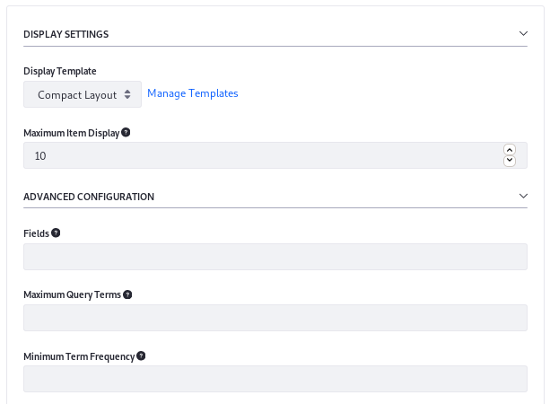

# Similar Results Configuration Reference

> **Subscribers**
> **Available:** Download the app through Liferay Marketplace.

The Similar Results widget shows more results similar to the main selected result from a search. For an overview of this widget and its usage, see [Similar Results](./similar-results.md).

This widget has a variety of options available to change its behavior (listed [below](#similar-results-configurations)). Continue reading to learn how to use these configurations.

## Configuring the Similar Results Widget

Follow these steps to add a configure a Similar Results widget to the page:

1.  Click the Add menu () &rarr; Widgets &rarr; Search and drag the Similar Results widget onto the page.

2.  To configure it, open the widget Options menu () and click _Configuration_.

The full list of available properties is found [below](#similar-results-configurations).

## Similar Results Configurations

The first configuration options appear in a section called _Display Settings_.

**Display Template:** Choose the widget template to configure how similar results are displayed.

**Maximum Item Display:** Set the maximum number of results to display in the widget.

The _Advanced Configuration_ section collects settings for tweaking the
behavior of the widget. Many of these settings are used to configure the 
[More Like this Query for Elasticsearch](https://www.elastic.co/guide/en/elasticsearch/reference/current/query-dsl-mlt-query.html).

**Fields:** Use a comma-separated list to specify keyword or text fields whose content is
used to determine whether another asset matches the Main Asset.

**Maximum Query Terms:** Set the maximum number of query terms to extract from the main asset. These are the terms used for matching search results to the main asset. Increasing this value enhances the relevance of returned results at the expense of execution speed. If left blank, this defaults to `25`.

**Minimum Term Frequency:** Set the minimum threshold for the times a term must appear in the index to be used for matching similar results. If left blank, this defaults to `2`.

**Minimum Document Frequency:** Set the minimum threshold for the number of documents that contain a term in order for the term to be used in constructing the More Like This query. If left blank, this defaults to `5`.

**Maximum Document Frequency:** Set The maximum threshold for the number of documents in the index where a term can appear to use it for matching similar results. Use this to ignore highly frequent words such as stop words. If left blank, no upper bound is set.

**Minimum Word Length:** Set a minimum word length, below which terms are omitted from the More Like This query. If left blank, this defaults to `0`.

**Maximum Word Length:** Set a maximum word length, above which terms are omitted from the More Like This query. If left blank, no upper bound is set.

**Stop Words:** An array of uninteresting stop words (in a comma-separated list) that should be ignored for the purpose of finding similar results. If the configured analyzer allows for stop words, these are words you can completely avoid sending to the More Like This query. 

**Analyzer:** Specify the analyzer to use on the input document's fields. If left blank, this defaults to the analyzer associated with the first entry in the fields configuration.

**Minimum Should Match:** After the disjunctive query has been formed, this parameter controls the number of terms that must match (defaults to `30%`). For the accepted syntax, see the [Elasticsearch documentation](https://www.elastic.co/guide/en/elasticsearch/reference/current/query-dsl-minimum-should-match.html#query-dsl-minimum-should-match).

**Term Boost:** Set the boost factor to use if boosting terms by their [tf-idf](https://en.wikipedia.org/wiki/Tf%E2%80%93idf) score is desired. If left blank, this defaults to deactivated (`0`). Any other positive value activates terms boosting with the given boost factor.

**Federated Search Key:**  Enter the key of an alternate Search where this widget is participating.