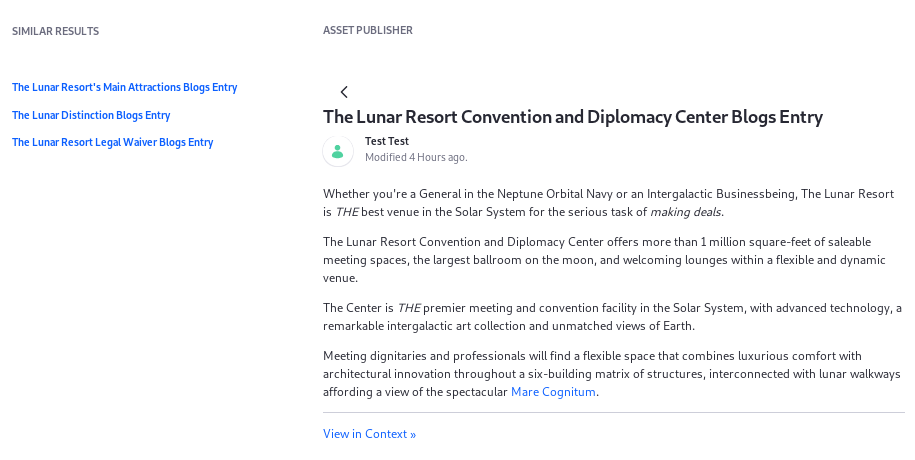

# Similar Results

> **Subscribers**
> **Available:** Download the app through Liferay Marketplace.

The Similar Results widget shows search results similar to the _main asset_ that's selected on the page.

The concept of the main asset is important. Certain widgets in DXP display lists of assets: Asset Publisher, Blogs, Wiki, and more. If a user clicks one of the displayed assets and the widget shows its full content on the page, it's now the page's _main asset_. The Similar Results widget, if placed on the same page, shows a list of assets that are similar enough to be returned by a [_More Like This_ query](https://www.elastic.co/guide/en/elasticsearch/reference/current/query-dsl-mlt-query.html).  Note that the concept of a main asset is synonymous with Elasticsearch's [_input document_](https://www.elastic.co/guide/en/elasticsearch/reference/current/query-dsl-mlt-query.html#_how_it_works).

Similar Results uses the input document/main asset to construct a query that returns itself as the best match to the query, and then sends this disjunctive query (or OR) to the search engine to return matching result documents. This whole process is configurable: how to process the input document, how to select terms from the processed content, and how to form the query itself. See the Elasticsearch documentation for the [details](https://www.elastic.co/guide/en/elasticsearch/reference/current/query-dsl-mlt-query.html#_parameters_4).

For information on how to configure the Similar Results widget, see the [Similar Results Configuration Reference](./similar-results-configuration-reference). To learn more about widget templates that can be used to render this widget, see [Similar Results Widget Templates](./similar-results-widget-templates.md).

## Using the Similar Results Widget

What happens when a Similar Results widget is placed on a page depends on the context and the assets currently displayed by the page. If no main asset is selected on the page, the Similar Results displays nothing: its space on the page remains blank. Site administrators see this informational message: 

_There are no similar results available._

When a main asset's document is detected, the widget shows similar results of the same asset type, displayed in a format dictated by the configured [Widget Template](#similar-results-widget-templates).

Learn more by considering two use cases.

## Use Case 1: Similar Results on Asset Publisher Pages

> **End Result:** Similar Results (those that would be returned as matching search hits) of the same asset type are displayed when an asset is selected in the Asset Publisher.

To configure this example, 

1. Create a widget page. Add an Asset Publisher widget and a Similar Results widget.

1. Go to the Asset Publisher's configuration Display Settings and set Asset Link Behavior to _Show Full Content_. 

    This makes a selected asset display its full content inside the Asset Publisher. If you choose _View in Context_, you're redirected to the page where the asset exists natively, making your Similar Results widget useless.

1. Create multiple similar assets of the types listed below. Make sure they're similar enough that the Similar Results widget would populate results.

    To create assets that will be returned by the More Like This Query, pay attention to the content of the assets you create and to the [Similar Results widget configuration](#similar-results-configurations).  For testing, it's advisable to set the _Minimum Term Frequency_ and the _Minimum Document Frequency_ values both to `1`.

    Blogs Entries
    Documents and Media files
    Documents and Media folders
    Web Content Articles
    Web Content Folders
    Wiki Pages
    Message Boards threads
    Message Boards messages
    Message Boards categories

Click on an asset displayed by the Asset Publisher widget, and similar results appear in the Similar Results widget. 

Click on one of the similar results. The Asset Publisher updates its main asset, and Similar Results are recalculated for the new main asset.

## Use Case 2: Similar Results on Asset Display Pages

These widgets and accompanying assets can display a list of their assets and select one to be used as a Main Asset for the Similar Results widget:

| Widget Name | Asset Type(s) |
|---------------------|--------------------------------------------------|
| Blogs               | Blogs Entries                                    |
| Documents and Media | Documents and Media Files, Folders               |
| Wiki                | Wiki Pages                                       |
| Message Boards      | Message Boards Threads, Messages, and Categories |

To configure an example for using Similar Results with Blogs,

1. Create a widget page. Add a Blogs widget and a Similar Results widget.

1. Create multiple similar Blogs entries. Make sure they're similar enough that the Similar Results widget returns them as results.

    To create assets that will be returned by the More Like This Query, pay attention to the content of the assets you create and to the [Similar Results widget configuration](#similar-results-configurations).  For testing, it's advisable to set the _Minimum Term Frequency_ and the _Minimum Document Frequency_ values both to `1`.

1.  Click on a Blogs post in the Blogs widget. The Blogs entry is displayed, and the Similar Results widget displays links to similar entries.

1.  Click one of the similar results. Its Blog content is now rendered on the Blogs widget on the current page.

## Additional Information

* [Similar Results Configuration Reference](./similar-results-configuration-reference.md)
* [Similar Results Widget Templates](./similar-results-widget-templates.md)