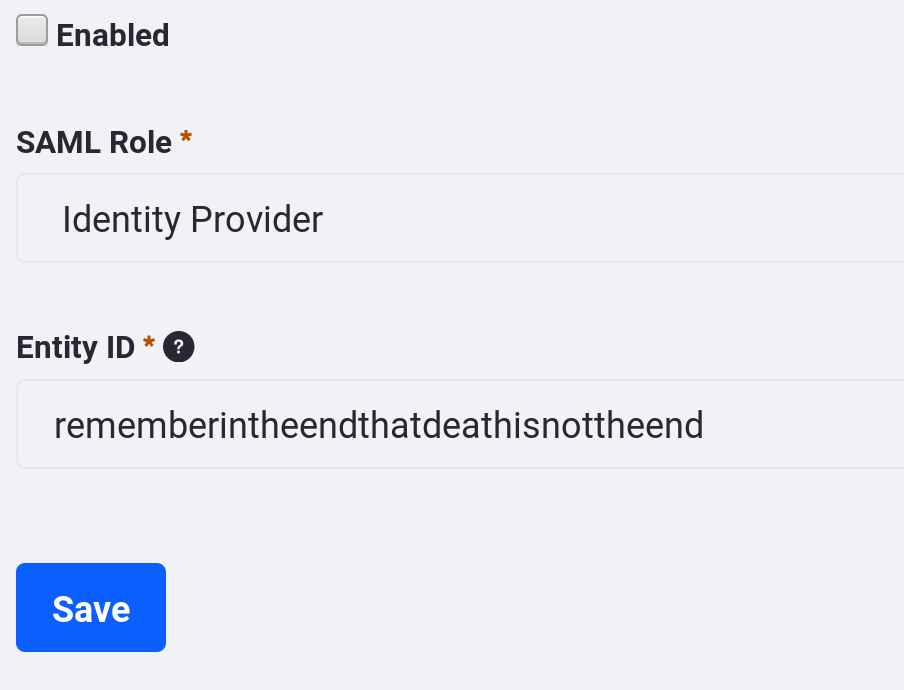
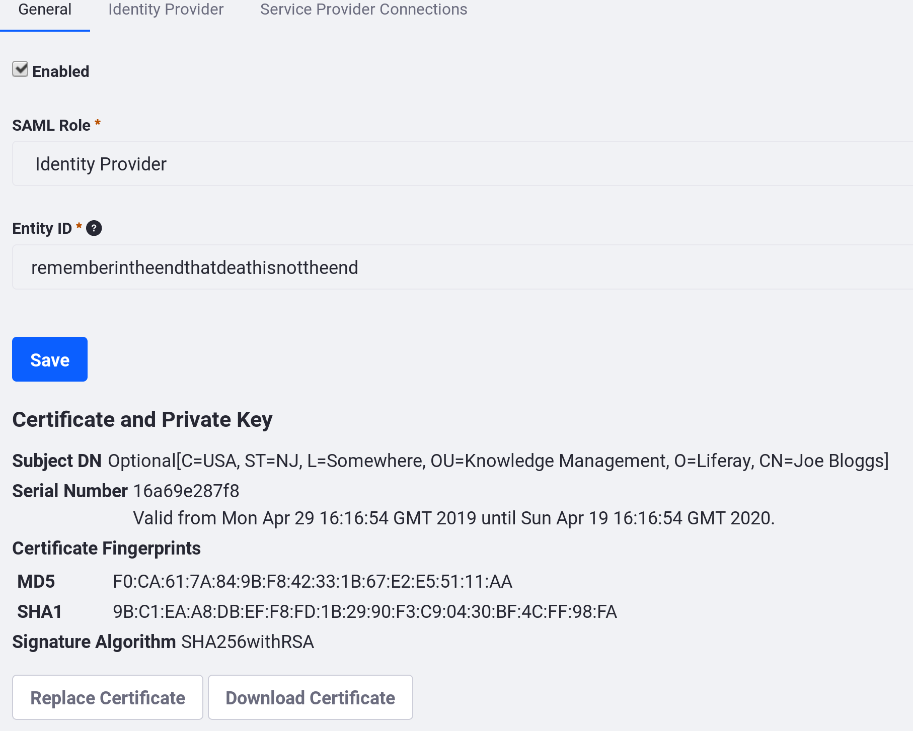

# Setting up Liferay as a SAML Identity Provider

Your Liferay DXP instance can be an Identity Provider or a Service Provider, but not both. If you don't have an existing SAML Identity Provider, follow these instructions to define your Liferay DXP installation as one.

Before you start, review the prerequisites: setting up your Keystore and knowing the important SAML paths.

## Prerequisites

### Setting up Your Keystore

You have two options for where to put your Keystore:

* In the file system
* In the Documents and Media library

The file system keystore manager is used by default, and the default location is the `[Liferay Home]/data` directory (you can change the location in System Settings &rarr; SSO &rarr; SAML Configuration &rarr; Key Store Path).

To use Documents and Media library storage for your keystore instead of file system storage, go to *Control Panel* &rarr; *System Settings* &rarr; *Security* &rarr; *SSO* &rarr; *SAML KeyStoreManager Implementation Configuration*. Select from the two options: *Filesystem Keystore Manager* or *Document Library Keystore Manager*.

If you use Document Library storage, you can use any of the [back-end file stores](../../../../system-administration/file-storage/configuring-file-storage.md). These are protected not only by the system where the key is stored, but also by Liferay DXP's permissions system.

### Important SAML Paths

For reference, here are a few important SAML paths.

This URL is the default location of the metadata XML file:

```
[host]:[port]/c/portal/saml/metadata
```

Note that when configuring SAML, no importing of SAML certificates is required. Liferay DXP reads certificates from the SAML metadata XML file. If you want a third-party application like Salesforce to read a Liferay SAML certificate, you can export the generated certificate from the keystore. The default keystore file is

```bash
[Liferay Home]/data/keystore.jks
```

You can change this path in _System Settings_ &rarr; _SSO_ &rarr; _SAML Configuration_ &rarr; _Key Store Path_.

## Configuring Liferay DXP as a SAML Identity Provider

1. To access the SAML Admin interface, click on *Control Panel* &rarr; *Configuration* and then on *SAML Admin*.

1. To begin configuring Liferay DXP to use SAML, select the _Identity Provider_ role for your installation and enter your entity ID.

    

    Click *Save*. A new Certificate and Private Key section appears.

1. Now you can create a keystore for SAML. Click on *Create Certificate* and enter the following information:

    * Your common name (your first and last name)
    * The name of your organization
    * The name of your organizational unit
    * The name of your city or locality
    * The name of your state or province
    * The name of your country
    * The length in days that your keystore should remain valid (how long before the keystore expires)
    * The key algorithm (RSA is the default)
    * The key length in bits (2048 is the default)
    * The key password

    Click *Save*.

    When you create the certificate and private key, you also create a keystore if one doesn't already exist. As described above, this keystore has two storage options: file system storage (the default) and Documents and Media storage. By default, the certificate uses the `SHA256` algorithm for encryption and is fingerprinted and self-signed via RSA and `SHA256`.

1. After you click *Save*, you can click *Replace Certificate* at any time to replace the current certificate with a new one if your old one has expired or if you want to change the key's password.

    

    Three more tabs now appear:

    **General:** For enabling or disabling a SAML IdP and managing the required keystore.

    **Identity Provider:** Contains IdP options, such as whether to enable SSL. If SSL has been enabled, then SAML requests are not approved unless they are also encrypted.

    **Service Provider Connections:** Manages any Service Providers connected to this Liferay DXP instance.

    See below for more information on the Identity Provider and Service Provider Connections tabs.

1. After you save your certificate and private key information, check the *Enabled* box at the top of the General tab and click *Save*. Your Liferay DXP installation is now a SAML Identity Provider!

## Changing the Identity Provider Settings

To configure Liferay DXP's SAML Identity Provider Settings, navigate to the *Identity Provider* tab of the SAML Admin Control Panel entry, which includes these options:

**Sign Metadata?:** Check this box to ensure the metadata XML file that's produced is signed.

**SSL Required:** Check this box to reject SAML messages *not* sent over SSL. This affects URLs in the generated metadata.

**Require Authn Request Signature?:** If checked, each Authn Request must be signed by the sending Service Provider. In most cases, this should be enabled.

**Session Maximum Age:** Specify the maximum duration of the SAML SSO session in seconds. If this property is not set or is set to `0`, the SSO session has an unlimited duration. The SSO session maximum duration can be longer than the portal session maximum duration. If the portal session expires before the SSO session expires, the user is logged back in automatically. SSO session expiration does not trigger a single logout from all service providers. You can use the session maximum age, for example, to force users to sign in again after a certain period of time.

**Session Timeout:** Specify the maximum idle time of the SAML SSO session. Even if the session maximum age is unlimited, the SSO session expires whenever the user's idle time reaches the limit set by the session timeout property.

## Checkpoint

Before adding a Service Provider (SP), verify you've completed these tasks:

1. A SAML keystore has been generated. It can be stored in one of two locations: the `data` folder or in the Documents and Media library.

1. On the *Identity Provider* tab, the following settings have been set:

    a. **Sign Metadata** has been checked.

    b. **SSL Required** - checked if SSL is active elsewhere. SSL is disabled by default.

    c. **Authn Request Signature Required:** has been checked.

    d. **Session Maximum Age:** has been set. If set to `0`, then the SSO has an unlimited duration.

    e. **Session Timeout:** Specify the maximum idle time of the SAML SSO session.

1. Once the *Enabled* checkbox has been checked, the IdP is live, and you can generate the required metadata. This URL is the default location of Liferay DXP's metadata XML file:

```
[host]:[port]/c/portal/saml/metadata
```

If this URL does not display correctly, then the SAML instance has not been enabled. Use the URL or click *Save* in the browser to generate an `XML` file.

Your Identity Provider is now set up. Next, you must register a Service Provider.
