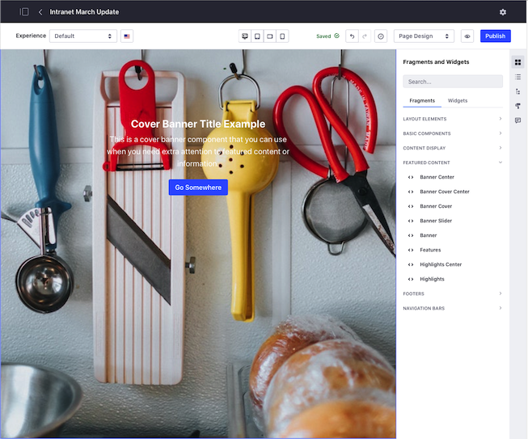

# Content Pages Overview

By default, Liferay DXP uses the Content Page type, which provides a convenient UI for both managing and editing page content and design. With Content Pages, you can use configurable drag-and-drop elements out-of-the-box or develop your own to create the desired User experience.

As with other page types, you can use [widgets](./using-widgets-on-a-content-page.md) to add dynamic functionality to a Content Page, integrating blogs, wikis, message boards, and more. Content Pages are primarily built using [Page Fragments](../../displaying-content/using-fragments/using-page-fragments.md). Page Fragments are extensible, reusable page elements that include editable components, such as [text](./configuring-elements-on-content-pages.md#editing-text-inline), [images](./configuring-elements-on-content-pages.md#editing-images), and [links](./configuring-elements-on-content-pages.md#editing-hyperlinks), which you can also [map](./configuring-elements-on-content-pages.md#mapping-content) to available content. See [Using Page Fragments](../../displaying-content/using-fragments/using-page-fragments.md) to learn more about DXP's out-of-the-box Fragments, or [Developing Fragments](../../developer-guide/developing-page-fragments/developing-fragments-intro.md) to learn how to create your own.

When editing Content Pages, changes are made through a *Site Builder* and are saved as a draft. You can review, undo, and redo changes you've made during your current editing session, without affecting the live version. When ready, publish your changes immediately or enable a custom [Workflow](../../../process-automation/workflow/introduction-to-workflow.md) to direct the review and publishing process. You can also use Fragment and widget [comments](../../displaying-content/using-fragments/using-fragment-comments.md) during this process to collaborate with team members.

With Content Page Fragments and widgets, you can display web content, documents, and more. You can also view, edit, and manage your content, including content mapped to page fields. See [Managing Web Content on Content Pages](./managing-web-content-on-content-pages.md) for more information.

Create personalized page [experiences](../../personalizing-site-experience/experience-personalization/content-page-personalization.md) and manage localized translations to engage your target audiences. You can also further optimize user experience with the Responsive Layout Editor. This tool adapts the page content, so you can view and configure how your Content Page is displayed on desktops, tablets, and smartphones.

Finally, with [A/B Testing](../../optimizing-sites/ab-testing/ab-testing.md), you can create alternative versions of a Content Page to track visitor data (e.g., bounce rate, clicks, etc.). Using algorithms, you can analyze this data to determine which page version best achieves your goals and hone your message accordingly.

See [Adding Elements to Content Pages](./adding-elements-to-content-pages.md) to get started!

## Additional Information

- [Adding Elements to Content Pages](./adding-elements-to-content-pages.md)
- [Configuring Elements on Content Pages](./configuring-elements-on-content-pages.md)
- [Using Page Fragments](../../displaying-content/using-fragments/using-page-fragments.md)
